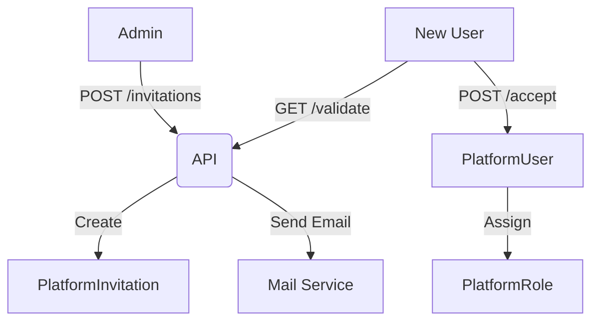

# Platform Identity & Access Management (IAM)

## 1. Context
### Goal
Manage Super-Admin staff access to the Platform Portal, ensuring strict Role-Based Access Control (RBAC) and audited invitation flows.

### Target Platform
- [x] Web
- [ ] Mobile (iOS/Android)
- [ ] Backend API Only

### User Stories
- **As a Platform Admin**, I want to invite support staff so they can help customers.
- **As a Platform Admin**, I want to define custom roles (e.g., "Billing Viewer") to limit access.
- **As a Staff Member**, I want to accept an invitation via email token.

### Key Business Rules
- **1. Invite-Only**: No public signup. Users must be invited by an existing Admin.
- **2. Role Enforcement**: Every user must have exactly one Role.
- **3. Immutable Logs**: All role changes and invitations are audit logged.

## 2. Architecture
### Data Flow

### Key Components
| Component | File | Description |
| :--- | :--- | :--- |
| **Model** | `models/user.py` | `PlatformUser` entity |
| **Model** | `models/permission.py` | `PlatformRole`, `PlatformPermission` |
| **Model** | `models/invitation.py` | `PlatformInvitation` |
| **API** | `routers/roles.py` | Role management |
| **API** | `routers/invitations.py` | User onboarding |

## 3. Database Schema
**Schema**: `platform`

| Table Name | Description | Key Columns |
| :--- | :--- | :--- |
| `platform_users` | Staff accounts | `id`, `email`, `role_id` |
| `platform_roles` | Role definitions | `id`, `name`, `is_system_role` |
| `platform_permissions` | Granular allow-list | `role_id`, `resource`, `action` |
| `platform_invitations` | Pending signups | `token`, `email`, `expires_at` |

## 4. API Reference
**Base Path**: `/api/platform`

### Roles
| Method | Path | Description | Permission |
| :--- | :--- | :--- | :--- |
| `GET` | `/roles/` | List roles | `users:read` |
| `POST` | `/roles/` | Create role | `users:write` |

### Invitations
| Method | Path | Description | Permission |
| :--- | :--- | :--- | :--- |
| `GET` | `/invitations/` | List pending invites | `invitations:read` |
| `POST` | `/invitations/` | Invite user | `invitations:write` |
| `POST` | `/invitations/{id}/revoke` | Revoke invite | `invitations:write` |
| `GET` | `/invitations/validate/{token}` | Validate token | `Public` |

## 5. UI Requirements
### Components
- **Staff List**: Table showing Name, Email, Role, Status (Active/Invited).
- **Role Editor**: Matrix of Resources (Rows) vs Actions (Columns) for permission assignment.
- **Invite Dialog**: Simple Modal (Email + Role Select).

### UX Rules
- **Critical Actions**: Revoking an invite should require confirmation.
- **Feedback**: Show "Copied to Clipboard" when generating invite links (if manual).

## 6. Observability & Audit
### Audit Logs
- **Event**: `create_invitation`, `revoke_invitation`, `create_role`
- **Payload**: `target_email`, `role_allocated`

### Metrics
- `count_active_staff`
- `count_pending_invites`

## 7. Extensions
*(If not applicable, write "Not Applicable")*

### Architecture
Not Applicable

### Configuration
- **Initial Admin**: Seeded via `scripts/seed_platform.py`.

## 8. Testing
### Critical Scenarios
- **Success**: Invite -> Email Sent -> Token Validated -> User Created.
- **Expired**: Token usage after 7 days returns 400.
- **Unauthorized**: Support staff cannot invite new admins.

### Test Location
- `backend/tests/e2e_api/platform/test_iam.py` (Proposed)

## 9. Dependencies
- **Internal**: `services.platform_service`
- **External**: SendGrid (Email)
- **Env Vars**: `FRONTEND_URL` (for invite links)
