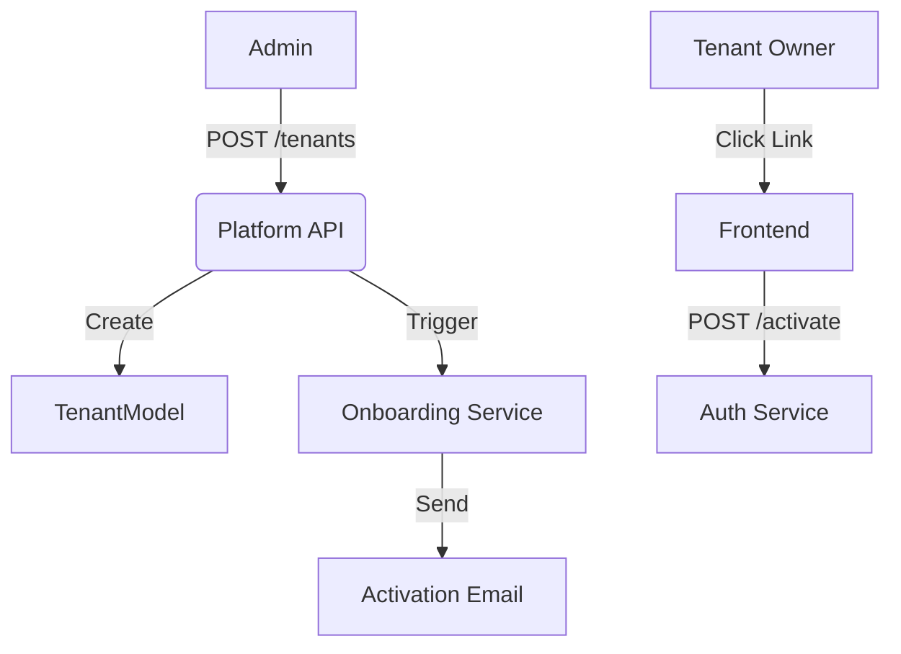

# Tenant Management (B2B)

## 1. Context
### Goal
Oversee the lifecycle of Enterprise Tenants, including onboarding, suspension, and emergency access (impersonation), providing the core "SaaS Control Plane".

### Target Platform
- [x] Web
- [ ] Mobile (iOS/Android)
- [ ] Backend API Only

### User Stories
- **As a Platform Admin**, I want to onboard a new Tenant so they can start using the SaaS.
- **As a Support Agent**, I want to impersonate a Tenant Admin to reproduce a bug.
- **As a Billing Admin**, I want to deactivate a Tenant for non-payment.

### Key Business Rules
- **1. Soft Deletion**: Tenants are rarely hard-deleted. "Deactivation" stops login but preserves data.
- **2. Impersonation Auditing**: Every impersonation session is logged with a reason.
- **3. Domain Uniqueness**: Tenant domains must be unique across the platform.

## 2. Architecture
### Data Flow

### Key Components
| Component | File | Description |
| :--- | :--- | :--- |
| **API** | `routers/platform_b2b.py` | Tenant CRUD & Actions |
| **Service** | `services/tenant_onboarding_service.py` | Orchestrates creation & email |
| **Model** | `modules/b2b/models/tenant.py` | `TenantModel` entity |

## 3. Database Schema
**Schema**: `public` (Shared Tenant Table) usually, or `b2b`? 
*Note: `TenantModel` is often in `public.tenants` or `b2b.tenants`. Based on imports `modules.b2b.models`, it's B2B.*

| Table Name | Description | Key Columns |
| :--- | :--- | :--- |
| `tenants` | Business Identities | `id`, `name`, `domain`, `is_active` |
| `platform_audit_log` | Records actions | `action='impersonate'`, `resource_id` |

## 4. API Reference
**Base Path**: `/api/platform/b2b/tenants`

### Lifecycle
| Method | Path | Description | Permission |
| :--- | :--- | :--- | :--- |
| `GET` | `/` | List tenants | `tenants:read` |
| `POST` | `/onboard` | Create & Invite | `tenants:write` |
| `PATCH` | `/{id}/deactivate` | Ban access | `tenants:write` |
| `PATCH` | `/{id}/reactivate` | Restore access | `tenants:write` |

### Operations
| Method | Path | Description | Permission |
| :--- | :--- | :--- | :--- |
| `POST` | `/{id}/impersonate` | Get short-lived admin token | `tenants:impersonate` |
| `POST` | `/{id}/resend-activation` | Retry onboarding email | `tenants:write` |

## 5. UI Requirements
### Components
- **Tenant Table**: Searchable list with Status Badges (Active, Pending, Deactivated).
- **Tenant Detail View**: showing User Count, Team Count, Subscription Status.
- **Action Menu**: Context menu for "Impersonate", "Deactivate", "Resend Invite".

### UX Rules
- **Impersonation**: Display a prominent "You are impersonating X" banner when active.
- **Destructive Actions**: Deactivation requires typing the tenant name to confirm.

## 6. Observability & Audit
### Audit Logs
- **Event**: `onboard_tenant`, `deactivate_tenant`, `impersonate_tenant_admin`
- **Payload**: `domain`, `company_name`, `target_user_email`

### Metrics
- `count_tenants_active`
- `count_tenants_churned`
- `rate_impersonation_events`

## 7. Extensions
Not Applicable

## 8. Testing
### Critical Scenarios
- **Onboarding**: Create Tenant -> Email Sent -> Verify Token -> Tenant Active.
- **Impersonation**: Admin generates token -> Use token to access B2B API -> Verify audit log.
- **Isolation**: Impersonating Tenant A does not allow access to Tenant B.

### Test Location
- `backend/tests/e2e_api/platform/test_tenants.py`
