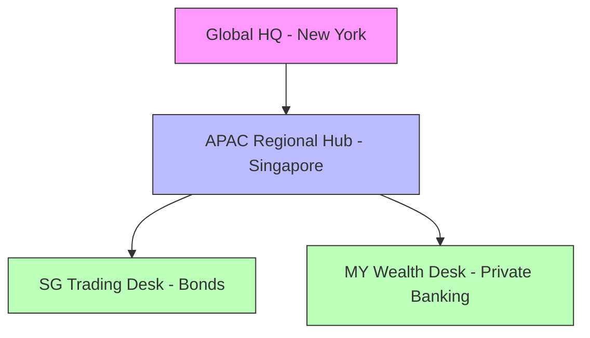
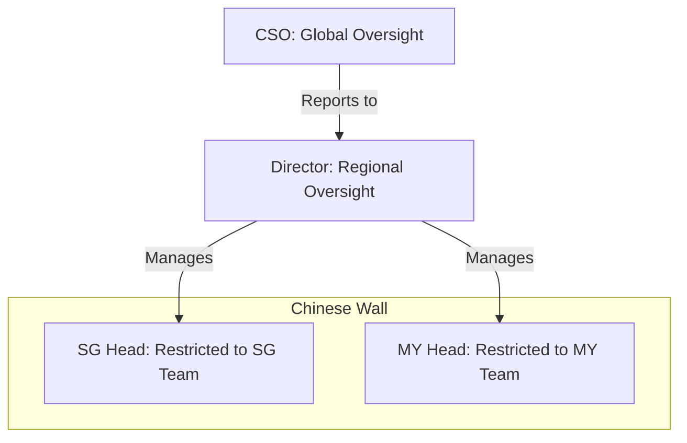

# Bank Surveillance Use Case (Enterprise)

Complete RBAC configuration for Global Bank Surveillance operations, demonstrating "2-Layer" Role-Based Access Control.

## 1. Target Organization Structure

We are modeling **Worldwide Bank**, a regulated financial institution with a hierarchical structure designed to enforce compliance and data segregation.



*   **Global HQ:** Oversight of all regions (CSO).
*   **APAC Hub:** Management of Asian markets (Regional Director).
*   **Trading Desks:** Isolated operational units (Singapore & Malaysia).

---

## 2. Role Portfolio

We define specific roles to match the bank's operational and compliance needs.

| Category | Role Name | Type | Description |
| :--- | :--- | :--- | :--- |
| **Leadership** | `surveillance_chief` | **Tenant** | C-Suite executive (CSO) with global oversight. |
| **Leadership** | `regional_director` | **Tenant** | Senior management for a specific region. |
| **Desk** | `surveillance_lead` | **Team** | Runs a specific desk (e.g., Head of SG). |
| **Desk** | `surveillance_analyst` | **Team** | Standard investigator. |
| **Operations** | `operations_maker` | **Team** | Can create cases but **cannot approve**. |
| **Operations** | `operations_checker` | **Team** | Can approve cases but **cannot create**. |
| **Support** | `tech_support` | **Team** | IT support for tools (no business data write access). |
| **Audit** | `compliance_officer` | **Team** | Read-only regulatory oversight. |
| **External** | `guest_analyst` | **Team** | Limited read-only access for auditors. |

---

## 3. Organizational Fit (Hybrid RBAC)

We use a **Hybrid Model** to map these roles to the organization. This distinguishes between *who you are* (Tenant Role) and *what you do* (Team Role).

### The "Access Pyramid"



*   **Global Leaders (CSO/Director):** Have **Tenant-Level Roles** that grant visibility across all teams.
*   **Desk Heads:** Have the **Member** tenant role (no special power) but the **Surveillance Lead** team role. This restricts their power *strictly* to their assigned desk (Singapore vs Malaysia).

---

## 4. User Roster & Configuration

The `bank_surveillance_bulk_invite.csv` provisions **10 Users** ensuring 100% role coverage.

### A. Leadership (Global Scope)
| User | Email | Tenant Role | Team Role | Scope |
| :--- | :--- | :--- | :--- | :--- |
| **Susan Martinez** | `cso@worldwidebank.com` | `surveillance_chief` | - | **ALL Data** |
| **APAC Director** | `director.apac.surv@...` | `regional_director` | - | **ALL Data** |

### B. Desk Operations (Restricted Scope)
| User | Email | Tenant Role | Team Role | Scope |
| :--- | :--- | :--- | :--- | :--- |
| **SG Head** | `head.sg.surv@...` | `member` | `surveillance_lead` | **SG Team Only** |
| **MY Head** | `head.my.surv@...` | `member` | `surveillance_lead` | **MY Team Only** |
| **MY Analyst** | `analyst.my.wealth@...` | `member` | `surveillance_analyst` | **MY Team Only** |

### C. Separation of Duties (SoD)
*These users work in the "Special Investigations" team.*

| User | Email | Role | Permission |
| :--- | :--- | :--- | :--- |
| **Maker** | `analyst.global.forensic@...` | `operations_maker` | Can **Create**, Cannot Approve |
| **Checker** | `checker.global.forensic@...` | `operations_checker` | Can **Approve**, Cannot Create |

---

## 5. Auxiliary Roles Mapping

Special configurations for non-business users.

### Tech Support (`tech.support.apac@...`)
*   **Mapping:** Appointed to both SG and MY teams.
*   **Function:** Troubleshooting investigation tools and configuration.
*   **Constraint:** Can **Manage Team Settings** and **Train Models** but strictly **Read-Only** for business communications (cannot delete/alter evidence).

### External Auditors (`guest.auditor@...` / `liaison.sg.mas@...`)
*   **Mapping:** `guest.auditor` is assigned `guest_analyst` role. `liaison.sg.mas` is `compliance_officer`.
*   **Function:** Regulatory review.
*   **Constraint:** "Least Privilege". They can see reports and case details but cannot see raw sensitive comms or PII unless explicitly authorized.

---

## 6. Permissions Summary

| Role | Comms | Investigations | Alerts | Watchlist | Admin |
| :--- | :---: | :---: | :---: | :---: | :---: |
| **Chief (CSO)** | ✅ Full | ✅ Full | ✅ Full | ✅ Full | ❌ |
| **Director** | ✅ Full | ✅ Full | ✅ Full | ✅ Approve | ❌ |
| **Lead (STL)** | 👁️ Read | ✅ Full | ✅ Full | ✅ Approve | ❌ |
| **Analyst (SA)** | 👁️ Read | ➕ Create | 👁️ Read | ❌ | ❌ |
| **Maker** | 👁️ Read | ➕ Create | 👁️ Read | ➕ Create | ❌ |
| **Checker** | ❌ | ✅ Approve | 👁️ Read | ✅ Approve | ❌ |
| **Tech Support** | 👁️ Read | ❌ | 👁️ Read | ❌ | ✅ Config |

*Legend: ✅ Full Access, 👁️ Read Only, ➕ Create Only, ❌ No Access*

---

## 7. FAQ

**Q: Why do we have two layers of roles (Tenant vs. Team)?**
This "2-Layer RBAC" model is crucial for enterprise banking:
1.  **Tenant Roles (The Badge):** Define *who you are* (e.g., Regional Director). These are broad, organization-wide badges.
2.  **Team Roles (The Job):** Define *what you do* in a specific context (e.g., Surveillance Lead for SG Desk).
*   *Benefit:* A "Member" (standard employee) can be a "Lead" in Singapore but have no access to Malaysia, enforcing **Chinese Walls**.

**Q: What is the difference between `owner` and `surveillance_chief`?**
*   **`owner` (IT Platform Role):** Has technical control (billing, inviting users) but **NO** access to sensitive surveillance data.
*   **`surveillance_chief` (Business Role):** Has full view of all investigations and alerts but cannot modify billing or delete the tenant.
*   *Benefit:* Enforces **Separation of Duties** (IT admins shouldn't see insider trading investigations).

*   They can *create* nothing and *approve* nothing, only *audit* existing records.

**Q: Is the team structure structurally hierarchical (Nested Teams)?**
*   **Current State:** It is **Structurally Flat** but **Logically Hierarchical**. "SG Desk" and "APAC Hub" are sibling records in the database. Hierarchy is enforced by *who* is assigned *where* (e.g., Director gets "Tenant Role" visibility, Desk Head gets "Team Role" restriction).
*   **Future (Plugin Extension):** Yes! The `teams` table includes a `config_data` JSONB column. A future **"Hierarchy Plugin"** will use `config_data['parent_id']` to enable recursive permissions (e.g., "Grant access to Team X and all its children").

---

## 8. Usage

```bash
# 1. Reset DB and seed RBAC with bank surveillance use case
make reset-db
make b2b-seed-roles USE_CASE=bank_surveillance

# 2. Create demo tenant
make b2b-invite f=scripts/b2b/use_cases/bank_surveillance/bank_surveillance_demo.json

# 3. Log in as CSO
# Email: cso@worldwidebank.com
```

**Fixed Tenant ID:** `b5e1fa40-89f4-50c2-a3f4-4c122000beef`
