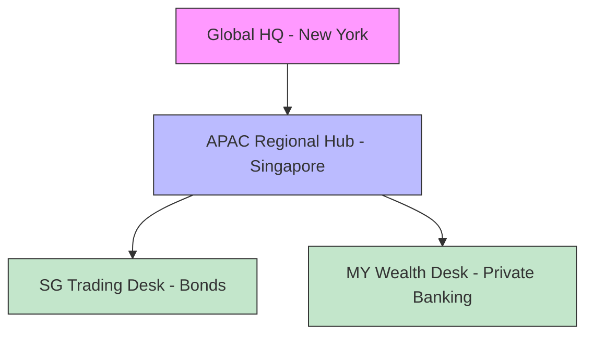
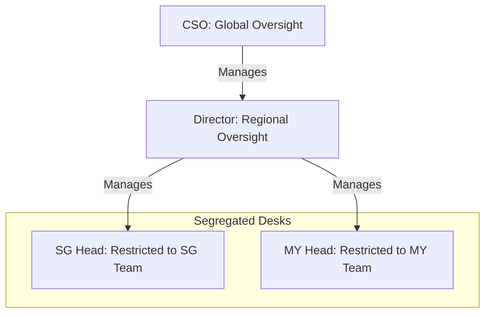

# Bank Surveillance Use Case (Enterprise)

Complete RBAC configuration for Global Bank Surveillance operations, demonstrating "2-Layer" Role-Based Access Control.

## 1. Target Organization Structure

We are modeling **Worldwide Bank**, a regulated financial institution with a hierarchical structure designed to enforce compliance and data segregation.



*   **Global HQ:** Oversight of all regions (CSO).
*   **APAC Hub:** Management of Asian markets (Regional Director).
*   **Trading Desks:** Isolated operational units (Singapore & Malaysia).

---

## 2. Role Portfolio

We define specific roles to match the bank's operational and compliance needs.

| Category | Role Name | Type | Description |
| :--- | :--- | :--- | :--- |
| **Leadership** | `surveillance_chief` | **Tenant** | C-Suite executive (CSO) with global oversight. |
| **Leadership** | `regional_director` | **Tenant** | Senior management for a specific region. |
| **Leadership** | `head_compliance` | **Tenant** | Global oversight (Head of Compliance). |
| **Desk** | `surveillance_lead` | **Team** | Runs a specific desk (e.g., Head of SG). |
| **Desk** | `surveillance_analyst` | **Team** | Standard investigator. |
| **Operations** | `operations_maker` | **Team** | Can create cases but **cannot approve**. |
| **Operations** | `operations_checker` | **Team** | Can approve cases but **cannot create**. |
| **Support** | `surveillance_ops` | **Team** | Surveillance Operations (SurvOps) - Monitors pipelines and stats. |
| **Audit** | `compliance_officer` | **Team** | Read-only regulatory oversight. |
| **External** | `guest_analyst` | **Team** | Limited read-only access for auditors. |

---

## 3. Organizational Fit (Hybrid RBAC)

We use a **Hybrid Model** to map these roles to the organization. This distinguishes between *who you are* (Tenant Role) and *what you do* (Team Role).

### The "Access Pyramid"



*   **Global Leaders (CSO/Director):** Have **Tenant-Level Roles** that grant visibility across all teams.
*   **Desk Heads:** Have the **Member** tenant role (no special power) but the **Surveillance Lead** team role. This restricts their power *strictly* to their assigned desk (Singapore vs Malaysia).

---

## 4. User Roster & Configuration

The `bank_surveillance_bulk_invite.csv` provisions **10 Users** ensuring 100% role coverage.

### A. Leadership (Global Scope)
| User | Email | **Invitation Tenant Role** | Team Role | Scope |
| :--- | :--- | :--- | :--- | :--- |
| **Susan Martinez** | `cso@worldwidebank.com` | **Surveillance Chief** | - | **ALL Data** |
| **APAC Director** | `director.apac.surv@...` | **Regional Director** | - | **ALL Data** |

> **Note:** If manual invitation UI does not show custom roles, invite as **Member** and update role via API or script.

### B. Desk Operations (Restricted Scope)
| User | Email | **Invitation Tenant Role** | Team Role | Scope |
| :--- | :--- | :--- | :--- | :--- |
| **SG Head** | `head.sg.surv@...` | **Member** | `surveillance_lead` | **SG Team Only** |
| **MY Head** | `head.my.surv@...` | **Member** | `surveillance_lead` | **MY Team Only** |
| **MY Analyst** | `analyst.my.wealth@...` | **Member** | `surveillance_analyst` | **MY Team Only** |

### C. Separation of Duties (SoD)
*These users work in the "Special Investigations" team.*

| User | Email | **Invitation Tenant Role** | Team Permission |
| :--- | :--- | :--- | :--- |
| **Maker** | `analyst.global.forensic@...` | **Member** | Can **Create**, Cannot Approve |
| **Checker** | `checker.global.forensic@...` | **Member** | Can **Approve**, Cannot Create |

---

### D. Auxiliary & Support Staff
| User | Email | **Invitation Tenant Role** | Team Role | Scope |
| :--- | :--- | :--- | :--- | :--- |
| **SurvOps** | `surv.ops.apac@...` | **Member** | `surveillance_ops` | **SG & MY Teams** |
| **MAS Liaison** | `liaison.sg.mas@...` | **Member** | `compliance_officer` | **SG Team Only** |
| **Ext. Auditor** | `guest.auditor@...` | **Viewer** | `guest_analyst` | **SG Team Only** |

---

## 5. Auxiliary Roles Mapping

Special configurations for non-business users.

### Surveillance Operations (`surv.ops.apac@...`)
*   **Mapping:** Appointed to both SG or/and MY teams.
*   **Invitation Tenant Role:** **Member**
*   **Function:** Monitoring data pipeline health, processing volumes, and failure statistics.
*   **Constraint:** Can **Manage Team Members** (for support access) and **Train Models** but strictly **No Access** to sensitive business data content (Comms, Investigations, Alerts). They focus on the **Data Ingestion Pipelines** dashboard.

### External Auditors (`guest.auditor@...` / `liaison.sg.mas@...`)
*   **Mapping:** `guest.auditor` is assigned `guest_analyst` role. `liaison.sg.mas` is `compliance_officer`.
*   **Invitation Tenant Role:** **Member** (for Liaison) or **Viewer** (for Guest).
*   **Function:** Regulatory review.
*   **Constraint:** "Least Privilege". They can see reports and case details but cannot see raw sensitive comms or PII unless explicitly authorized.

---

## 6. Permissions Matrix

### A. Surveillance Mission Operations (Business)

| Role | Comms | Investigations | Alerts | Subjects (Watchlist) | Reports | Analytics | AI Models |
| :--- | :---: | :---: | :---: | :---: | :---: | :---: | :---: |
| **Chief (CSO)** | ✅ Full | ✅ Full | ✅ Full | ✅ Full | ✅ Full | ✅ Full | ✅ Full |
| **Director** | ✅ Full | ✅ Full | ✅ Full | ✅ Approve | ✅ Full | ✅ Full | 👁️ Read |
| **Lead (STL)** | 👁️ Read | ✅ Full | ✅ Full | ✅ Approve | ✅ Full | ✅ Full | 👁️ Read |
| **Analyst (SA)** | 👁️ Read | ➕ Create | 👁️ Read | ❌ | 👁️ Read | ❌ | ❌ |
| **Maker** | 👁️ Read | ➕ Create | 👁️ Read | ➕ Create | ❌ | ❌ | ❌ |
| **Checker** | ❌ | ✅ Approve | 👁️ Read | ✅ Approve | ❌ | ❌ | ❌ |

### B. Platform & Technical Support (Separation of Duties)

| Role | Users/Teams | Roles/RBAC | Settings | Data Pipelines | AI Models | Billing | Audit Logs |
| :--- | :---: | :---: | :---: | :---: | :---: | :---: | :---: |
| **Owner (IT)** | ✅ Full | ✅ Full | ✅ Full | ❌ | ❌ | ✅ Full | ✅ Full |
| **Admin (IT)** | ✅ Full | ✅ Full | ✅ Full | ❌ | ❌ | ❌ | ✅ Full |
| **SurvOps** | ✅ Manage | ❌ | ✅ Manage | ✅ Full | ✅ Full | ❌ | 👁️ Read |
| **Chief (CSO)** | 👁️ Read | ❌ | ❌ | ✅ Full | ✅ Full | ❌ | 👁️ Read |

*Legend: ✅ Full Access, 👁️ Read Only, ➕ Create/Update Only, ❌ No Access*

---

## 7. Configuration Architecture (Base + Overlay)

The RBAC seeding system uses a **Modular "Base + Overlay" Pattern** to keep core definitions clean while allowing domain-specific customizations.

### How it works
1.  **Core Layer (Universal):** The platform loads immutable base roles (`Owner`, `Admin`, `Member`) from the core system.
2.  **Domain Layer (Specific):** The use case loads its unique roles (e.g., `Surveillance Chief`) from `tenant_roles.yaml`.
3.  **Overlay Layer (Patching):** *Optional.* The use case can inject new permissions into existing Core roles without modifying the core files.

### Why use Overlays?
Instead of redefining the `Member` role from scratch (which breaks updates), we can "patch" it.

**Example (Not used in this demo):**
If we wanted every standard **Member** to view High Priority Alerts, we would create a `tenant_permissions.yaml` overlay:
```yaml
tenant_permissions:
  member:              # Target existing Core role
    - resource: alerts # Inject new resource access
      actions: [read]
```

*Note: This specific demo relies entirely on distinct roles defined in `tenant_roles.yaml` and does not currently use overlays, hence the "No tenant permission overlays to apply" message during seeding.*

---

## 8. Specifications: Bulk Invitation Logic

Details on how the `bank_surveillance_bulk_invite.csv` is processed by the system.

### A. CSV Format
The loader expects the following columns:
| Column | Description | Mandatory? |
| :--- | :--- | :--- |
| `email` | User's email address (Must match tenant domain). | **Yes** |
| `name` | Full name (e.g., "Susan Martinez"). | No |
| `role` | **Tenant Role** (System Role). Defines "Who you are".<br>Values: `owner`, `admin`, `member`, `surveillance_chief`, etc. | **Yes** |
| `team_name`| Name of the team to join.<br>**Auto-Creation:** If the team does not exist, it is **created automatically**. | No |
| `team_role`| **Team Role** (Context Role). Defines "What you do".<br>Values: `surveillance_lead`, `surveillance_analyst`, etc.<br>Default: `team_contributor` | No |

### B. Logic Rules
1.  **Role Assignment:** The `role` column maps directly to the **Tenant Role**. This is your global badge.
2.  **Team Assignment:**
    *   **One Team Limit:** The bulk loader only supports checking into **one primary team** per invitation.
    *   **Missing Teams:** If `team_name` is "New Ops Team" and it doesn't exist, the system creates it immediately.
3.  **No Team?** If `team_name` is blank, the user is invited with *only* their Tenant Role. For `member` role, this typically means they have **Zero Access** until added to a team manually later.

### C. Multi-Team Assignment
*   **Limitation:** A user cannot be assigned to multiple teams (e.g., SG *and* MY) in a single CSV row.
*   **Workflow:**
    1.  Invite user to their **Primary Team** (e.g., SG) via CSV.
    2.  After they join, an Admin uses the **Team Members UI** to add them to secondary teams (e.g., MY).

---

## 9. FAQ

**Q: Why do we have two layers of roles (Tenant vs. Team)?**
This "2-Layer RBAC" model is crucial for enterprise banking:
1.  **Tenant Roles (The Badge):** Define *who you are* (e.g., Regional Director). These are broad, organization-wide badges.
2.  **Team Roles (The Job):** Define *what you do in a specific context* (e.g., Surveillance Lead for SG Desk).
*   *Benefit:* A "Member" (standard employee) can be a "Lead" in Singapore but have no access to Malaysia, enforcing **Chinese Walls**.

**Q: What is the difference between `owner` and `surveillance_chief`?**
*   **`owner` (IT Platform Role):** Has technical control (billing, inviting users) but **NO** access to sensitive surveillance data.
*   **`surveillance_chief` (Business Role):** Has full view of all investigations and alerts but cannot modify billing or delete the tenant.
*   *Benefit:* Enforces **Separation of Duties** (IT admins shouldn't see insider trading investigations).

**Q: What can auditors and compliance officers see?**
*   They can *create* nothing and *approve* nothing, only *audit* existing records.

**Q: Is the team structure structurally hierarchical (Nested Teams)?**
*   **Current State:** It is **Structurally Flat** but **Logically Hierarchical**. "SG Desk" and "APAC Hub" are sibling records in the database. Hierarchy is enforced by *who* is assigned *where* (e.g., Director gets "Tenant Role" visibility, Desk Head gets "Team Role" restriction).
*   **Future (Plugin Extension):** Yes! The `teams` table includes a `config_data` JSONB column. A future **"Hierarchy Plugin"** will use `config_data['parent_id']` to enable recursive permissions (e.g., "Grant access to Team X and all its children").

**Q: Why do we have `compliance_officer` in Team Roles if we have a Head of Compliance?**
*   **Head of Compliance (`head_compliance`):** A **Tenant Role** with global power. They oversee the entire bank.
*   **Compliance Liaison (`compliance_officer`):** A **Team Role** for local oversight. This corresponds to an officer physically sitting at the desk (e.g., "Singapore Desk Liaison"). They need access ONLY to that specific team's investigations, not the whole bank.

---

## 10. Usage

```bash
# 1. Reset DB and seed RBAC with bank surveillance use case
make reset-db
make b2b-seed-roles USE_CASE=bank_surveillance

# 2. Create demo tenant
make b2b-invite f=scripts/b2b/use_cases/bank_surveillance/bank_surveillance_demo.json

# 3. Log in as CSO
# Email: cso@worldwidebank.com
```

**Fixed Tenant ID:** `b5e1fa40-89f4-50c2-a3f4-4c122000beef`
 