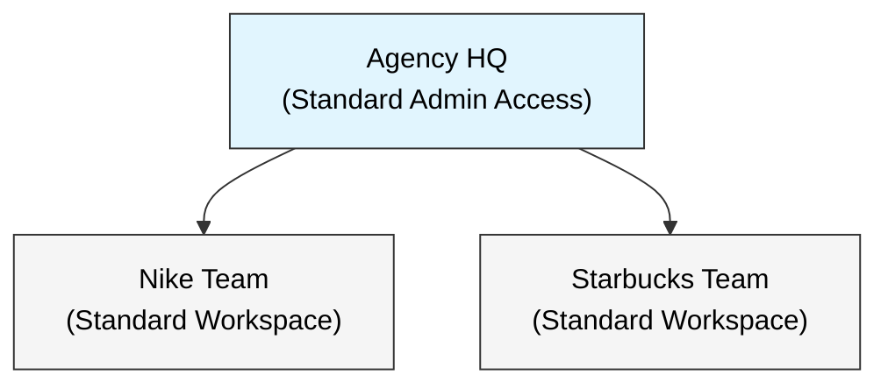

# Marketing Agency Use Case (CreativeEdge)

A standard RBAC configuration for a **Digital Marketing Agency** managing multiple client accounts. 
This use case demonstrates the **Core Platform Capabilities** without advanced compliance plugins.

## 1. Organization Structure

**CreativeEdge Agency** operates on a simple **Hub-and-Spoke** model:
1.  **Agency HQ:** Management (Owner/Admin) with visibility across all clients.
2.  **Client Teams:** Isolated workspaces for each client (e.g., "Nike Team", "Starbucks Team").



---

## 2. Role Portfolio

Standard SaaS roles. No complex "Clearance Levels" or "Geographic Restrictions".

| Category | Role Name | Type | Description |
| :--- | :--- | :--- | :--- |
| **Admin** | `agency_owner` | **Tenant** | Full Admin. Manages billing & users. |
| **Manager** | `account_manager` | **Team** | Team Lead. Can invite members to their team. |
| **Staff** | `creative_lead` | **Team** | Senior Contributor (Can Edit/Publish). |
| **Staff** | `content_writer` | **Team** | Standard Contributor (Can Edit). |
| **Client** | `guest_review` | **Team** | Read-only access for clients. |

---

## 3. Operational Model (Standard 2-Layer RBAC)

This use case uses the **Default Platform Behavior**:

1.  **Tenant Role:** Determines if you can manage the *Subscriber Account* (e.g., invite users, pay bills).
2.  **Team Role:** Determines what you can do within a *Workspace* (e.g., edit campaigns).

**Why no plugins?**
*   No need for "Top Secret" clearance (everyone in the team trusts each other).
*   No need for "Geo-Fencing" (teams are separated by standard workspace boundaries).

---

## 4. User Roster

| User | Email | Tenant Role | Team Role | Team Context |
| :--- | :--- | :--- | :--- | :--- |
| **Jennifer (CEO)** | `jennifer@creativeedge.com` | `agency_owner` | - | All Teams |
| **Sarah (Mgr)** | `sarah.mgr@creativeedge.com` | `member` | `account_manager` | Nike Team |
| **Dave (Writer)** | `dave.writer@creativeedge.com` | `member` | `content_writer` | Nike Team |
| **Guest (Client)** | `cmo@nike.com` | `guest` | `guest_review` | Nike Team |

---

## 5. Usage

```bash
# 1. Reset and Seed
make reset-db
make b2b-seed-roles USE_CASE=marketing_agency

# 2. Invite Users
make b2b-invite f=scripts/b2b/use_cases/marketing_agency/marketing_agency_demo.json
```

**Fixed Tenant ID:** `c6f2ea50-92a5-51d3-b4e5-5d233111cafe`
