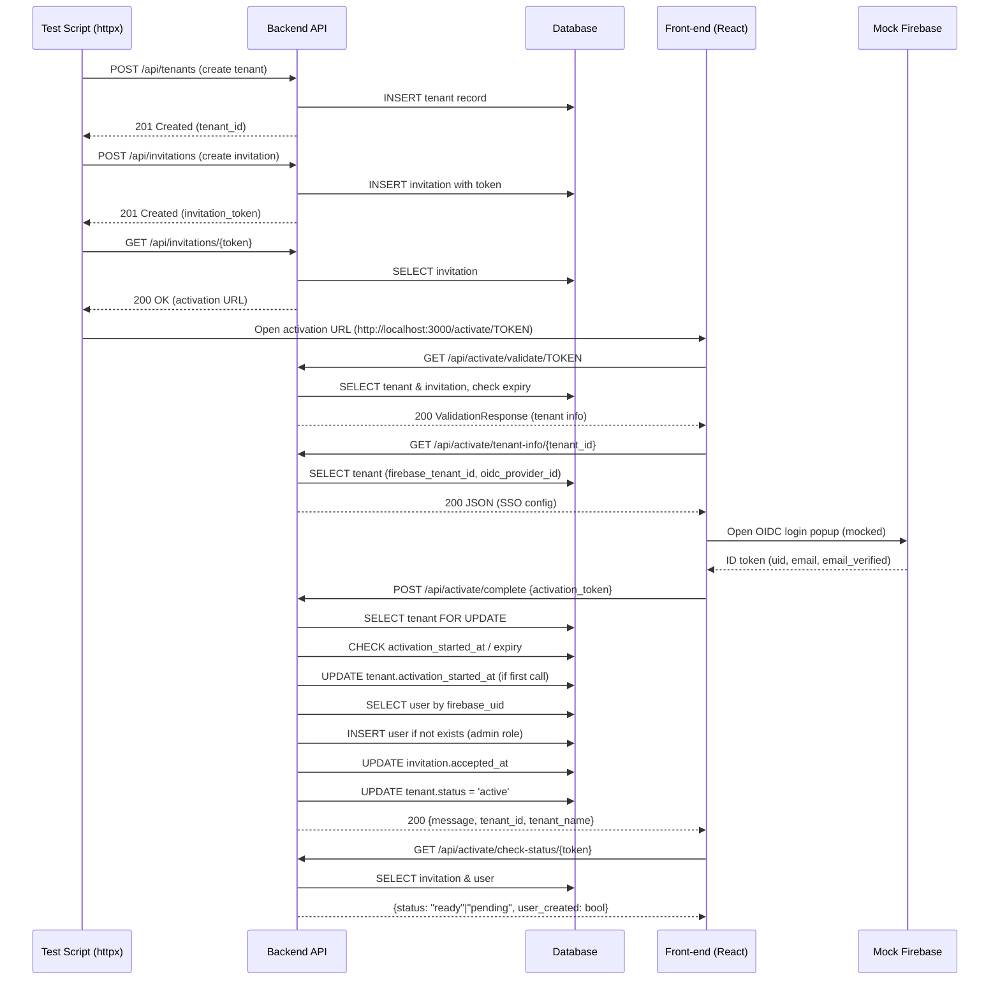
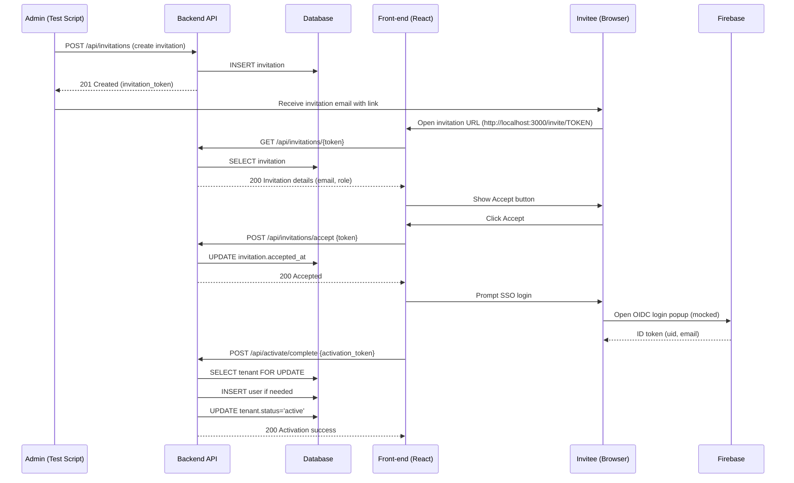

# API Sequence – Tenant On‑boarding & Invite‑User Flow

## Overview
This document describes, step‑by‑step, the **HTTP API calls** that make up the tenant activation (on‑boarding) flow and the invitation‑acceptance flow, and explains **what each endpoint does internally** (router logic → service layer → DB changes).

---

## Mermaid diagram (high‑level flow)

---

## Mermaid diagram – Invite‑User Flow

---

## Detailed step‑by‑step API sequence

### 1. **Create Tenant**
- **Endpoint**: `POST /api/tenants`
- **Router**: `app/routers/tenants.py` (not shown here but follows same pattern as other routers)
- **Service**: `tenant_service.create_tenant`
- **DB actions**: `INSERT` into `tenants` table, generates `tenant_id`, `activation_token`, `activation_expires_at`.
- **Response**: `{ "tenant_id": "<uuid>", "activation_token": "<token>" }`

### 2. **Create Invitation**
- **Endpoint**: `POST /api/invitations`
- **Router**: `app/routers/invitations.py`
- **Service**: `invitation_service.create_invitation`
- **DB actions**: `INSERT` into `invitations` with `email`, `role`, `invitation_token` (linked to tenant).
- **Response**: `{ "invitation_token": "<token>" }`

### 3. **Fetch Activation URL** (used by the test script to simulate the email link)
- **Endpoint**: `GET /api/invitations/{token}`
- **Router**: `app/routers/invitations.py`
- **Service**: `invitation_service.get_invitation_by_token`
- **DB actions**: `SELECT` invitation, compose URL `http://localhost:3000/activate/{token}`.
- **Response**: `{ "activation_url": "http://..." }`

### 4. **Validate Activation Token** (first front‑end request when user clicks the link)
- **Endpoint**: `GET /api/activate/validate/{token}`
- **Router**: `app/routers/activation.py` → `validate_activation_token`
- **Internal flow**:
  1. `tenant_service.get_tenant_by_activation_token` → fetch tenant.
  2. Verify token exists, not expired, tenant not already active.
  3. `invitation_service.get_invitation_by_token` → fetch admin email.
  4. Return `ActivationValidationResponse` (tenant_id, name, domain, admin_email, expires_at).
- **DB actions**: `SELECT` tenant & invitation, no writes.

### 5. **Retrieve SSO Configuration** (front‑end needs Firebase tenant & OIDC provider)
- **Endpoint**: `GET /api/activate/tenant-info/{tenant_id}`
- **Router**: `app/routers/activation.py` → `get_tenant_for_activation`
- **Internal flow**:
  1. `tenant_service.get_tenant_by_id` → fetch tenant.
  2. Return JSON with `firebase_tenant_id` and `oidc_provider_id`.
- **DB actions**: `SELECT` tenant.

### 6. **Complete Activation** (after successful SSO login)
- **Endpoint**: `POST /api/activate/complete`
- **Router**: `app/routers/activation.py` → `complete_activation`
- **Internal flow**:
  1. **Row lock** – `SELECT ... FOR UPDATE` on `TenantModel` using the activation token.
  2. **Replay protection** – check `activation_started_at`; if not set, set it now.
  3. **User lookup** – `user_service.get_user_by_firebase_uid` using `uid` from the Firebase mock token.
  4. **Role check** – ensure the user has `admin` role.
  5. **Accept invitation** – `invitation_service.accept_invitation` updates `accepted_at`.
  6. **Activate tenant** – `tenant_service.activate_tenant` sets `activation_status='active'` and records `activated_at`.
  7. Commit transaction and return success payload.
- **DB actions**: `SELECT ... FOR UPDATE`, possible `INSERT` of user (if not present), `UPDATE` invitation, `UPDATE` tenant.

### 7. **Poll Activation Status** (front‑end polls until SSO login creates the user)
- **Endpoint**: `GET /api/activate/check-status/{token}`
- **Router**: `app/routers/activation.py` → `check_activation_status`
- **Internal flow**:
  1. Fetch tenant & invitation.
  2. Query `users` table for a record matching the invitation email and `is_active=True`.
  3. Return `{status: "ready", user_created: true}` when the user exists, otherwise `{status: "pending"}`.
- **DB actions**: `SELECT` tenant, invitation, and user.

---

## Where the code lives
| Component | File | Responsibility |
|-----------|------|----------------|
| **Router** | `app/routers/activation.py` | HTTP endpoint definitions, request validation, response models |
| **Tenant service** | `app/services/tenant_service.py` | DB CRUD for tenants, token generation, activation logic |
| **Invitation service** | `app/services/invitation_service.py` | Create/accept invitations, token handling |
| **User service** | `app/services/user_service.py` | Lookup/create users based on Firebase UID |
| **Auth middleware** | `app/middleware/auth.py` | Extracts Firebase mock token, provides `current_user` dependency |
| **Test helpers** | `backend/tests/conftest.py` & `backend/tests/integration/` | `create_test_tenant`, `create_test_invitation` factories used by the test suite |

---

## Quick reference table (API → Service → DB)
| HTTP Method & Path | Service called | DB operation |
|---------------------|----------------|--------------|
| `POST /api/tenants` | `tenant_service.create_tenant` | `INSERT tenants` |
| `POST /api/invitations` | `invitation_service.create_invitation` | `INSERT invitations` |
| `GET /api/invitations/{token}` | `invitation_service.get_invitation_by_token` | `SELECT invitation` |
| `GET /api/activate/validate/{token}` | `tenant_service.get_tenant_by_activation_token` + `invitation_service.get_invitation_by_token` | `SELECT tenant`, `SELECT invitation` |
| `GET /api/activate/tenant-info/{tenant_id}` | `tenant_service.get_tenant_by_id` | `SELECT tenant` |
| `POST /api/activate/complete` | `tenant_service.activate_tenant`, `invitation_service.accept_invitation`, `user_service.get_user_by_firebase_uid` | `SELECT … FOR UPDATE`, possible `INSERT user`, `UPDATE invitation`, `UPDATE tenant` |
| `GET /api/activate/check-status/{token}` | `invitation_service.get_invitation_by_token`, `user_service.get_user_by_firebase_uid` | `SELECT invitation`, `SELECT user` |

---

## How to extend / customise
1. **Add extra validation** – modify `validate_activation_token` to also check tenant‑level feature flags.
2. **Support multi‑step SSO** – expose additional endpoint to fetch OIDC discovery metadata.
3. **Audit logging** – hook into `tenant_service.activate_tenant` to write an audit record (already present in `app/services/tenant_service.py`).

---

*Document generated on 2025‑11‑27.  Keep this file in `docs/` and reference it from the onboarding README.*
