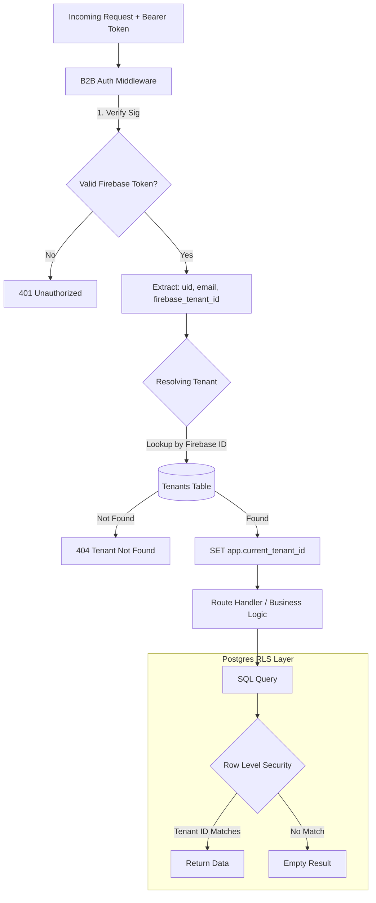
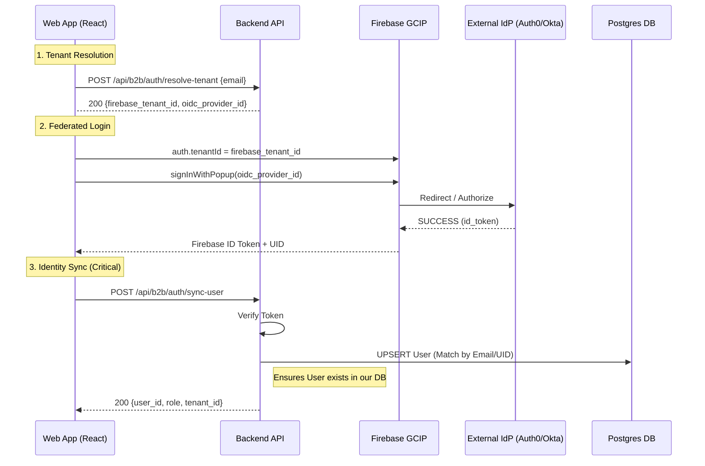
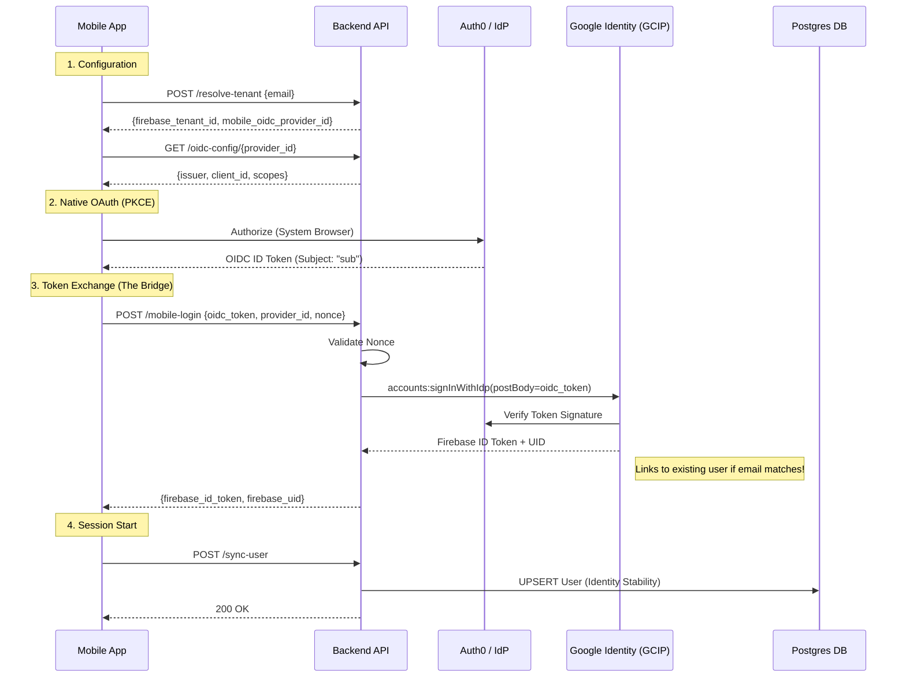
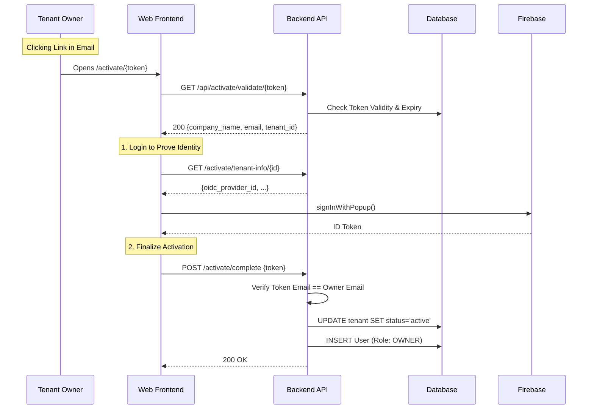

# Authentication Architecture

**Audience:** Mobile Developers, Backend Engineers, Architects

This document serves as the **Single Source of Truth** for authentication in the Enterprise SSO system. It details how identity is established, verified, and linked across Web and Mobile platforms, and how Multi-Tenant Isolation (RLS) is enforced.

---

## 1. Core Principles 🛡️

1.  **Identity Federation**: We adhere to the **"One Identity"** rule. Users have a single canonical identity (Email) regardless of login method (Web OIDC vs Mobile Native).
2.  **Stable Anchors**: `firebase_uid` is the stable anchor for DB records. It persists even if metadata changes.
3.  **Tenant Isolation**: Authentication != Authorization. A valid user must also have a valid **Tenant Context** to access data.

### Request Lifecycle ("The Traffic Cop")

Every request follows this specialized middleware pipeline:

---

## 2. Web Application Authentication 💻

The Web App utilizes the standard **Firebase Identity Platform (GCIP)** SDK flow. This is a "Client-Side Driven" flow where the browser handles the handshake.

### Web Login Sequence

---

## 3. Mobile Native Authentication 📱

Mobile Apps **cannot** use the Web SDK's popup flow. They use a **Native OIDC Flow** combined with a **Server-Side Token Exchange**.

> **Architecture Note:** Mobile often requires a separate OIDC Client ID (Bundle ID vs Web Origin). We support separate `oidc_provider_id` configurations for this valid use case to prevent Audience Mismatch errors.

### Mobile Login Sequence

### Identity Linking Details
*   **Problem**: Mobile login comes from a different OIDC Client ID than Web.
*   **Solution**: GCIP treats them as two providers, but **Atomically Links them** into a single `firebase_uid` because the **Email Address** matches.
*   **Result**: A user can log in on Web, then Mobile, and share the exact same User ID and Data.

---

## 4. Tenant Activation & Onboarding Flow 🚀

This is the flow where a "Pending" tenant becomes "Active" via the owner's first action.

---

## 5. Security & Isolation

### Common Attacks & Defenses

| Attack Vector | Our Defense | Implementation |
|---------------|-------------|----------------|
| **Tenant Hopping** | **Token-Based RLS** | RLS Policy: `Using current_setting('app.current_tenant_id')` ensures query *physically cannot* see other rows. |
| **Identity Spoofing** | **Signature Verification** | `firebase_admin.verify_id_token()` checks cryptographic signature on every request. |
| **Audience Mismatch** | **Nonce Validation** | Mobile flow enforces `nonce` to prevent replay attacks during token exchange. |
| **Dangling Users** | **Soft Deletes** | `deleted_at` column + filtered indices ensure no zombie access. |

### Role Based Access Control (RBAC)
Roles are stored in Postgres (`b2b.roles`) but enforced in Application Logic.
*   **Frontend**: `useAuth()` hook checks permisssions.
*   **Backend**: `User` object injected into route handlers contains `role` slug.

---

**Related Documents:**
*   [Multi-Tenant Isolation](./multi-tenant-isolation.md)
*   [Tenant Onboarding](./tenant-onboarding-flow.md)
