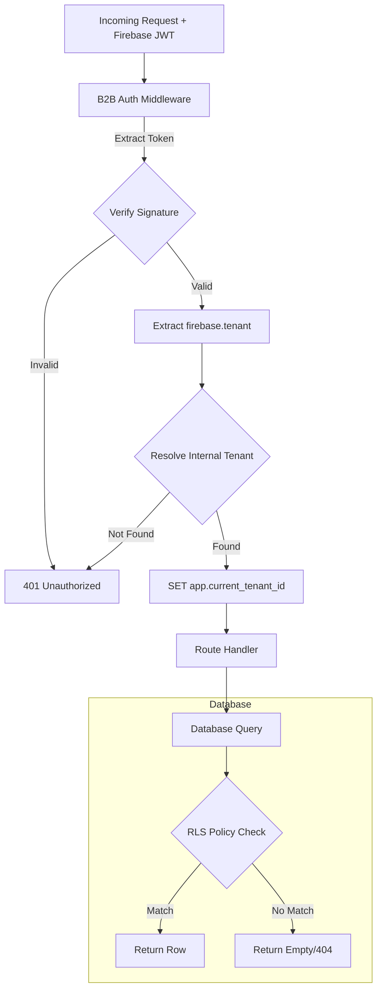
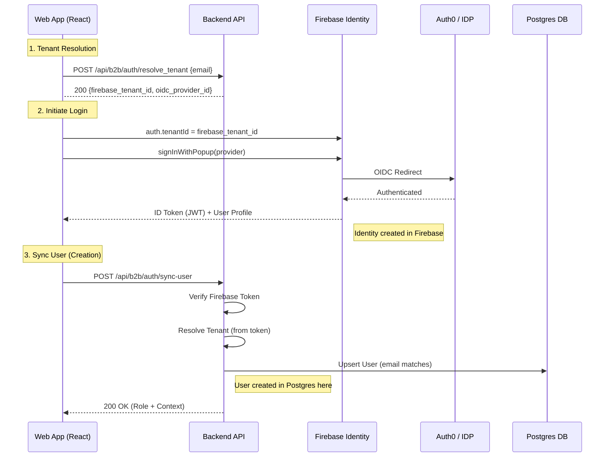
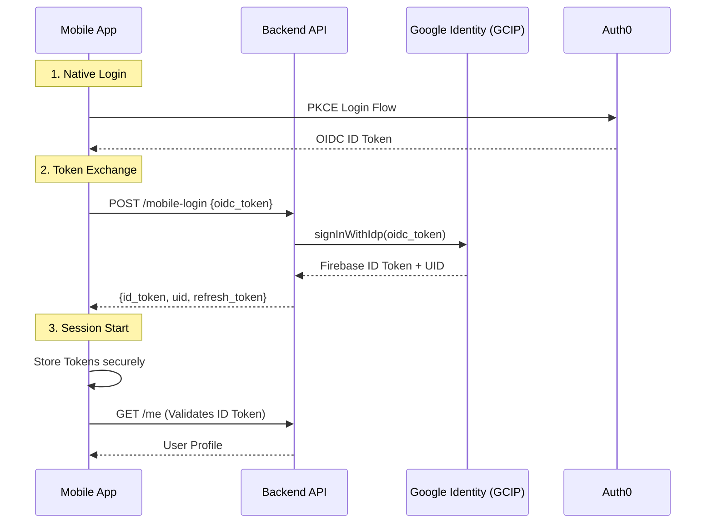

# Authentication Architecture

**Audience:** Mobile Developers, Backend Engineers

This document details the authentication flows for both Web and Mobile clients, focusing on how the backend establishes identity and isolation context before processing requests.

---

## 1. Request Lifecycle ("The Traffic Cop") 🛡️

Every incoming request must be validated and routed to the correct tenant context **before** it reaches the business logic.

### Key Components
-   **Firebase JWT**: Contains `firebase.tenant` (external ID).
-   **Tenant Resolution**: Maps external `firebase_tenant_id` → internal UUID.
-   **RLS Context**: `app.current_tenant_id` is set *per request*, ensuring all DB queries are automatically scoped.

## 2. Web Application Authentication 💻

The Web App follows the standard **Firebase Identity Platform (GCIP)** flow using the Firebase JS SDK.

### Web Login Sequence

### Key Differences from Mobile
-   **Client-Side Driven**: The browser handles the entire OAuth handshake via Firebase SDK.
-   **Firebase-Issued Tokens**: The ID Token is signed directly by Firebase.
-   **Identity Creation**: Occurs immediately when user completes IDP login flow.

---

## 3. Mobile Native Authentication 📱

Mobile apps cannot use the standard Firebase Web SDK's popup/redirect flow. Instead, they use a "Native" flow involving **Auth0** and **GCIP Token Exchange**.

### Architecture Comparison

| Aspect | Web | Mobile Native |
|--------|-----|---------------|
| **OAuth Flow** | Firebase GCIP handles OIDC | Direct Auth0 OAuth + GCIP Token Exchange |
| **Firebase Token** | GCIP issues token after popup | GCIP issues token after `signInWithIdp` |
| **Tenant API** | Browser popup with tenant set | `auth().setTenantId()` async method |
| **User Identity** | GCIP-generated UID | GCIP-generated UID (Same as Web) |

### Mobile Login Sequence

### Integration Notes
-   **Endpoint**: `POST /api/b2b/auth/mobile-login`
-   **Client Lib**: `react-native-app-auth`
-   **React Native**: Must use `await auth().setTenantId(id)` **method**, then use the ID Token directly (or sign in with credential if needed, but managing the token manually is often easier with this flow).

---

## 4. Email-Based User Identity

To ensure users are recognized as the **same identity** across Web (Firebase UID) and Mobile (Custom UID), we use **Email** as the canonical identifier.

| Platform | UID Generation | Example UID |
|----------|----------------|-------------|
| **Web** | Firebase GCIP | `oidc.auth0-company:auth0\|abc123...` |
| **Mobile** | Custom Token | `oidc-john_acme_com` |

**Resolution Logic**:
1.  Backend looks up user by `(tenant_id, email)`.
2.  Updates `firebase_uid` to match the *current* login method.

### Identity Creation Strategy

Since we support both Web (standard OIDC) and Mobile (Native Auth0), the creation of the **Firebase User Record** happens at different times:

| Scenario | Trigger | Identity Created In Firebase | Backend User Created |
|----------|---------|------------------------------|----------------------|
| **Web Login** | User completes SSO Popup | **Immediately** (Client-side via GCIP) | At `/sync-user` call |
| **Mobile Login** | App exchanges Auth0 token | **Delayed** (Upon first `signInWithCustomToken`) | At `/mobile-login` (implicit) |
| **Web Invite** | User accepts & logs in | **Before Join** (Must login to accept) | At `/join` call |
| **Mobile Invite** | User deep-links & logs in | **After Token Exchange** | At `/join` call |

**Crucial Logic**: The backend treats **Email** as the immutable identifier. 

### Why this architecture is robust:
-   **Stable Identifiers**: By using the **Identity Toolkit API (`signInWithIdp`)** on the backend for mobile logins, we exchange the external OIDC token for a **First-Class Firebase ID Token**. 
-   **Automatic Account Linking**: GCIP automatically links the mobile login to the existing web account if the emails match.
-   **Session Continuity**: The returned Firebase UID is the **same** as the Web UID. This means a user can be logged in on both Web and Mobile simultaneously without invalidating either session. The 1:1 `users.firebase_uid` mapping in Postgres remains valid and sufficient.
