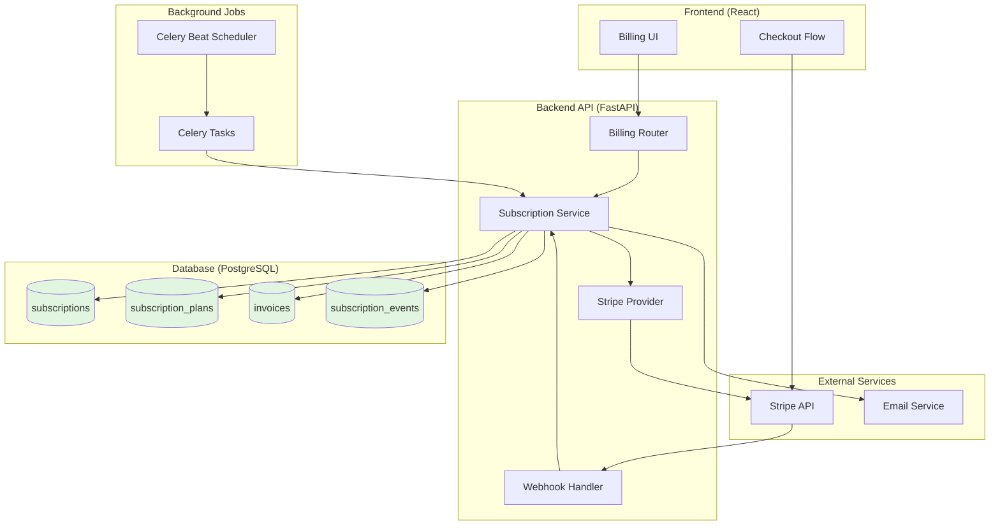
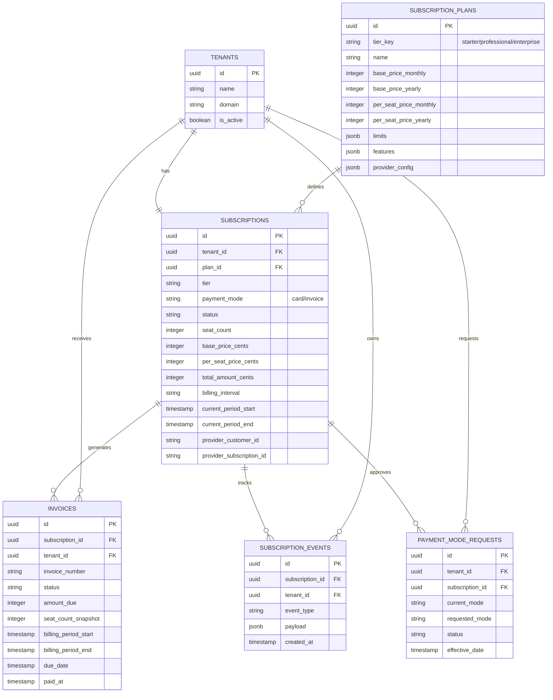
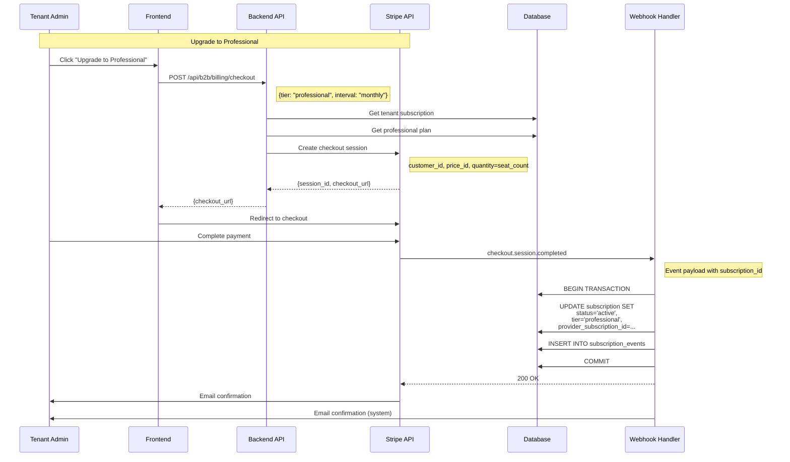
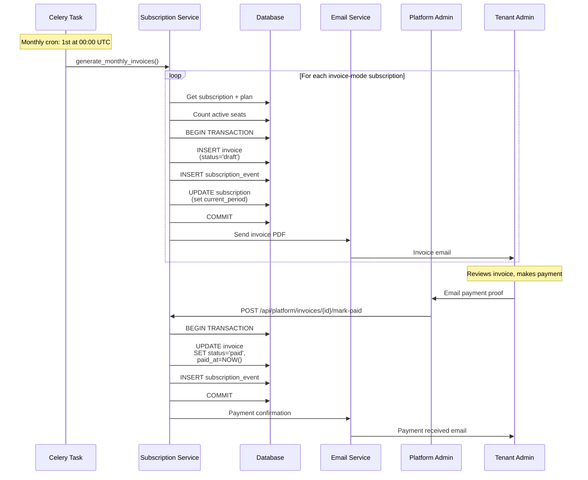
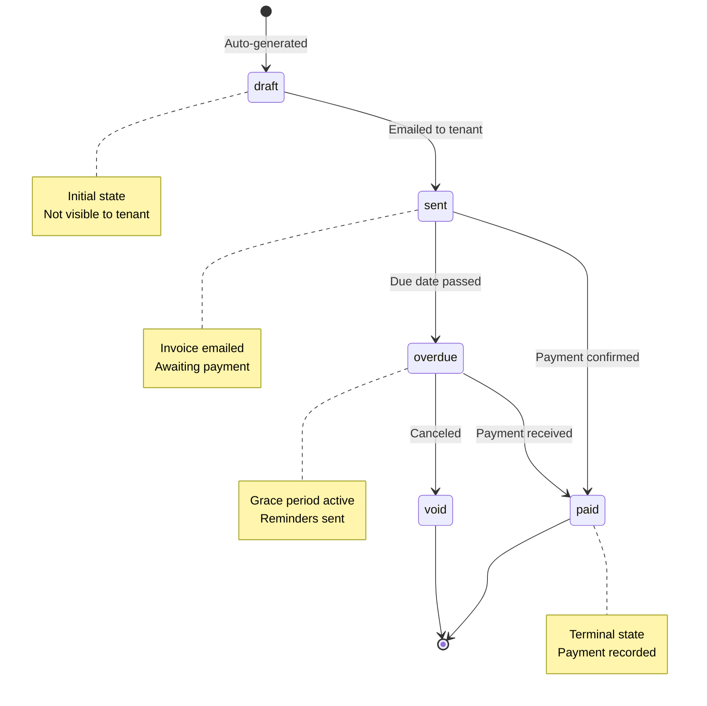

# B2B Subscription & Billing Architecture

**Audience:** Backend Engineers, Architects, DevOps

This document provides comprehensive technical details on the B2B subscription and billing system, including data models, payment flows, Stripe integration, invoice generation, and operational procedures.

For high-level business requirements, see [Subscription Specification](../../specifications/b2b/subscription.md).

---

## Table of Contents

1. [Architecture Overview](#architecture-overview)
2. [Data Model](#data-model)
3. [Pricing Engine](#pricing-engine)
4. [Payment Flows](#payment-flows)
5. [Webhook Handling](#webhook-handling)
6. [Invoice Management](#invoice-management)
7. [Security & RLS](#security--rls)
8. [Operational Procedures](#operational-procedures)

---

## Architecture Overview

### System Components



### Design Principles

1. **Tenant Isolation** - Each tenant has exactly one active subscription
2. **Dual Payment Modes** - Card (Stripe) and Invoice (Manual) support
3. **Seat-Based Pricing** - Base price + per-seat pricing model
4. **Audit Trail** - All subscription changes logged in `subscription_events`
5. **RLS Enforcement** - Postgres policies prevent cross-tenant access
6. **Idempotency** - Webhook handlers are idempotent via event deduplication

---

## Data Model

### Entity Relationship Diagram



### Table Details

#### `b2b.subscription_plans`

**Purpose:** Catalog of subscription tiers with pricing and feature configuration.

**Key Fields:**
- `tier_key` - Logical identifier (e.g., "starter", "professional", "enterprise")
- `base_price_monthly/yearly` - Fixed monthly/yearly cost in cents
- `per_seat_price_monthly/yearly` - Per-user cost in cents
- `limits` - JSONB containing feature limits (e.g., `{"projects": 100, "storage_gb": 50}`)
- `features` - JSONB containing boolean feature flags (e.g., `{"sso": true, "audit_logs": true}`)
- `provider_config` - JSONB with Stripe price IDs (e.g., `{"stripe": {"monthly_price_id": "price_..."}`)
- `contact_required` - If true, displays "Contact Us" instead of checkout button (Enterprise tier)

**Example Data:**
```json
{
  "tier_key": "professional",
  "name": "Professional",
  "base_price_monthly": 5000,  // $50.00
  "per_seat_price_monthly": 2000,  // $20.00
  "limits": {
    "projects": 100,
    "storage_gb": 50,
    "api_calls_per_month": 100000
  },
  "features": {
    "sso": true,
    "audit_logs": true,
    "team_management": true,
    "saml": false
  },
  "provider_config": {
    "stripe": {
      "monthly_price_id": "price_professional_monthly",
      "yearly_price_id": "price_professional_yearly"
    }
  }
}
```

#### `b2b.subscriptions`

**Purpose:** Active subscription record for each tenant.

**Key Fields:**
- `tenant_id` - UNIQUE constraint ensures one subscription per tenant
- `plan_id` - Links to subscription_plans (database-driven pricing)
- `tier` - Denormalized for quick access ("starter", "professional", "enterprise")
- `payment_mode` - "card" or "invoice"
- `status` - "active", "canceled", "past_due", "trialing", "incomplete"
- `seat_count` - Current active user count (recalculated daily)
- `base_price_cents` - Cached from plan for performance
- `per_seat_price_cents` - Cached from plan for performance
- `total_amount_cents` - Computed: base + (seat_count × per_seat)
- `provider_customer_id` - Stripe customer ID
- `provider_subscription_id` - Stripe subscription ID

**Lifecycle:**
1. Created during tenant onboarding (default: starter tier)
2. Updated during upgrades/downgrades
3. Soft-deleted on cancellation (archived, not dropped)

#### `b2b.invoices`

**Purpose:** Billing invoices for both card and invoice payment modes.

**Key Fields:**
- `invoice_number` - Human-readable ID (e.g., "INV-202401-UUID")
- `status` - "draft", "sent", "paid", "overdue", "void"
- `seat_count_snapshot` - Frozen seat count at generation time (prevents disputes)
- `base_price_snapshot_cents` - Frozen pricing at generation time
- `per_seat_price_snapshot_cents` - Frozen pricing at generation time
- `provider` - "stripe" (webhook-created) or "manual" (system-generated)
- `provider_invoice_id` - Stripe invoice ID (if applicable)

**Generation Triggers:**
1. **Card Mode:** Stripe webhook creates invoice on billing cycle
2. **Invoice Mode:** Celery task generates on 1st of month

#### `b2b.subscription_events`

**Purpose:** Immutable audit trail for compliance and debugging.

**Event Types:**
- `subscription.created`
- `subscription.upgraded`
- `subscription.downgraded`
- `subscription.canceled`
- `subscription.reactivated`
- `payment.succeeded`
- `payment.failed`
- `payment_mode.changed`
- `seat_count.recalculated`

**Payload Example:**
```json
{
  "from_tier": "starter",
  "to_tier": "professional",
  "from_payment_mode": "card",
  "to_payment_mode": "card",
  "triggered_by_user_id": "uuid",
  "stripe_event_id": "evt_...",
  "timestamp": "2024-01-15T10:30:00Z"
}
```

#### `b2b.payment_mode_requests`

**Purpose:** Approval workflow for switching between card ↔ invoice payments.

**Workflow:**
1. Tenant admin requests change via API
2. Platform admin reviews request
3. Admin approves/rejects
4. If approved, change applied at next billing period

**Status Flow:**
```
pending → approved → scheduled → applied
        ↓
      rejected
```

---

## Pricing Engine

### Seat-Based Calculation

**Formula:**
```python
total_monthly_cost = base_price + (active_seat_count × per_seat_price)
```

**Example (Professional tier, 15 users):**
```python
base_price = $50.00
per_seat_price = $20.00
seat_count = 15

total = $50 + (15 × $20) = $350/month
```

### Yearly Billing Discount

**Formula:**
```python
yearly_cost = monthly_cost × 10  # 2 months free
```

**Example:**
```python
monthly = $350
yearly = $350 × 10 = $3,500/year
# Effective discount: $700 (16.7%)
```

### Seat Count Recalculation

**Daily Automated Task** (Celery Beat):
```python
# Scheduled: Daily at 02:00 UTC
@celery_app.task
def recalculate_seat_counts():
    """Update seat counts for all active subscriptions"""
    for subscription in get_active_subscriptions():
        # Count active users
        seat_count = count_active_users(subscription.tenant_id)
        
        # Update subscription
        subscription.seat_count = seat_count
        subscription.total_amount_cents = calculate_total(
            subscription.base_price_cents,
            subscription.per_seat_price_cents,
            seat_count
        )
        
        # Log event
        log_event(subscription, "seat_count.recalculated", {
            "old_count": subscription.seat_count,
            "new_count": seat_count
        })
```

**Seat Counting Rules:**
1. Only users with `is_active = true`
2. Excludes deactivated users
3. Freezes at invoice generation time (immutable snapshot)

### Prorated Billing (Future Enhancement)

**Mid-Period Upgrade:**
```python
days_remaining = (period_end - today).days
days_total = (period_end - period_start).days
proration_factor = days_remaining / days_total

upgrade_credit = (new_price - old_price) × proration_factor
```

---

## Payment Flows

### Card Payment Flow (Stripe)



**API Endpoint:**
```python
@router.post("/checkout")
async def create_checkout_session(
    request: CheckoutRequest,
    current_user: dict = Depends(get_current_active_user),
    db: AsyncSession = Depends(get_db)
):
    """Create Stripe Checkout session for subscription upgrade"""
    
    # Get tenant's current subscription
    subscription = await get_subscription(db, current_user['tenant_id'])
    
    # Get target plan
    plan = await get_plan_by_tier(db, request.tier)
    
    # Calculate quantity (seat count)
    seat_count = await count_active_users(db, current_user['tenant_id'])
    
    # Create Stripe checkout session
    session = await stripe_provider.create_checkout_session(
        customer_id=subscription.provider_customer_id,
        price_id=plan.provider_config['stripe'][f'{request.interval}_price_id'],
        quantity=seat_count,
        success_url=f"{frontend_url}/billing/success",
        cancel_url=f"{frontend_url}/billing"
    )
    
    return {"checkout_url": session.url}
```

### Invoice Payment Flow (Manual)



**Invoice Generation Code:**
```python
@celery_app.task
def auto_generate_monthly_invoices():
    """Celery task: Generate invoices for all invoice-mode subscriptions"""
    
    subscriptions = get_invoice_mode_subscriptions(status="active")
    
    for subscription in subscriptions:
        # Get plan for pricing
        plan = get_plan(subscription.plan_id)
        
        # Freeze seat count
        seat_count = subscription.seat_count
        
        # Calculate amount
        amount_due = calculate_total(
            plan.base_price_monthly,
            plan.per_seat_price_monthly,
            seat_count
        )
        
        # Generate invoice
        invoice = create_invoice(
            subscription_id=subscription.id,
            tenant_id=subscription.tenant_id,
            invoice_number=generate_invoice_number(subscription.tenant_id),
            amount_due=amount_due,
            seat_count_snapshot=seat_count,
            base_price_snapshot_cents=plan.base_price_monthly,
            per_seat_price_snapshot_cents=plan.per_seat_price_monthly,
            billing_period_start=now(),
            billing_period_end=now() + timedelta(days=30),
            due_date=now() + timedelta(days=30),
            status="sent"
        )
        
        # Send email
        send_invoice_email(subscription.tenant_id, invoice)
        
        # Log event
        log_event(subscription, "invoice.generated", {
            "invoice_id": invoice.id,
            "amount_due": amount_due,
            "seat_count": seat_count
        })
```

---

## Webhook Handling

### Stripe Webhook Configuration

**Endpoint:** `POST /api/b2b/billing/webhooks/stripe`

**Security:**
```python
@router.post("/webhooks/stripe")
async def stripe_webhook(
    request: Request,
    stripe_signature: str = Header(None, alias="Stripe-Signature")
):
    """Handle Stripe webhook events"""
    
    # Verify signature
    payload = await request.body()
    event = stripe.Webhook.construct_event(
        payload, stripe_signature, settings.stripe_webhook_secret
    )
    
    # Handle event
    await handle_stripe_event(event)
    
    return {"status": "success"}
```

### Event Handlers

#### `checkout.session.completed`

**Trigger:** User completes Stripe Checkout

**Action:**
1. Create or update Stripe customer
2. Create Stripe subscription
3. Update database subscription record
4. Send confirmation email

```python
async def handle_checkout_completed(event):
    session = event['data']['object']
    
    # Extract metadata
    tenant_id = session['metadata']['tenant_id']
    tier = session['metadata']['tier']
    
    # Update subscription
    subscription = await get_subscription_by_tenant(tenant_id)
    subscription.tier = tier
    subscription.status = "active"
    subscription.provider_subscription_id = session['subscription']
    subscription.provider_customer_id = session['customer']
    subscription.current_period_start = datetime.fromtimestamp(session['created'])
    
    await db.commit()
    
    # Log event
    await log_event(subscription, "subscription.created", {
        "stripe_event_id": event['id'],
        "tier": tier
    })
    
    # Send email
    await send_email("subscription_activated", tenant_id)
```

#### `invoice.payment_succeeded`

**Trigger:** Stripe successfully charges recurring payment

**Action:**
1. Mark invoice as paid
2. Update subscription period
3. Send payment confirmation

```python
async def handle_invoice_paid(event):
    stripe_invoice = event['data']['object']
    
    # Find our invoice
    invoice = await get_invoice_by_provider_id(stripe_invoice['id'])
    
    # Mark as paid
    invoice.status = "paid"
    invoice.paid_at = datetime.fromtimestamp(stripe_invoice['status_transitions']['paid_at'])
    
    await db.commit()
    
    # Log event
    await log_event(invoice.subscription, "payment.succeeded", {
        "invoice_id": invoice.id,
        "amount_paid": stripe_invoice['amount_paid']
    })
```

#### `invoice.payment_failed`

**Trigger:** Stripe payment attempt fails

**Action:**
1. Update subscription status to "past_due"
2. Send payment failure notification
3. Initiate dunning process (future)

```python
async def handle_payment_failed(event):
    stripe_invoice = event['data']['object']
    subscription_id = stripe_invoice['subscription']
    
    # Update subscription
    subscription = await get_subscription_by_provider_id(subscription_id)
    subscription.status = "past_due"
    
    await db.commit()
    
    # Log event
    await log_event(subscription, "payment.failed", {
        "stripe_invoice_id": stripe_invoice['id'],
        "attempt_count": stripe_invoice['attempt_count']
    })
    
    # Send email
    await send_email("payment_failed", subscription.tenant_id)
```

### Idempotency

**Problem:** Webhooks may be delivered multiple times.

**Solution:** Event deduplication using `provider_event_id`:

```python
async def handle_stripe_event(event):
    # Check if already processed
    existing = await db.execute(
        select(B2BSubscriptionEvent)
        .where(B2BSubscriptionEvent.provider_event_id == event['id'])
    )
    
    if existing.scalar_one_or_none():
        logger.info(f"Event {event['id']} already processed, skipping")
        return
    
    # Process event
    await process_event(event)
    
    # Record in audit log
    await create_event(
        provider="stripe",
        provider_event_id=event['id'],
        event_type=event['type'],
        payload=event
    )
```

---

## Invoice Management

### Invoice Number Format

**Pattern:** `INV-{YYYYMM}-{SHORT_TENANT_ID}`

**Example:** `INV-202401-ABCD1234`

```python
def generate_invoice_number(tenant_id: UUID, billing_month: datetime) -> str:
    """Generate unique invoice number"""
    year_month = billing_month.strftime("%Y%m")
    tenant_short = str(tenant_id).replace("-", "")[:8].upper()
    return f"INV-{year_month}-{tenant_short}"
```

### Invoice Status Transitions



### Invoice PDF Generation (Future)

**Planned Implementation:**
```python
from weasyprint import HTML

async def generate_invoice_pdf(invoice_id: UUID) -> bytes:
    """Generate PDF invoice from HTML template"""
    
    invoice = await get_invoice(invoice_id)
    
    # Render HTML template
    html = render_template("invoice.html", invoice=invoice)
    
    # Convert to PDF
    pdf = HTML(string=html).write_pdf()
    
    # Upload to S3
    url = await s3_client.upload(f"invoices/{invoice_id}.pdf", pdf)
    
    # Update invoice
    invoice.invoice_pdf_url = url
    await db.commit()
    
    return pdf
```

---

## Security & RLS

### Row-Level Security Policies

**All subscription tables enforce tenant isolation:**

```sql
-- b2b.subscriptions policy
CREATE POLICY tenant_isolation ON b2b.subscriptions
FOR ALL TO sso_user
USING (tenant_id::text = current_setting('app.current_tenant_id', true));

-- b2b.invoices policy  
CREATE POLICY tenant_isolation ON b2b.invoices
FOR ALL TO sso_user
USING (tenant_id::text = current_setting('app.current_tenant_id', true));

-- b2b.subscription_events policy
CREATE POLICY tenant_isolation ON b2b.subscription_events
FOR ALL TO sso_user
USING (tenant_id::text = current_setting('app.current_tenant_id', true));
```

**Context Setting** (in authentication middleware):
```python
# In get_current_active_user
await rls_service.set_tenant_context(db, tenant.id)

# Sets: app.current_tenant_id = '<tenant_uuid>'
```

**Effect:**
- Tenant A's API calls can ONLY see Tenant A's subscription data
- Cross-tenant queries return empty results
- Physical security guarantee at database level

### Platform Admin Bypass

**Use Case:** Platform admins need global visibility.

```sql
-- Platform admin policy (higher priority)
CREATE POLICY platform_admin_full_access ON b2b.subscriptions
FOR ALL TO sso_user
USING (current_setting('app.is_platform_admin', true) = 'true');
```

**Context Setting:**
```python
# In platform admin endpoints
await rls_service.set_platform_admin_context(db)

# Sets: app.is_platform_admin = 'true'
```

### API Authorization

**Subscription Access:**
```python
@router.get("/subscription")
async def get_subscription(
    current_user: dict = Depends(get_current_active_user),
    db: AsyncSession = Depends(get_db)
):
    """Get current subscription (RLS enforced)"""
    
    # RLS context already set by middleware
    # Query will only return this tenant's subscription
    subscription = await db.execute(
        select(B2BSubscription)
        .where(B2BSubscription.tenant_id == current_user['tenant_id'])
    )
    
    return subscription.scalar_one_or_none()
```

**Invoices Access:**
```python
@router.get("/invoices")
async def list_invoices(
    current_user: dict = Depends(get_current_active_user),
    db: AsyncSession = Depends(get_db)
):
    """List invoices (RLS enforced)"""
    
    # RLS context ensures only this tenant's invoices
    invoices = await db.execute(
        select(B2BInvoice)
        .where(B2BInvoice.tenant_id == current_user['tenant_id'])
        .order_by(B2BInvoice.created_at.desc())
    )
    
    return invoices.scalars().all()
```

---

## Operational Procedures

### Setting Up Subscription Plans

**1. Define Plans in Database:**

```sql
-- Insert Professional plan
INSERT INTO b2b.subscription_plans (
    tier_key, name, description,
    base_price_monthly, base_price_yearly,
    per_seat_price_monthly, per_seat_price_yearly,
    limits, features, provider_config
) VALUES (
    'professional',
    'Professional',
    'For growing teams',
    5000,  -- $50/month base
    50000,  -- $500/year base
    2000,  -- $20/user/month
    20000,  -- $200/user/year
    '{"projects": 100, "storage_gb": 50}'::jsonb,
    '{"sso": true, "audit_logs": true, "saml": false}'::jsonb,
    '{"stripe": {"monthly_price_id": "price_xxx", "yearly_price_id": "price_yyy"}}'::jsonb
);
```

**2. Create Stripe Products:**

```bash
# Create Stripe product
stripe products create \
  --name "Professional" \
  --description "For growing teams"

# Create monthly price
stripe prices create \
  --product prod_xxx \
  --unit_amount 2000 \
  --currency usd \
  --recurring interval=month

# Create yearly price  
stripe prices create \
  --product prod_xxx \
  --unit_amount 20000 \
  --currency usd \
  --recurring interval=year
```

**3. Update plan's provider_config** with price IDs.

### Manual Subscription Operations

**Upgrade a Tenant:**
```python
# Platform admin endpoint
async def upgrade_tenant(tenant_id: UUID, new_tier: str):
    subscription = await get_subscription_by_tenant(tenant_id)
    plan = await get_plan_by_tier(new_tier)
    
    # Update subscription
    subscription.tier = new_tier
    subscription.plan_id = plan.id
    subscription.base_price_cents = plan.base_price_monthly
    subscription.per_seat_price_cents = plan.per_seat_price_monthly
    subscription.total_amount_cents = calculate_total(
        plan.base_price_monthly,
        plan.per_seat_price_monthly,
        subscription.seat_count
    )
    
    await db.commit()
    
    # Log event
    await log_event(subscription, "subscription.upgraded", {
        "to_tier": new_tier,
        "by_admin": True
    })
```

**Cancel a Subscription:**
```python
async def cancel_subscription(tenant_id: UUID, immediate: bool = False):
    subscription = await get_subscription_by_tenant(tenant_id)
    
    if immediate:
        subscription.status = "canceled"
        subscription.canceled_at = datetime.utcnow()
    else:
        subscription.cancel_at_period_end = True
    
    await db.commit()
    
    # Cancel in Stripe if card mode
    if subscription.payment_mode == "card" and subscription.provider_subscription_id:
        await stripe_provider.cancel_subscription(
            subscription.provider_subscription_id,
            cancel_at_period_end=not immediate
        )
```

### Monitoring & Alerts

**Key Metrics:**
1. **MRR (Monthly Recurring Revenue):**
   ```sql
   SELECT SUM(total_amount_cents) / 100 as mrr
   FROM b2b.subscriptions
   WHERE status = 'active' AND billing_interval = 'monthly';
   ```

2. **Churn Rate:**
   ```sql
   SELECT 
       COUNT(*) FILTER (WHERE status = 'canceled' AND canceled_at > NOW() - INTERVAL '30 days') * 100.0 /
       COUNT(*) FILTER (WHERE status = 'active' OR status = 'canceled')
   FROM b2b.subscriptions;
   ```

3. **Overdue Invoices:**
   ```sql
   SELECT COUNT(*), SUM(amount_due)
   FROM b2b.invoices
   WHERE status = 'overdue';
   ```

**Celery Task Monitoring:**
```bash
# Check task status
celery -A worker inspect active

# View scheduled tasks
celery -A worker inspect scheduled

# Check failed tasks
celery -A worker inspect failed
```

### Troubleshooting

**Problem: Webhook not received**

1. Check Stripe webhook logs: https://dashboard.stripe.com/webhooks
2. Verify webhook secret matches environment variable
3. Check backend logs for signature verification errors
4. Manually replay webhook from Stripe dashboard

**Problem: Seat count incorrect**

1. Manually trigger recalculation:
   ```python
   await recalculate_seat_counts.delay()
   ```

2. Verify user count:
   ```sql
   SELECT COUNT(*) FROM b2b.users
   WHERE tenant_id = '<UUID>' AND is_active = true;
   ```

3. Check subscription_events for anomalies

**Problem: Invoice not generated**

1. Check Celery beat is running: `celery -A worker inspect active`
2. Verify subscription has `payment_mode = 'invoice'`
3. Check celery logs for errors
4. Manually generate: `POST /api/platform/invoices/generate/{subscription_id}`

---

## Related Documentation

- **[Subscription Specification](../../specifications/b2b/subscription.md)** - Business requirements and pricing
- **[Authentication Architecture](./authentication.md)** - User authentication flow
- **[Authorization Architecture](./authorization.md)** - RBAC and permissions
- **[Multi-Tenant Isolation](./multi-tenant-isolation.md)** - RLS implementation details
