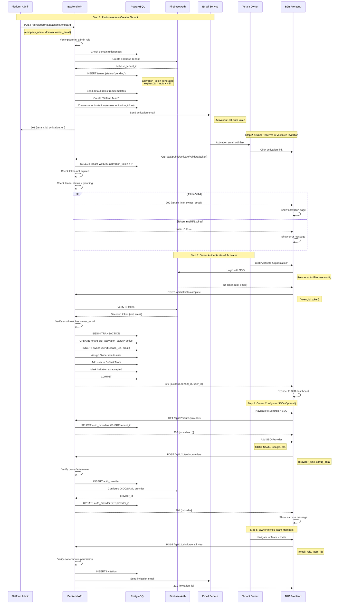
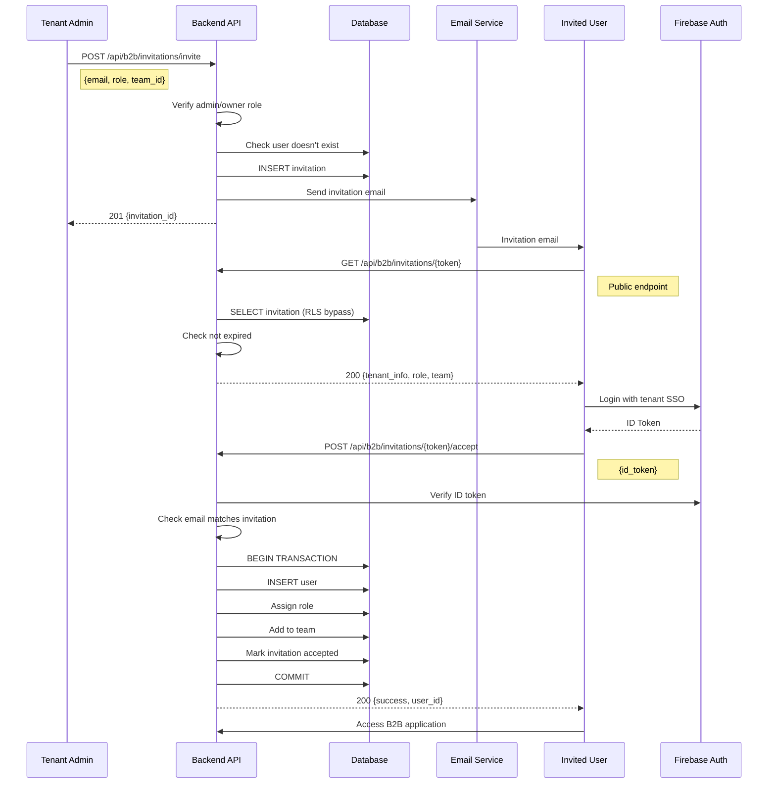
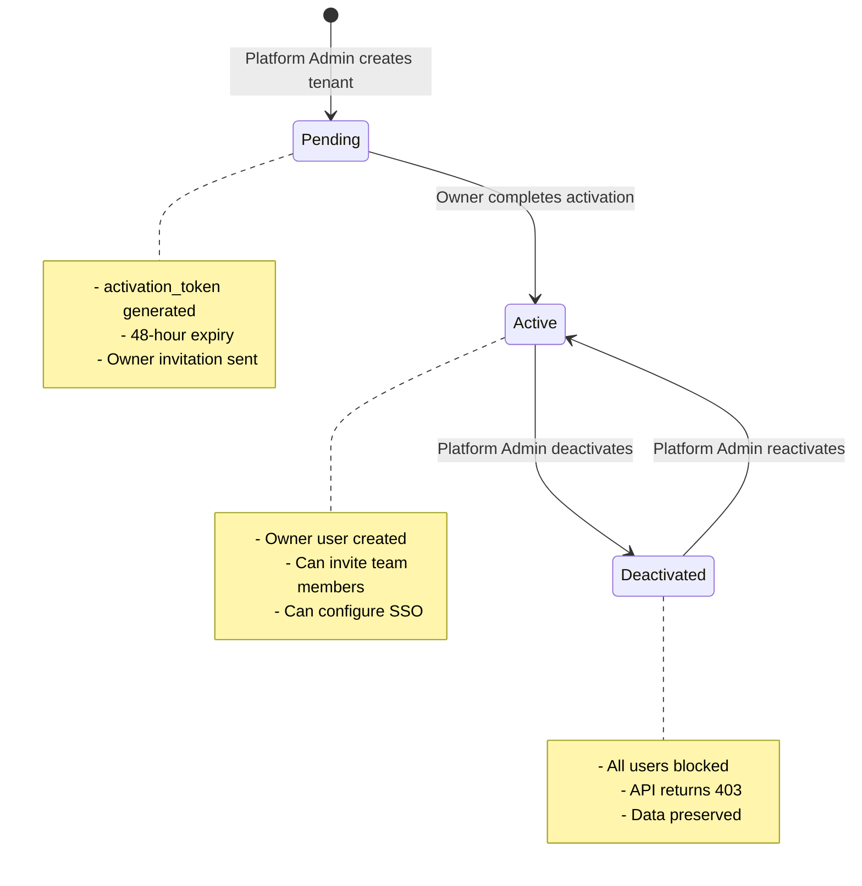
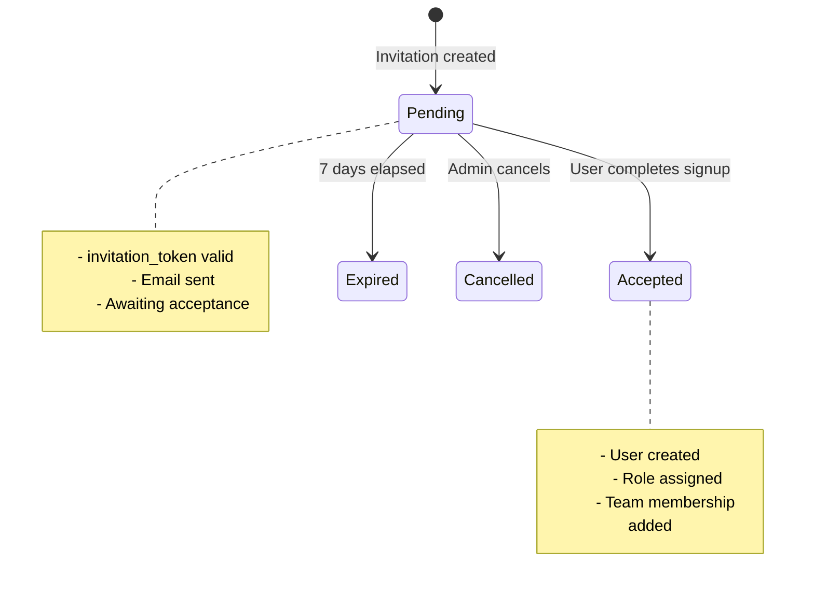

# B2B Tenant Onboarding Flow

**Audience:** Product Managers, Frontend Developers, Backend Engineers

This document provides a comprehensive view of the B2B tenant onboarding process, from platform admin invitation through tenant activation and SSO configuration.

For related security details, see:
- [Authentication Architecture](./authentication.md) - Token lifecycle & Mobile Auth
- [Multi-Tenant Isolation](./multi-tenant-isolation.md) - RLS Mechanics

---

## Overview

The B2B tenant onboarding is a multi-step process that involves:

1. **Platform Admin** creates a tenant and sends activation invitation
2. **Tenant Owner** receives email with activation link
3. **Tenant Owner** validates and activates their organization
4. **Tenant Owner** configures SSO settings (optional)
5. **Tenant** invites team members

---

## Complete Onboarding Flow



---

## Detailed Step Breakdown

### Step 1: Platform Admin Creates Tenant

**Endpoint:** `POST /api/platform/b2b/tenants/onboard`

**Request:**
```json
{
  "company_name": "Acme Corporation",
  "domain": "acme.com",
  "owner_email": "admin@acme.com"
}
```

**Backend Process:**
1. Validates platform admin role
2. Checks domain uniqueness
3. Creates Firebase tenant (multi-tenancy isolation)
4. Generates activation token (48-hour expiry)
5. Creates database records:
   - Tenant (status: `pending`)
   - Default roles from templates  
   - Default team
   - Owner invitation (reuses activation token)
6. Sends activation email to owner

**Response:**
```json
{
  "tenant_id": "uuid",
  "tenant_name": "Acme Corporation",
  "domain": "acme.com",
  "owner_email": "admin@acme.com",
  "firebase_tenant_id": "acme-xxxxx",
  "activation_url": "https://app.example.com/activate/{token}",
  "activation_token": "secret_token",
  "expires_at": "2024-01-15T12:00:00Z"
}
```

---

### Step 2: Owner Validates Activation Link

**Endpoint:** `GET /api/public/activate/validate/{token}`

**Backend Process:**
1. Looks up tenant by activation token
2. Validates:
   - Token exists
   - Not expired
   - Tenant status is `pending`
3. Returns tenant information for display

**Response:**
```json
{
  "valid": true,
  "tenant": {
    "id": "uuid",
    "name": "Acme Corporation",
    "domain": "acme.com"
  },
  "owner_email": "admin@acme.com",
  "firebase_config": {
    "tenant_id": "acme-xxxxx",
    "api_key": "...",
    "auth_domain": "..."
  },
  "expires_at": "2024-01-15T12:00:00Z"
}
```

---

### Step 3: Owner Completes Activation

**Endpoint:** `POST /api/activate/complete`

**Request:**
```json
{
  "activation_token": "secret_token",
  "id_token": "firebase_id_token"
}
```

**Backend Process:**
1. Verifies Firebase ID token
2. Validates email matches owner_email  
3. **Atomic Transaction:**
   - Updates tenant status: `pending` → `active`
   - Creates owner user record
   - Assigns Owner role
   - Adds to Default Team
   - Marks invitation as accepted
4. Commits all changes

**Response:**
```json
{
  "success": true,
  "tenant_id": "uuid",
  "user_id": "uuid",
  "message": "Organization activated successfully"
}
```

**Frontend Behavior:**
- Redirects to B2B dashboard
- Stores authentication token
- User can now access the application

---

### Step 4: SSO Configuration (Optional)

**Endpoint:** `POST /api/b2b/auth-providers`

**Request:**
```json
{
  "provider_type": "oidc",
  "provider_name": "Okta SSO",
  "config_data": {
    "client_id": "okta_client_id",
    "client_secret": "okta_secret",
    "issuer": "https://okta.example.com"
  }
}
```

**Backend Process:**
1. Verifies owner/admin role
2. Creates auth provider record in database
3. Configures provider in Firebase
4. Links Firebase provider_id to database record

**Response:**
```json
{
  "id": "uuid",
  "provider_type": "oidc",
  "provider_id": "oidc.okta",
  "provider_name": "Okta SSO",
  "status": "active"
}
```

---

### Step 5: Team Member Invitation

**Endpoint:** `POST /api/b2b/invitations/invite`

**Request:**
```json
{
  "email": "user@acme.com",
  "role": "admin",
  "team_id": "uuid"
}
```

**Process:** See [User Invitation Flow](#user-invitation-flow) below.

---

## User Invitation Flow

After tenant activation, owners and admins can invite team members.



---

## State Transitions

### Tenant States



### Invitation States



---

## Security Considerations

### RLS (Row Level Security)

1. **Platform Admin Context:** 
   - Required for cross-tenant operations
   - Set via `app.is_platform_admin = true`

2. **Tenant Context:**
   - Set after authentication: `app.current_tenant_id = uuid`
   - All queries automatically filtered by tenant_id

3. **Public Endpoints:**
   - Validation endpoints bypass RLS temporarily
   - Immediately scope to specific tenant after lookup

### Token Security

1. **Activation Tokens:**
   - 32-byte URL-safe random string
   - 48-hour expiration
   - Single-use (marked used on activation)

2. **Invitation Tokens:**
   - 32-byte URL-safe random string  
   - 7-day expiration
   - Single-use (marked used on acceptance)

### Email Verification

- Owner email must match Firebase authentication email
- Prevents unauthorized activations
- Enforced during `complete_activation`

---

## API Endpoints Reference

### Platform Admin Endpoints

| Method | Endpoint | Purpose |
|--------|----------|---------|
| POST | `/api/platform/b2b/tenants/onboard` | Create and send activation |
| POST | `/api/platform/b2b/tenants/{id}/resend` | Resend activation email |
| PATCH | `/api/platform/b2b/tenants/{id}/deactivate` | Deactivate tenant |
| PATCH | `/api/platform/b2b/tenants/{id}/reactivate` | Reactivate tenant |

### Public Endpoints (No Auth)

| Method | Endpoint | Purpose |
|--------|----------|---------|
| GET | `/api/public/activate/validate/{token}` | Validate activation link |
| GET | `/api/b2b/invitations/{token}` | View invitation details |

### Authenticated Endpoints

| Method | Endpoint | Purpose |
|--------|----------|---------|
| POST | `/api/activate/complete` | Complete activation |
| POST | `/api/b2b/invitations/invite` | Invite team member |
| POST | `/api/b2b/invitations/{token}/accept` | Accept invitation |
| POST | `/api/b2b/auth-providers` | Configure SSO |

---

## Error Handling

### Common Error Scenarios

1. **Expired Activation Token**
   - Status: 410 Gone
   - Solution: Platform admin resends activation

2. **Domain Already Exists**
   - Status: 409 Conflict
   - Solution: Use different domain or contact existing tenant

3. **Email Mismatch During Activation**
   - Status: 403 Forbidden
   - Solution: Use correct email address for SSO login

4. **Tenant Deactivated**
   - Status: 403 Forbidden
   - Message: "This organization has been deactivated"
   - Solution: Contact platform admin

---

## Best Practices

### For Platform Admins

1. **Domain Validation:** Verify company owns the domain before onboarding
2. **Email Verification:** Ensure owner_email is correct and accessible
3. **Monitoring:** Track activation rates and follow up on pending tenants
4. **Resend Capability:** Use resend activation for expired tokens

### For Tenant Owners

1. **Immediate Activation:** Complete activation within 48 hours
2. **SSO Configuration:** Set up SSO providers before inviting team
3. **Role Assignment:** Use principle of least privilege for team members
4. **Team Organization:** Create teams before sending invitations

### For Developers

1. **Atomic Transactions:** All activation steps in single transaction
2. **Idempotency:** Handle duplicate onboarding requests gracefully
3. **RLS Context:** Always set proper context before database operations
4. **Error Recovery:** Provide clear paths for error scenarios

---

## Related Documentation

- **[Authentication Architecture](./authentication.md)** - Token lifecycle and security
- **[Multi-Tenant Isolation](./multi-tenant-isolation.md)** - RLS implementation
- **[RBAC System](./rbac.md)** - Role and permission management
- **[Team Management](./teams.md)** - Team structure and membership
