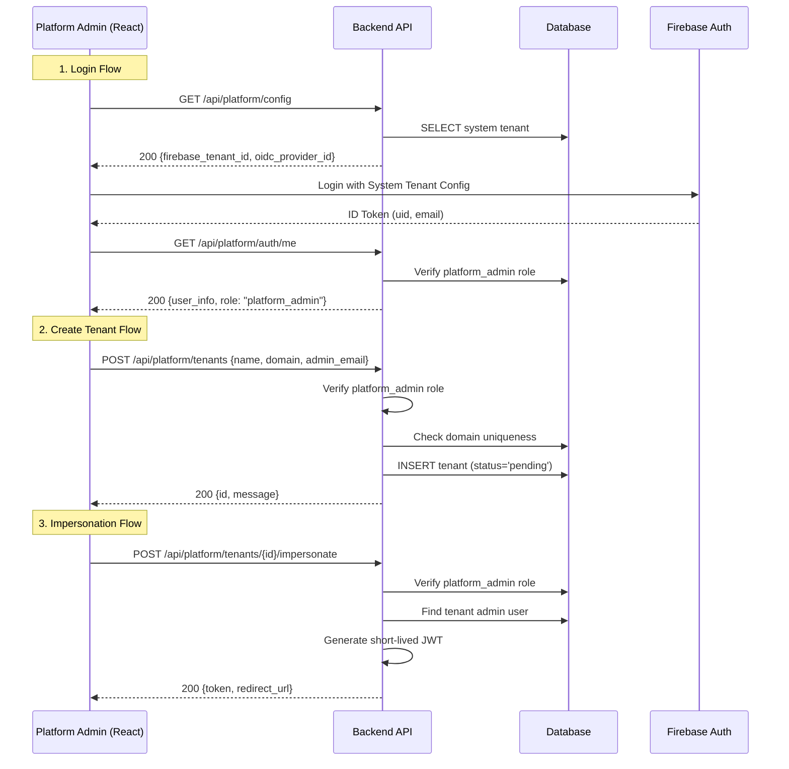

# Growth Workflows: Onboarding & Invitations

**Audience:** Product Managers, Frontend Developers, Backend Engineers

This document visualizes the core growth workflows: **Tenant Activation** (Onboarding), **User Invitation**, and **Platform Administration**.

For lower-level details on how requests are secured, see:
-   [Authentication Architecture](./authentication.md) - Request lifecycle & Mobile Auth
-   [Multi-Tenant Isolation](./multi-tenant-isolation.md) - RLS Mechanics

---
## 1. Tenant Activation Flow 🚀

How a "Pending" tenant becomes "Active" via the owner's first login.

> **Technical Note**: For the detailed cryptographic handshake and token exchange during activation, please refer to the **[Authentication Architecture](./authentication.md#4-tenant-activation--onboarding-flow)** document.

### High-Level Process

1.  **Email Received**: Owner clicks unique activation link.
2.  **Validation**: Backend validates the signed token.
3.  **Authentication**: Owner logs in via SSO (proving they own the email).
4.  **Provisioning**: 
    *   Tenant status flips `pending` -> `active`.
    *   Owner user is created in Postgres.
    *   Initial "Default Team" is assigned.

### Key API Endpoints
*   `GET /api/public/activate/validate/{token}`: Public validation.
*   `POST /api/activate/complete`: Authenticated finalization step.

---

## 2. User Invitation Flow 📩

How an existing tenant admin invites a new member.

### Process Overview

1.  **Invite Sent**: Admin creates invitation via API.
2.  **Invite Clicked**: User validates token.
3.  **Acceptance**: User clicks "Join Team" (Requires SSO Login).
4.  **Creation**: User record created and assigned to Role/Team.

### Security Model (RLS Bypass)
Since the `GET /invitations/{token}` endpoint is public (no user context yet), it uses a special **RLS Bypass** pattern:
1.  Router temporarily grants **Platform Admin** context (`app.is_platform_admin=true`).
2.  Looks up token globally across all tenants.
3.  Once found, immediately **scopes down** to that specific tenant (`set_tenant_context`).

---

## 3. Platform Admin Flows ⚡

Super-admin capabilities for managing the system.

### Platform Mermaid Diagram

### Steps
1.  **Login**: Authenticates against the dedicated **Platform Tenant**.
2.  **Impersonation**: Generates a short-lived custom JWT that allows the admin to "become" a tenant owner for debugging.
