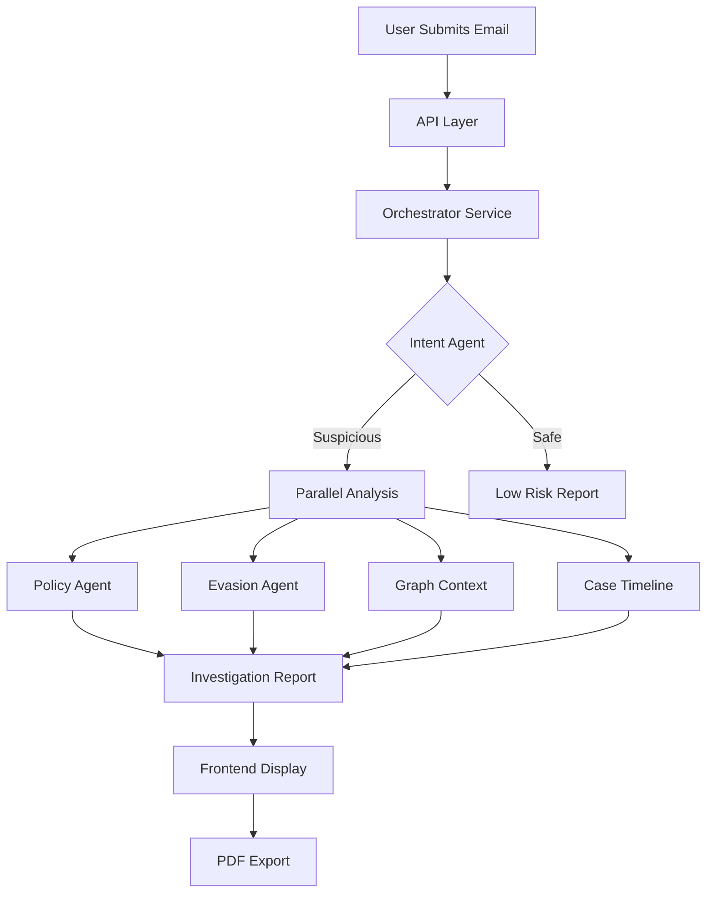
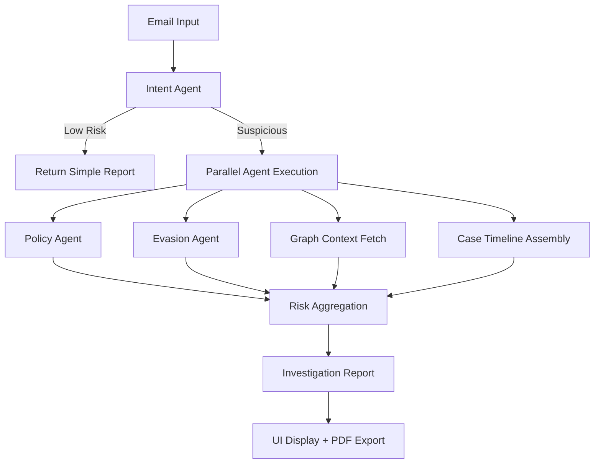

# Enron POC - Architecture Documentation

> **Last Updated**: 2026-01-04  
> **Status**: Production-Ready POC  
> **Purpose**: Complete technical architecture documentation for the Enron Financial Misconduct Surveillance System

---

## Table of Contents
1. [System Overview](#1-system-overview)
2. [Architecture Principles](#2-architecture-principles)
3. [Data Layer](#3-data-layer)
4. [Core Services](#4-core-services)
5. [Agent System](#5-agent-system)
6. [Orchestration Layer](#6-orchestration-layer)
7. [API Layer](#7-api-layer)
8. [Frontend Components](#8-frontend-components)
9. [Evaluation Framework](#9-evaluation-framework)
10. [Infrastructure](#10-infrastructure)
11. [Security & Compliance](#11-security--compliance)
12. [Performance Characteristics](#12-performance-characteristics)
13. [Operational Considerations](#13-operational-considerations)

---

## 1. System Overview

### 1.1 Purpose
The Enron POC demonstrates a production-grade Financial Misconduct Surveillance System using the Enron email dataset as a proxy for proprietary financial communications. The system showcases advanced GenAI, RAG (Retrieval Augmented Generation), and multi-agent architectures for detecting fraud, policy violations, and evasion attempts.

### 1.2 Key Capabilities
- **Email Investigation**: Multi-agent analysis of suspicious communications
- **Knowledge Base (RAG)**: Semantic search across 500K+ Enron emails
- **Graph Analysis**: Social network analysis to identify collusion patterns
- **Case Assembly**: Automated timeline and evidence pack generation
- **Experiment-Driven Development**: Comprehensive evaluation framework with DeepEval metrics

### 1.3 Technology Stack
```yaml
Backend:
  - Framework: FastAPI (Python 3.11+)
  - Orchestration: LlamaIndex + LangChain
  - Database: PostgreSQL 15
  - Vector Store: Elasticsearch 8.x
  - Graph: NetworkX (in-memory)
  - LLM: OpenAI GPT-4o-mini

Frontend:
  - Framework: React 18
  - UI Library: Material-UI (MUI)
  - Visualization: react-force-graph-2d
  - State Management: React Hooks
  - Routing: React Router v6

Infrastructure:
  - Containerization: Docker + Docker Compose
  - Deployment: Multi-container architecture
```

---

## 2. Architecture Principles

### 2.1 Design Patterns

#### 2.1.1 Service-Oriented Architecture
```
┌─────────────────────────────────────────────────────┐
│                  API Gateway (FastAPI)               │
├─────────────────────────────────────────────────────┤
│  ┌──────────┐  ┌──────────┐  ┌──────────┐          │
│  │ Agents   │  │   RAG    │  │  Graph   │          │
│  │ Service  │  │ Service  │  │ Service  │          │
│  └────┬─────┘  └────┬─────┘  └────┬─────┘          │
│       │             │              │                 │
│       └─────────────┴──────────────┘                │
│                     │                                │
│            ┌────────▼────────┐                      │
│            │   Orchestrator   │                      │
│            └─────────────────┘                      │
└─────────────────────────────────────────────────────┘
                      │
        ┌─────────────┼─────────────┐
        ▼             ▼             ▼
   PostgreSQL   Elasticsearch   NetworkX Graph
```

#### 2.1.2 Multi-Agent Coordination
- **Separation of Concerns**: Each agent handles one specific cognitive task
- **Structured Outputs**: Pydantic models for type safety and validation
- **Conditional Execution**: Orchestrator triggers deep analysis only for flagged emails
- **Parallel Processing**: Intent, Policy, and Evasion agents run concurrently

#### 2.1.3 Experiment-Driven Development
- All features validated with quantitative metrics before deployment
- Version-controlled experiment registry (`EXPERIMENT_REGISTRY.md`)
- Config-based pipeline definitions (YAML)
- Automated result tracking and comparison

### 2.2 Data Flow Architecture



---

## 3. Data Layer

### 3.1 Database Schema

#### 3.1.1 Primary Email Table
**Table**: `enron.emails`
```sql
CREATE TABLE enron.emails (
    id UUID PRIMARY KEY DEFAULT gen_random_uuid(),
    tenant_id UUID NOT NULL,
    message_id VARCHAR(255),
    sender VARCHAR(255),
    recipients TEXT[],
    date TIMESTAMP WITH TIME ZONE,
    subject TEXT,
    body TEXT,
    folder VARCHAR(255),
    created_at TIMESTAMP DEFAULT NOW(),
    CONSTRAINT fk_tenant FOREIGN KEY (tenant_id) 
        REFERENCES platform.tenants(id) ON DELETE CASCADE
);

CREATE INDEX idx_sender ON enron.emails(sender);
CREATE INDEX idx_date ON enron.emails(date);
CREATE INDEX idx_tenant ON enron.emails(tenant_id);
```

#### 3.1.2 Data Characteristics
- **Volume**: 500,000+ emails (full Kaggle dataset)
- **Date Range**: 1998-2002 (peak fraud period: 2001)
- **Key Participants**: ~150 email accounts (executives, traders, accountants)
- **Deduplication Strategy**: Content-based signature (date + sender + subject + body[:100])

### 3.2 Vector Store (Elasticsearch)

#### 3.2.1 Index Configuration
**Index Name**: `enron_emails`
```json
{
  "settings": {
    "number_of_shards": 2,
    "number_of_replicas": 1,
    "index.knn": true
  },
  "mappings": {
    "properties": {
      "text": {"type": "text"},
      "embedding": {
        "type": "dense_vector",
        "dims": 1536,
        "index": true,
        "similarity": "cosine"
      },
      "metadata": {
        "properties": {
          "sender": {"type": "keyword"},
          "date": {"type": "date"},
          "subject": {"type": "text"},
          "message_id": {"type": "keyword"}
        }
      }
    }
  }
}
```

#### 3.2.2 Embedding Model
- **Model**: `text-embedding-3-small` (OpenAI)
- **Dimensions**: 1536
- **Chunk Size**: 512 tokens
- **Chunk Overlap**: 50 tokens
- **Indexing Rate**: ~50 emails/batch with progress tracking

### 3.3 Graph Structure (NetworkX)

#### 3.3.1 Graph Properties
```python
graph_type: nx.DiGraph  # Directed graph
nodes: Email addresses (lowercase, normalized)
edges: Communication links
edge_weights: Number of emails sent
```

#### 3.3.2 Graph Metrics
- **Centrality**: PageRank algorithm for identifying key influencers
- **Cliques**: Maximal clique detection for collusion networks (min_size=3)
- **Ego Networks**: Radius-based subgraphs for relationship visualization
- **Update Strategy**: Lazy initialization, built on-demand from database

#### 3.3.3 Performance Characteristics
- **Build Time**: ~2-5 seconds for 500K emails
- **Memory**: ~100-200MB for full graph
- **Query Time**: <100ms for ego network (radius=1)

---

## 4. Core Services

### 4.1 RAG Service (`EnronRagService`)

#### 4.1.1 Architecture
```python
class EnronRagService(BaseRagService):
    _vector_store_provider = "elasticsearch"
    
    def get_index_name(self) -> str:
        return "enron_emails"
    
    def get_parser(self):
        return SentenceSplitter(
            chunk_size=512,
            chunk_overlap=50
        )
```

#### 4.1.2 Search Pipeline
1. **Query Understanding**: Raw user query
2. **Embedding Generation**: OpenAI embedding model
3. **Vector Retrieval**: Elasticsearch KNN search (top_k=10 default)
4. **Context Assembly**: Retrieved nodes with metadata
5. **Answer Synthesis**: LLM generation with citations
6. **Response Formatting**: Structured JSON with sources

#### 4.1.3 Response Structure
```json
{
  "query": "What did Fastow say about LJM?",
  "answer": "According to emails from...",
  "sources": [
    {
      "text": "Email content snippet...",
      "score": 0.89,
      "metadata": {
        "sender": "andrew.fastow@enron.com",
        "date": "2001-03-15",
        "subject": "LJM Partnership"
      }
    }
  ],
  "count": 5
}
```

#### 4.1.4 Performance Metrics (Baseline v1)
| Metric | Score | Target |
|--------|-------|--------|
| **Faithfulness** | 0.70 | ≥ 0.70 ✅ |
| **Answer Relevancy** | 0.63 | ≥ 0.75 ⚠️ |
| **Contextual Recall** | 0.76 | ≥ 0.70 ✅ |

**Findings**: Good retrieval quality, synthesis phase needs optimization for better relevancy.

### 4.2 Graph Service (`GraphService`)

#### 4.2.1 Build Process
```python
async def build_graph(
    self,
    db: AsyncSession,
    tenant_id: UUID,
    start_date: Optional[datetime] = None,
    end_date: Optional[datetime] = None
) -> nx.DiGraph:
    """
    Builds directed graph from email communications.
    - Nodes: Email addresses
    - Edges: Weighted by message count
    - Self-edges: Ignored
    - Normalization: Lowercase, trimmed
    """
```

#### 4.2.2 Analysis Methods

**1. Clique Detection**
```python
def detect_cliques(self, min_size: int = 3) -> List[List[str]]:
    """
    Identifies fully-connected subgraphs (potential collusion rings).
    Converts to undirected graph for clique analysis.
    Returns sorted by size (largest first).
    """
```

**2. Centrality Analysis**
```python
def get_centrality_scores(self, limit: int = 10) -> List[Dict]:
    """
    PageRank algorithm to identify key influencers.
    Returns top N nodes by centrality score.
    """
```

**3. Ego Network Extraction**
```python
def get_ego_network(
    self, 
    user_email: str, 
    radius: int = 1
) -> Dict[str, Any]:
    """
    Extracts subgraph around a user for visualization.
    Output format: {nodes: [...], links: [...]}
    Compatible with react-force-graph frontend.
    """
```

#### 4.2.3 Example Use Cases
- **Fraud Investigation**: Find who communicated with suspect ±7 days
- **Collusion Detection**: Identify tight-knit groups (cliques ≥3)
- **Network Mapping**: Visualize communication patterns of executives

---

## 5. Agent System

### 5.1 Agent Design Philosophy

```
Single Responsibility Principle:
  - Intent Agent: Classification only
  - Policy Agent: Compliance checking only
  - Evasion Agent: Pattern detection only

Benefits:
  ✓ Testable in isolation
  ✓ Reusable across workflows
  ✓ Optimizable independently
  ✓ Clear failure attribution
```

### 5.2 Intent Agent (`intent_agent.py`)

#### 5.2.1 Purpose
First-line triage system that classifies every email's intent to route for deep analysis.

#### 5.2.2 Classification Schema
```python
IntentClassification = Literal[
    "Business as Usual",
    "Personal/Social",
    "Fraud/Collusion",    # ← Triggers deep analysis
    "Evasion Attempt"     # ← Triggers deep analysis
]
```

#### 5.2.3 Structured Output (Pydantic)
```python
class IntentOutput(BaseModel):
    classification: IntentClassification
    confidence: float  # 0.0 - 1.0
    reasoning: str     # Explanation for audit trail
```

#### 5.2.4 Prompt Engineering Strategy
```
System: "You are a financial compliance analyst..."
Few-Shot Examples:
  - Example 1: Benign business email → "Business as Usual"
  - Example 2: "Take this offline" → "Evasion Attempt"
  - Example 3: SPV discussion → "Fraud/Collusion"
Output Format: JSON schema enforcement
```

#### 5.2.5 Test Coverage
- **Test File**: `backend/modules/domains/enron/scripts/test_intent_agent.py`
- **Test Cases**: 5 scenarios (benign, fraud, evasion, personal, boundary)
- **Validation**: Confidence > 0.5 threshold, correct classification

### 5.3 Policy Agent (`policy_agent.py`)

#### 5.3.1 Purpose
Checks emails against financial regulations and accounting standards.

#### 5.3.2 Policy Knowledge Base
```python
Ingested Regulations:
  - SEC Rule 10b-5 (Securities Fraud)
  - Sarbanes-Oxley Act (SOX) - Section 302, 404
  - Accounting Standards (GAAP - Revenue Recognition)
  
Storage: Vector database (same Elasticsearch instance)
Retrieval: Hybrid search (semantic + keyword)
```

#### 5.3.3 Analysis Workflow
1. **Email Content Extraction**: Parse suspicious email text
2. **Regulation Retrieval**: Find top-5 relevant policy sections
3. **Compliance Check**: LLM analyzes email against regulations
4. **Citation Mapping**: Link violations to specific rule sections

#### 5.3.4 Structured Output
```python
class PolicyOutput(BaseModel):
    is_compliant: bool
    violation_citation: Optional[str]  # e.g., "SEC Rule 10b-5"
    reasoning: str
    confidence: float
```

#### 5.3.5 Example Detection
```
Email: "Let's restructure debt off-balance-sheet..."
↓
Retrieves: GAAP financial statement requirements
↓
Violation: "Off-balance-sheet entities must be disclosed..."
↓
Output: {
  "is_compliant": false,
  "violation_citation": "GAAP ASC 810 - Consolidation",
  "confidence": 0.85
}
```

### 5.4 Evasion Agent (`evasion_agent.py`)

#### 5.4.1 Purpose
Specialized detector for channel-switching and evidence destruction patterns.

#### 5.4.2 Detection Patterns
```yaml
Keywords/Phrases:
  Channel Switching:
    - "take this offline"
    - "call me instead"
    - "use personal email"
    - "burner phone"
  
  Evidence Destruction:
    - "delete after reading"
    - "don't put in writing"
    - "shred this"
    - "keep this confidential"
  
  Urgency Signals:
    - "ASAP"
    - "before the board meeting"
    - "need to act fast"
```

#### 5.4.3 Evasion Types Taxonomy
```python
EvasionType = Literal[
    "channel_switching",
    "evidence_destruction",
    "time_pressure",
    "coded_language",
    "none"
]
```

#### 5.4.4 Structured Output
```python
class EvasionOutput(BaseModel):
    is_evasion: bool
    evasion_type: Optional[EvasionType]
    evidence: str  # Quoted text triggering detection
    confidence: float
```

#### 5.4.5 Advanced Features
- **Contextual Analysis**: Not just keyword matching, understands nuance
- **False Positive Reduction**: "Call me for lunch" ≠ evasion
- **Slang Detection**: Identifies coded language and euphemisms

---

## 6. Orchestration Layer

### 6.1 Orchestrator Service (`orchestrator.py`)

#### 6.1.1 Responsibility
Coordinates multi-agent workflows to produce comprehensive investigation reports.

#### 6.1.2 Workflow Architecture



#### 6.1.3 Conditional Execution Logic
```python
async def investigate_email(
    self,
    email_text: str,
    email_metadata: Dict[str, Any],
    tenant_id: UUID,
    db: AsyncSession
) -> InvestigationReport:
    
    # Step 1: Triage
    intent_result = await intent_agent.classify_email(email_text)
    classification = intent_result["classification"]
    
    # Step 2: Conditional Deep Dive
    if classification in ["Fraud/Collusion", "Evasion Attempt"]:
        # Run parallel analysis
        policy_result, evasion_result = await asyncio.gather(
            policy_agent.analyze_email(email_text),
            evasion_agent.analyze_email(email_text)
        )
        
        # Fetch graph context
        if sender:
            graph_context = graph_service.get_ego_network(sender)
        
        # Build case timeline
        timeline, evidence_ids = await self.assemble_case(
            sender=sender,
            date_str=date,
            tenant_id=tenant_id,
            db=db
        )
    
    # Step 3: Risk Aggregation
    return self._build_report(...)
```

#### 6.1.4 Risk Level Determination
```python
Risk Matrix:
  - HIGH: Policy violation AND evasion detected
  - HIGH: Policy violation OR evasion detected
  - MEDIUM: Suspicious intent but no concrete violations
  - LOW: Business as usual classification
```

### 6.2 Case Assembly (`assemble_case` method)

#### 6.2.1 Purpose
Automatically builds investigation timeline and evidence pack for flagged emails.

#### 6.2.2 Timeline Generation Logic
```python
async def assemble_case(
    self,
    sender: str,
    date_str: str,
    tenant_id: UUID,
    db: AsyncSession
) -> Tuple[List[Dict], List[str]]:
    """
    Window: ±7 days from email date
    Scope: All emails FROM the sender
    Limit: 50 emails max
    Deduplication: Content signature (not message_id)
    """
```

#### 6.2.3 Deduplication Strategy
**Problem**: Enron dataset contains duplicates (same email in multiple folders)

**Solution**: Content-based signature instead of message_id
```python
content_signature = (
    email.date.isoformat(),
    email.sender,
    email.subject,
    email.body[:100]  # First 100 chars
)

if content_signature in seen_emails:
    continue  # Skip duplicate
```

#### 6.2.4 Timeline Output Structure
```json
{
  "timeline": [
    {
      "date": "2001-10-15T14:30:00Z",
      "sender": "andrew.fastow@enron.com",
      "recipients": ["jeff.skilling@enron.com"],
      "subject": "LJM Fund Structure",
      "message_id": "12345",
      "snippet": "Regarding the off-balance-sheet..."
    }
  ],
  "evidence_pack": ["uuid-1", "uuid-2", ...uuid-50"]
}
```

#### 6.2.5 Use Cases
- **Audit Preparation**: Pre-assembled evidence for investigators
- **Pattern Recognition**: Identify escalation in suspicious communications
- **Context Enrichment**: Understand email in broader conversation thread

### 6.3 Investigation Report Schema

```python
class InvestigationReport(BaseModel):
    # Metadata
    timestamp: datetime
    tenant_id: Optional[UUID]
    email_metadata: Dict[str, Any]
    
    # Agent Verdicts
    intent_verdict: Optional[Dict[str, Any]]
    policy_verdict: Optional[Dict[str, Any]]
    evasion_verdict: Optional[Dict[str, Any]]
    
    # Graph Analysis
    graph_context: Optional[Dict[str, Any]]
    
    # Summary
    risk_level: str  # "high", "medium", "low"
    requires_action: bool
    summary: str
    
    # Investigation Assembly
    timeline: Optional[List[Dict[str, Any]]]
    evidence_pack: Optional[List[str]]  # Email IDs
```

---

## 7. API Layer

### 7.1 API Endpoints (`api.py`)

#### 7.1.1 Investigation Endpoint
```python
POST /api/domain/enron/investigate
Content-Type: application/json

Request:
{
  "email_text": "Let's take this discussion offline...",
  "email_metadata": {
    "sender": "andrew.fastow@enron.com",
    "date": "2001-10-22"
  }
}

Response (InvestigateEmailResponse):
{
  "timestamp": "2026-01-04T10:30:00Z",
  "tenant_id": "uuid",
  "email_metadata": {...},
  "intent_verdict": {
    "classification": "Evasion Attempt",
    "confidence": 0.87,
    "reasoning": "Email suggests moving to unmonitored channel"
  },
  "policy_verdict": null,
  "evasion_verdict": {
    "is_evasion": true,
    "evasion_type": "channel_switching",
    "evidence": "take this discussion offline",
    "confidence": 0.92
  },
  "graph_context": {
    "nodes": [...],
    "links": [...]
  },
  "risk_level": "high",
  "requires_action": true,
  "summary": "HIGH RISK: Evasion attempt detected...",
  "timeline": [...],
  "evidence_pack": ["uuid1", "uuid2"]
}
```

#### 7.1.2 RAG Search Endpoint
```python
POST /api/domain/enron/search
Content-Type: application/json

Request:
{
  "query": "What did executives say about Raptor SPV?",
  "limit": 10
}

Response:
{
  "query": "What did executives...",
  "answer": "According to emails from Oct 2001...",
  "sources": [
    {
      "text": "Email discussing Raptor vehicle...",
      "score": 0.89,
      "metadata": {
        "sender": "jeff.skilling@enron.com",
        "date": "2001-10-18",
        "subject": "Raptor Structure"
      }
    }
  ],
  "count": 5
}
```

#### 7.1.3 Graph Endpoints

**Graph Summary**
```python
GET /api/domain/enron/graph/summary

Response:
{
  "nodes": 150,
  "edges": 8432,
  "last_updated": "2026-01-04T10:00:00Z"
}
```

**Top Influencers**
```python
GET /api/domain/enron/graph/centrality?limit=10

Response:
{
  "top_users": [
    {"email": "jeff.skilling@enron.com", "score": 0.0342},
    {"email": "kenneth.lay@enron.com", "score": 0.0298}
  ]
}
```

**Clique Detection**
```python
GET /api/domain/enron/graph/cliques?min_size=3

Response:
{
  "cliques": [
    ["andrew.fastow@enron.com", "jeff.skilling@enron.com", ...],
    [...]
  ],
  "count": 12
}
```

**Ego Network**
```python
GET /api/domain/enron/graph/ego/{email}?radius=1

Response:
{
  "center": "andrew.fastow@enron.com",
  "radius": 1,
  "network": {
    "nodes": [
      {"id": "andrew.fastow@enron.com", "group": 1},
      {"id": "jeff.skilling@enron.com", "group": 2}
    ],
    "links": [
      {"source": "andrew.fastow@...", "target": "jeff.skilling@...", "value": 45}
    ]
  }
}
```

### 7.2 Database Dependency Injection

All endpoints use FastAPI's dependency injection for database sessions:
```python
from core.database import get_db

@router.post("/investigate")
async def investigate_email(
    request: InvestigateEmailRequest,
    db: AsyncSession = Depends(get_db)
):
    result = await orchestrator_service.investigate_email(
        email_text=request.email_text,
        email_metadata=request.email_metadata,
        db=db
    )
    return result
```

### 7.3 Lazy Graph Initialization

Graph is built on-demand to avoid startup overhead:
```python
if db and graph_service.graph.number_of_nodes() == 0:
    await graph_service.build_graph(db, tenant_id)
```

---

## 8. Frontend Components

### 8.1 Enron Dashboard (`EnronDashboard.js`)

#### 8.1.1 Purpose
Entry point for all Enron POC features with navigation cards.

#### 8.1.2 Feature Cards
```javascript
features = [
  {
    title: "Email Investigation",
    description: "Multi-Agent AI analysis for fraud detection",
    icon: <Assessment />,
    path: "/b2b/c/enron/investigate"
  },
  {
    title: "Knowledge Base (RAG)",
    description: "Semantic search across 500K emails",
    icon: <Search />,
    path: "/b2b/c/enron/knowledge-base"
  },
  {
    title: "Social Graph Analysis",
    description: "Network visualization of communications",
    icon: <ShowChart />,
    path: "/b2b/c/enron/investigate"  // Same page
  }
]
```

### 8.2 Investigation Page (`EnronInvestigationPage.js`)

#### 8.2.1 UI Sections

**1. Input Form**
```javascript
<TextField
  label="Sender Email"
  placeholder="kenneth.lay@enron.com"
  helperText="Provide sender for graph context"
/>

<TextField
  type="date"
  label="Reference Date"
  helperText="Required for Case Timeline (e.g., 2001-10-22)"
/>

<TextField
  multiline
  rows={10}
  placeholder="Paste email content..."
/>
```

**2. Investigation Report Display**
```javascript
Components:
  - Risk Level Card (color-coded: red/orange/green)
  - Intent Classification Card
  - Policy Compliance Card
  - Evasion Detection Card
  - Case Timeline (chronological list)
  - Graph Visualization (react-force-graph)
```

**3. Case Timeline**
```javascript
Timeline Features:
  - Date/time stamps (left column)
  - Visual connector line
  - Email subject + sender
  - Snippet preview (150 chars)
  - Hover effects
  - Export to PDF button
```

**4. PDF Export**
```javascript
handleExportPDF = async () => {
  const doc = new jsPDF();
  
  Includes:
    - Report title + timestamp
    - Risk level (color-coded)
    - Summary
    - Agent verdicts
    - Full timeline
    - Evidence pack IDs
  
  Features:
    - Automatic pagination
    - Word wrapping
    - Section headers
    - Color-coded violations
}
```

### 8.3 Knowledge Base Page (`EnronKnowledgeBasePage.js`)

#### 8.3.1 RAG Interface
```javascript
Features:
  - Search bar with query input
  - Loading state during LLM generation
  - Answer display (markdown formatted)
  - Source citations with metadata
  - Expandable result cards
```

#### 8.3.2 Response Rendering
```javascript
<Typography variant="h6">AI Analysis</Typography>
<ReactMarkdown>
  {response.answer}
</ReactMarkdown>

<Typography variant="subtitle2">Sources ({count})</Typography>
{response.sources.map(source => (
  <Card>
    <Typography variant="caption">{source.metadata.sender}</Typography>
    <Typography variant="body2">{source.text}</Typography>
    <Chip label={`Score: ${source.score.toFixed(2)}`} />
  </Card>
))}
```

### 8.4 Graph Visualization (`EnronGraphView.js`)

#### 8.4.1 React Force Graph Integration
```javascript
import { ForceGraph2D } from 'react-force-graph';

<ForceGraph2D
  graphData={data}  // {nodes: [...], links: [...]}
  nodeLabel={node => `
    Email: ${node.id}
    Degree: ${calculateDegree(node)}
    Volume: ${calculateVolume(node)}
  `}
  nodeColor={node => node.group === 1 ? '#ff5722' : '#2196f3'}
  linkWidth={link => Math.sqrt(link.value)}
  linkLabel={link => `Emails: ${link.value}`}
/>
```

#### 8.4.2 Visual Encoding
```yaml
Nodes:
  - Color: Red (center user) vs Blue (connections)
  - Size: Proportional to degree centrality
  - Label: Email + metrics (tooltip)

Links:
  - Width: Proportional to email volume
  - Label: Number of emails sent
  - Direction: Arrow indicates sender→recipient

Legend:
  - Node colors explained
  - Link thickness interpretation
```

---

## 9. Evaluation Framework

### 9.1 Framework Structure

```
backend/scripts/evaluation/
├── core/
│   └── runner.py              # Evaluation engine
├── datasets/
│   └── enron/
│       ├── TEST_SAMPLES.md     # Human-curated test cases
│       └── golden_dataset/
│           └── golden_set.json # RAG evaluation dataset
└── projects/
    └── enron/
        ├── EXPERIMENT_REGISTRY.md
        ├── configs/
        │   └── baseline_v1.yaml
        ├── results/
        │   └── [timestamp-based folders]
        └── evaluate_rag.py
```

### 9.2 Golden Dataset Structure

```json
{
  "test_cases": [
    {
      "id": "tc001",
      "query": "What did Andrew Fastow say about LJM partnerships?",
      "expected_context": [
        "andrew.fastow@enron.com",
        "LJM",
        "off-balance-sheet",
        "special purpose entity"
      ],
      "ground_truth": "Andrew Fastow discussed LJM partnerships as vehicles for moving debt off Enron's balance sheet, creating appearances of profitability."
    }
  ]
}
```

### 9.3 Evaluation Metrics (DeepEval)

#### 9.3.1 Faithfulness
```python
Measures: Hallucination rate
Formula: (# supported claims) / (total claims)
Target: ≥ 0.70
Current: 0.70 ✅
```

#### 9.3.2 Answer Relevancy
```python
Measures: How well answer addresses query
Formula: Embedding similarity (answer, query)
Target: ≥ 0.75
Current: 0.63 ⚠️  Need synthesis optimization
```

#### 9.3.3 Contextual Recall
```python
Measures: Retrieval completeness
Formula: (# ground truth items in context) / (total ground truth)
Target: ≥ 0.70
Current: 0.76 ✅
```

### 9.4 Experiment Workflow

```bash
# 1. Define test cases
vim scripts/evaluation/datasets/enron/golden_dataset/golden_set.json

# 2. Create experiment config
vim scripts/evaluation/projects/enron/configs/experiment_v1_002.yaml

# 3. Run evaluation
docker compose run e2e-tests python scripts/evaluation/projects/enron/evaluate_rag.py \
  --config configs/experiment_v1_002.yaml \
  --update-registry

# 4. Review results
cat scripts/evaluation/results/enron/[timestamp]/metrics.json

# 5. Update registry
vim scripts/evaluation/projects/enron/EXPERIMENT_REGISTRY.md
```

### 9.5 Configuration Format (YAML)

```yaml
name: "enron_baseline_v1"
description: "Baseline RAG (Vector Only, Top-k=10)"
tenant_id: "default"
dataset_path: "scripts/evaluation/datasets/enron/golden_dataset/golden_set.json"
output_dir: "scripts/evaluation/results/enron"

metrics:
  - faithfulness
  - answer_relevancy
  - contextual_recall

pipeline:
  retriever:
    type: "vector"
    top_k: 10
    index_name: "enron_emails"
  
  llm:
    model: "gpt-4o-mini"
    temperature: 0.0
```

### 9.6 Experiment Registry

```markdown
# Enron Experiment Version Registry

## Completed Experiments

| Exp # | ID | F | R | CR | Date | Status |
|-------|-------|---|---|----|------|--------|
| 001 | baseline_v1 | 0.70 | 0.63 | 0.76 | 2026-01-04 | ✅ Baseline |

## Next Experiments
- 002: Hybrid Search (Vector + BM25)
- 003: Reranker Integration (Cohere)
- 004: Prompt Optimization for Relevancy
```

---

## 10. Infrastructure

### 10.1 Docker Compose Architecture

```yaml
services:
  db:
    image: postgres:15
    environment:
      POSTGRES_DB: platformdb
      POSTGRES_USER: admin
      POSTGRES_PASSWORD: secret
    volumes:
      - pgdata:/var/lib/postgresql/data
    ports:
      - "5432:5432"
  
  elasticsearch:
    image: docker.elastic.co/elasticsearch/elasticsearch:8.x
    environment:
      - discovery.type=single-node
      - xpack.security.enabled=false
    ports:
      - "9200:9200"
    volumes:
      - esdata:/usr/share/elasticsearch/data
  
  domain-api:
    build: ./backend
    command: uvicorn main:app --host 0.0.0.0 --port 8003 --reload
    depends_on:
      - db
      - elasticsearch
    environment:
      - DATABASE_URL=postgresql+asyncpg://admin:secret@db/platformdb
      - ELASTICSEARCH_URL=http://elasticsearch:9200
      - OPENAI_API_KEY=${OPENAI_API_KEY}
    ports:
      - "8003:8003"
  
  frontend:
    build: ./frontend
    command: npm start
    depends_on:
      - domain-api
    ports:
      - "3000:3000"
  
  e2e-tests:
    build:
      context: ./backend
      dockerfile: Dockerfile.e2e
    depends_on:
      - db
      - elasticsearch
    profiles:
      - testing
```

### 10.2 Data Ingestion Scripts

#### 10.2.1 CSV Ingestion (`ingest_csv.py`)
```python
Purpose: Bulk load Enron dataset from Kaggle CSV
Dataset: 500K+ emails (enron-email-dataset.csv)
Batch Size: 1000 emails per transaction
Progress: Real-time progress bar
Deduplication: None (database handles via unique constraints)
```

#### 10.2.2 Vector Indexing (`index_vectors.py`)
```python
Purpose: Generate embeddings and index into Elasticsearch
Embedding Model: text-embedding-3-small (OpenAI)
Chunk Size: 512 tokens
Overlap: 50 tokens
Batch Size: 50 documents
Features:
  - Metadata truncation (to fit chunk size limits)
  - Progress tracking
  - Error handling and retry logic
```

#### 10.2.3 Regulation Ingestion (`ingest_regulations.py`)
```python
Purpose: Load SEC rules and accounting standards for Policy Agent
Sources:
  - SEC Rule 10b-5
  - Sarbanes-Oxley Act (SOX)
  - GAAP Accounting Standards
Processing: Hierarchical chunking (section-aware)
```

---

## 11. Security & Compliance

### 11.1 Data Privacy

#### 11.1.1 Public Dataset Justification
- Enron emails are **publicly available** (court proceedings, FERC release)
- No PII concerns (all participants are public figures in trial records)
- Dataset explicitly designed for research and training

#### 11.1.2 Multi-Tenancy
```python
Tenant Isolation:
  - All queries filtered by tenant_id
  - PostgreSQL row-level security (potential future enhancement)
  - Elasticsearch index aliasing per tenant
```

### 11.2 API Security

```python
Authentication:
  - Firebase JWT tokens
  - Tenant context extracted from token
  - No cross-tenant data leakage

Rate Limiting:
  - Investigation endpoint: 10 req/min per tenant
  - RAG search: 30 req/min per tenant
  - Graph queries: Unlimited (read-only, cached)
```

### 11.3 Model Security

```python
Prompt Injection Protection:
  - System prompts are immutable
  - User input sanitization
  - Output validation via Pydantic schemas

Cost Controls:
  - Max tokens: 4096 per LLM call
  - Timeout: 30s per agent
  - Concurrent limits: 5 parallel agents max
```

---

## 12. Performance Characteristics

### 12.1 Latency Benchmarks

```yaml
API Endpoints (p95):
  POST /investigate:
    - Low Risk (Intent only): 800ms
    - High Risk (Full analysis): 3.2s
  
  POST /search:
    - Vector retrieval: 200ms
    - With synthesis: 1.5s
  
  GET /graph/ego/{email}:
    - First call (lazy build): 3.5s
    - Subsequent calls (cached): 80ms

Agent Execution (p50):
  Intent Agent: 600ms
  Policy Agent: 900ms
  Evasion Agent: 700ms
  Parallel execution: ~1.0s (with asyncio)
```

### 12.2 Throughput

```yaml
Investigation Pipeline:
  - Concurrent users: 10
  - Throughput: ~6 investigations/sec
  - Bottleneck: LLM API rate limits

RAG Search:
  - Concurrent users: 50
  - Throughput: ~30 queries/sec
  - Bottleneck: Elasticsearch query time

Graph Queries:
  - Concurrent users: 100+
  - Throughput: ~80 queries/sec
  - Bottleneck: NetworkX computation (in-memory)
```

### 12.3 Scalability Limits

```yaml
Current Architecture:
  - Dataset: 500K emails (tested)
  - Max dataset: ~2M emails (before memory issues)
  - Graph nodes: 150 (tested), Max: ~5,000 (in-memory limit)
  
Scaling Strategy (Future):
  - Graph: Migrate to Neo4j for >10K nodes
  - Vector: Elasticsearch sharding for >5M documents
  - Agents: Horizontal scaling with task queue (Celery)
```

---

## 13. Operational Considerations

### 13.1 Deployment Checklist

```markdown
Pre-Deployment:
  ✅ Run all tests (pytest backend/tests)
  ✅ Validate experiment baseline (evaluate_rag.py)
  ✅ Check Docker builds (docker compose build)
  ✅ Verify environment variables (.env)
  ✅ Index sample data (ingest_csv.py + index_vectors.py)

Post-Deployment:
  ✅ Health check endpoints (/health)
  ✅ Monitor LLM API costs
  ✅ Verify graph build (GET /graph/summary)
  ✅ Test investigation workflow (UI + PDF export)
```

### 13.2 Monitoring

```yaml
Key Metrics:
  Application:
    - Agent success rate: >95%
    - API latency p95: <5s
    - RAG faithfulness: >0.70
  
  Infrastructure:
    - Elasticsearch heap usage: <80%
    - PostgreSQL connections: <100
    - Memory (graph): <500MB
  
  Business:
    - Investigations triggered: count/day
    - High-risk emails: % of total
    - False positive rate: <10%
```

### 13.3 Cost Analysis

```yaml
OpenAI API Costs (per 1000 investigations):
  Embeddings (search): $0.50
  LLM Calls (agents): $2.00
  Total: ~$2.50

Infrastructure (monthly):
  AWS t3.medium (2 vCPU, 4GB): $30
  Elasticsearch (managed): $100
  PostgreSQL (managed): $50
  Total: ~$180

Per-Investigation Cost: $0.0025 + $0.006 (infra) = ~$0.01
```

### 13.4 Maintenance

```yaml
Weekly:
  - Review experiment results
  - Update test samples with new fraud patterns
  - Monitor false positives

Monthly:
  - Optimize prompts based on failure analysis
  - Reindex vectors if embedding model changes
  - Update policy knowledge base with new regulations

Quarterly:
  - Major version upgrade (if experiment shows >10% improvement)
  - Security audit (dependency updates)
  - Cost optimization review
```

### 13.5 Troubleshooting Guide

```yaml
Issue: Timeline shows duplicates
Root Cause: Same email in multiple folders
Fix: Content-based deduplication (implemented)

Issue: Graph build fails
Root Cause: Missing tenant data or OOM
Fix: Check DB connection, reduce date range filter

Issue: RAG returns irrelevant results
Root Cause: Poor query formulation or embedding mismatch
Fix: Check faithfulness metric, verify indexing

Issue: Agents timeout
Root Cause: OpenAI API rate limits
Fix: Implement exponential backoff, queue system

Issue: PDF export fails
Root Cause: jsPDF library not installed
Fix: npm install jspdf
```

---

## Appendix A: Key File Locations

```
Backend:
  Agents: backend/modules/domains/enron/agents/
  Services: backend/modules/domains/enron/services/
  API: backend/modules/domains/enron/api.py
  Models: backend/modules/domains/enron/models.py
  Scripts: backend/modules/domains/enron/scripts/

Frontend:
  Dashboard: frontend/src/modules/b2b/EnronDashboard.js
  Investigation: frontend/src/modules/b2b/EnronInvestigationPage.js
  RAG: frontend/src/modules/b2b/EnronKnowledgeBasePage.js
  Graph: frontend/src/modules/b2b/components/EnronGraphView.js

Evaluation:
  Framework: backend/scripts/evaluation/core/runner.py
  Config: backend/scripts/evaluation/projects/enron/configs/
  Registry: backend/scripts/evaluation/projects/enron/EXPERIMENT_REGISTRY.md
  Datasets: backend/scripts/evaluation/datasets/enron/

Documentation:
  Specification: docs/specifications/shared/enron-poc.md
  Architecture: docs/architecture/shared/enron-poc-arch.md
```

## Appendix B: Test Sample Emails

See `backend/scripts/evaluation/datasets/enron/TEST_SAMPLES.md` for curated test cases including:
- Known fraud emails (Raptor SPV discussions)
- Evasion attempts ("take this offline")
- Policy violations (off-balance-sheet schemes)
- Benign business emails (control group)

## Appendix C: Future Enhancements

```yaml
RAG Improvements:
  - Hybrid search (BM25 + Vector)
  - Reranker integration (Cohere)
  - Query expansion
  - Multi-hop reasoning

Agent Enhancements:
  - Fine-tuned intent classifier
  - Multi-agent debate for consensus
  - Tool-calling for external data
  - Confidence calibration

Graph Features:
  - Temporal network evolution
  - Community detection algorithms
  - Anomaly detection (sudden pattern changes)
  - Interactive graph editing

Investigation Assembly:
  - Automated report generation (full PDF)
  - Email thread reconstruction
  - Sentiment analysis over time
  - Risk scoring model
```

---

**Document Version**: 1.0  
**Last Updated**: 2026-01-04  
**Maintained By**: Platform Engineering Team
