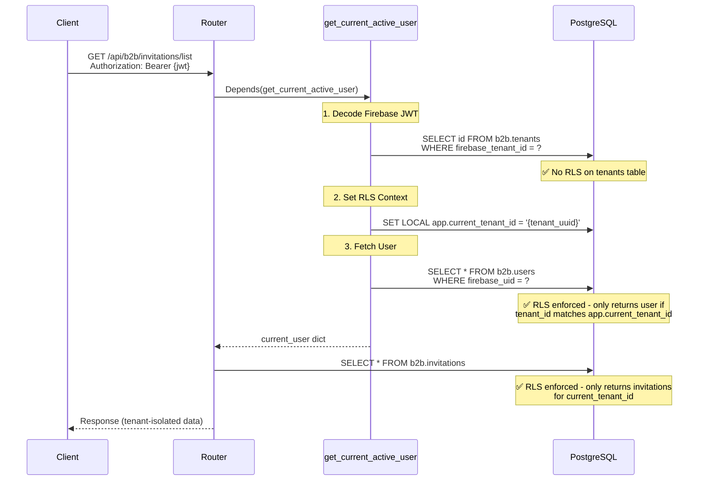

# Multi-Tenant Isolation Architecture

**Audience:** Developers, Security Engineers, Architects

This document explains how tenant data isolation is implemented using PostgreSQL Row Level Security (RLS), including middleware patterns, RLS policies, and best practices for extending the application.

---

## Table of Contents

1. [Overview](#overview)
2. [RLS-Protected Tables](#rls-protected-tables)
3. [Middleware Flow](#middleware-flow)
4. [RLS Context Management](#rls-context-management)
5. [Tables Without RLS](#tables-without-rls)
6 [Extending the Application](#extending-the-application)
7. [Common Pitfalls](#common-pitfalls)
8. [Security Guarantees](#security-guarantees)

---

## Overview

Multi-tenant isolation is enforced at the **database level** using PostgreSQL Row Level Security (RLS). This provides defense-in-depth: even if application code has a bug, the database prevents cross-tenant data access.

### Key Principle

> **RLS Context MUST be set BEFORE querying any RLS-protected table**

The tenant context is established by executing:
```sql
SET LOCAL app.current_tenant_id = '<tenant-uuid>'
```

This is session-scoped (lasts for the current transaction) and enforced by RLS policies on each table.

---

## RLS-Protected Tables

The following tables in the `b2b` schema have RLS enabled (defined in [`migrations/004_b2b_rls.sql`](file:///home/neeraj/codes/enterprisesso/backend/migrations/004_b2b_rls.sql)):

| Table | Policy | Description |
|-------|--------|-------------|
| `b2b.users` | Direct tenant_id match | Users belong to one tenant |
| `b2b.roles` | Direct tenant_id match | Roles are tenant-specific |
| `b2b.role_permissions` | Via role ownership | Permissions inherit tenant from role |
| `b2b.invitations` | Direct tenant_id match | Invitations belong to one tenant |
| `b2b.teams` | Direct tenant_id match | Teams belong to one tenant |
| `b2b.team_members` | Via team ownership | Team members inherit tenant from team |

### Policy Example

```sql
-- Users table policy
CREATE POLICY user_isolation_policy ON b2b.users
    USING (tenant_id = current_setting('app.current_tenant_id', true)::uuid);
```

**How it works:**
- Every SELECT/UPDATE/DELETE on `b2b.users` automatically includes: `WHERE tenant_id = current_setting('app.current_tenant_id')::uuid`
- If `app.current_tenant_id` is not set, `current_setting()` returns empty string, causing query to fail
- This prevents accidental cross-tenant access

---

## Middleware Flow

### B2B API Authentication Flow



### Where RLS Context Is Set

| Module | Function/Class | Location | When Called |
|--------|---------------|----------|-------------|
| **B2B Middleware** | `get_current_active_user()` | [`services/b2b/middleware/b2b_auth.py:51`](file:///home/neeraj/codes/enterprisesso/backend/services/b2b/middleware/b2b_auth.py#L51) | Every B2B API request |
| **Auth Router** | `/sync` endpoint | [`services/b2b/routers/auth.py:118`](file:///home/neeraj/codes/enterprisesso/backend/services/b2b/routers/auth.py#L118) | User sync after login |
| **Activation Router** | `/activate` endpoint | [`services/b2b/routers/activation.py:77`](file:///home/neeraj/codes/enterprisesso/backend/services/b2b/routers/activation.py#L77) | Tenant activation |
| **Audit Service** | `log_audit_background()` | [`services/b2b/services/audit_service.py:60`](file:///home/neeraj/codes/enterprisesso/backend/services/b2b/services/audit_service.py#L60) | Background audit logging |
| **Test Fixtures** | `create_test_user()`, `create_test_invitation()` | [`tests/conftest.py`](file:///home/neeraj/codes/enterprisesso/backend/tests/conftest.py) | Test setup |

---

## RLS Context Management

### Pattern 1: Middleware (Most Common)

**Used in:** All authenticated B2B API endpoints

```python
# services/b2b/middleware/b2b_auth.py
async def get_current_active_user(
    decoded_token: dict = Depends(get_current_user),
    db: AsyncSession = Depends(get_db)
):
    # 1. Resolve tenant UUID from Firebase tenant ID (No RLS needed)
    tenant = await tenant_service.get_tenant_by_firebase_id(db, firebase_tenant_id)
    
    # 2. Set RLS context BEFORE any RLS-protected queries
    await db.execute(text(f"SET LOCAL app.current_tenant_id = '{tenant.id}'"))
    
    # 3. Now safe to query users table
    result = await db.execute(
        select(UserModel).where(UserModel.firebase_uid == firebase_uid)
    )
    
    return {"id": user.id, "tenant_id": tenant.id, ...}
```

### Pattern 2: Public Endpoints (Explicit Context)

**Used in:** Activation, unauthenticated flows

```python
# services/b2b/routers/activation.py
@router.post("/activate")
async def activate_tenant(token: str, db: AsyncSession = Depends(get_db)):
    # 1. Verify tenant exists (No RLS)
    tenant = await tenant_service.get_tenant_by_id(db, tenant_id)
    
    # 2. Set context for this specific tenant
    await db.execute(text(f"SET LOCAL app.current_tenant_id = '{tenant.id}'"))
    
    # 3. Now can safely query/update tenant-scoped data
    admin_user = await create_admin_user(db, tenant.id, ...)
```

### Pattern 3: Background Tasks

**Used in:** Audit logging, async operations

```python
# services/b2b/services/audit_service.py
async def log_audit_background(tenant_id, event_type, ...):
    async with get_async_session() as session:
        # Must set context in background task too!
        await session.execute(text(f"SET LOCAL app.current_tenant_id = '{tenant_id}'"))
        
        audit_log = AuditLog(event_type=event_type, ...)
        session.add(audit_log)
        await session.commit()
```

---

## Tables Without RLS

### Public/Shared Tables (b2b schema)

These tables are **intentionally excluded** from RLS:

| Table | Why No RLS? | Access Pattern |
|-------|-------------|----------------|
| `b2b.tenants` | Needed for tenant resolution before RLS context is set | Public lookups by `firebase_tenant_id` or `domain` |
| `b2b.auth_providers` | Required for unauthenticated SSO configuration queries | Public lookups by `tenant_id` |
| `b2b.resources` | Global resource definitions (not tenant-specific) | Shared across all tenants |
| `b2b.actions` | Global action definitions (read, write, delete) | Shared across all tenants |
| `b2b.role_templates` | Global role templates for tenant seeding | Shared across all tenants |

### Platform Tables

Platform tables (`platform.*`) don't use RLS because they operate in a separate administrative context:

```sql
-- Platform tables (no RLS)
platform.platform_tenant  -- Singleton platform tenant
platform.platform_users   -- Platform admins
platform.platform_roles   -- Platform admin roles
platform.platform_audit_log  -- Platform activity logs
```

**Platform isolation:** Platform APIs use a different authentication middleware ([`services/platform/middleware/platform_auth.py`](file:///home/neeraj/codes/enterprisesso/backend/services/platform/middleware/platform_auth.py)) that doesn't set RLS context.

---

## Extending the Application

### Adding a New RLS-Protected Table

#### Step 1: Create Migration

```sql
-- migrations/XXX_add_projects_table.sql
CREATE TABLE b2b.projects (
    id UUID PRIMARY KEY DEFAULT gen_random_uuid(),
    tenant_id UUID NOT NULL REFERENCES b2b.tenants(id),
    name VARCHAR(255) NOT NULL,
    created_at TIMESTAMPTZ DEFAULT now()
);

-- Enable RLS
ALTER TABLE b2b.projects ENABLE ROW LEVEL SECURITY;

-- Create policy
CREATE POLICY project_isolation_policy ON b2b.projects
    USING (tenant_id = current_setting('app.current_tenant_id', true)::uuid);
```

#### Step 2: Create SQLAlchemy Model

```python
# services/b2b/models/project.py
from core.models.base import Base, TimestampMixin
from sqlalchemy import Column, String, ForeignKey
from sqlalchemy.dialects.postgresql import UUID

class Project(Base, TimestampMixin):
    __tablename__ = "projects"
    __table_args__ = {'schema': 'b2b'}
    
    id = Column(UUID(as_uuid=True), primary_key=True, server_default=text("gen_random_uuid()"))
    tenant_id = Column(UUID(as_uuid=True), ForeignKey("b2b.tenants.id"), nullable=False)
    name = Column(String(255), nullable=False)
```

#### Step 3: Create Router with Proper Dependency

```python
# services/b2b/routers/projects.py
from fastapi import APIRouter, Depends
from sqlalchemy.ext.asyncio import AsyncSession
from services.b2b.middleware import get_current_active_user
from core.database import get_db

router = APIRouter(prefix="/api/b2b/projects", tags=["projects"])

@router.get("/")
async def list_projects(
    current_user: dict = Depends(get_current_active_user),  # ✅ Sets RLS context!
    db: AsyncSession = Depends(get_db)
):
    # RLS context already set by get_current_active_user middleware
    # This query is automatically filtered to current tenant
    result = await db.execute(select(Project))
    projects = result.scalars().all()
    return projects
```

#### Step 4: Write Isolation Tests

```python
# tests/e2e_api/b2b/test_projects_isolation.py
@pytest.mark.asyncio
async def test_cross_tenant_project_access_blocked(api_client, db_session):
    # Create two tenants
    tenant_a = await create_test_tenant(db_session)
    tenant_b = await create_test_tenant(db_session)
    
    # Create admin for tenant A
    admin_a = await create_test_user(db_session, tenant_id=tenant_a.id, role_slug="admin")
    
    # Create project for tenant B
    await db_session.execute(text(f"SET LOCAL app.current_tenant_id = '{tenant_b.id}'"))
    project_b = Project(tenant_id=tenant_b.id, name="Tenant B Project")
    db_session.add(project_b)
    await db_session.flush()
    
    # Admin A tries to list projects
    jwt_a = create_test_jwt(admin_a)
    response = await api_client.get("/api/b2b/projects", headers={"Authorization": f"Bearer {jwt_a}"})
    
    # Should only see tenant A's projects (none in this case)
    assert response.status_code == 200
    projects = response.json()
    assert len(projects) == 0  # Tenant B's project is invisible
    assert str(project_b.id) not in [p["id"] for p in projects]
```

---

## Common Pitfalls

### ❌ Pitfall 1: Querying RLS Tables Before Setting Context

**Problem:**
```python
async def my_function(db: AsyncSession):
    # ❌ BAD: RLS context not set yet!
    result = await db.execute(select(Role).where(Role.name == "admin"))
    role = result.scalar_one_or_none()  # Returns None even if role exists!
    
    await db.execute(text(f"SET LOCAL app.current_tenant_id = '{tenant_id}'"))  # Too late!
```

**Solution:**
```python
async def my_function(tenant_id: UUID, db: AsyncSession):
    # ✅ GOOD: Set context first
    await db.execute(text(f"SET LOCAL app.current_tenant_id = '{tenant_id}'"))
    
    # Now safe to query
    result = await db.execute(select(Role).where(Role.name == "admin"))
    role = result.scalar_one_or_none()
```

### ❌ Pitfall 2: Using db.get() for RLS Tables

**Problem:**
```python
# ❌ POTENTIALLY RISKY: db.get() may not consistently respect RLS
user = await db.get(UserModel, user_id)
```

**Solution:**
```python
# ✅ BETTER: Use explicit select() queries
result = await db.execute(select(UserModel).where(UserModel.id == user_id))
user = result.scalar_one_or_none()
```

### ❌ Pitfall 3: Forgetting RLS in Test Fixtures

**Problem:**
```python
# ❌ BAD: Test helper doesn't set RLS context
async def create_test_user(db, tenant_id, email, role_slug):
    # Query roles table without RLS context
    result = await db.execute(select(Role).where(Role.name == role_slug))
    role = result.scalar_one_or_none()  # Returns None!
    
    user = UserModel(tenant_id=tenant_id, email=email, role_id=role.id)  # role.id is None!
```

**Solution:**
```python
# ✅ GOOD: Set RLS context first
async def create_test_user(db, tenant_id, email, role_slug):
    # Set RLS context BEFORE querying roles
    await db.execute(text(f"SET LOCAL app.current_tenant_id = '{tenant_id}'"))
    
    result = await db.execute(select(Role).where(Role.name == role_slug))
    role = result.scalar_one_or_none()
    
    user = UserModel(tenant_id=tenant_id, email=email, role_id=role.id)
```

---

## Security Guarantees

### What RLS Provides

✅ **Database-level enforcement:** Even with buggy application code, cross-tenant queries return empty results

✅ **Defense in depth:** Multiple layers of security (JWT validation → middleware → RLS)

✅ **Fail-safe:** If `app.current_tenant_id` is not set, queries return nothing

✅ **Transparent to developers:** Once middleware sets context, standard SQLAlchemy queries "just work"

### What RLS Does NOT Provide

❌ **Authorization:** RLS provides isolation, not permission checking. Use RBAC for that.

❌ **Audit logging:** RLS doesn't log access. Implement explicit audit logging.

❌ **Protection against SQL injection:** Use parameterized queries always.

### RLS vs 403 vs 404

When RLS blocks cross-tenant access:
- **Query returns empty result set** (like data doesn't exist)
- **API returns 404 Not Found** (resource appears non-existent)
- **NOT 403 Forbidden** (which would leak that resource exists)

This is **intentional and more secure** - it prevents information disclosure about other tenants.

---

## Related Documentation

- [RBAC Guide](../guides/rbac.md) - Role-based access control
- [Testing Strategy](../testing/strategy.md) - Multi-tenant testing patterns
- [Security Policy](./SECURITY.md) - Overall security architecture
- [Development Guide](../guides/development.md) - Setting up development environment

---

## Quick Reference

### Checklist for New API Endpoints

- [ ] Use `Depends(get_current_active_user)` for B2B APIs (sets RLS context automatically)
- [ ] If querying RLS tables outside middleware, set context explicitly
- [ ] Use `select()` queries instead of `db.get()` for RLS tables
- [ ] Write isolation tests verifying cross-tenant access is blocked
- [ ] Ensure new tables have RLS policies if they contain tenant data

### Debugging RLS Issues

1. **Check if context is set:** Query `current_setting('app.current_tenant_id')`
2. **Verify table has RLS enabled:** `SELECT * FROM pg_tables WHERE tablename='users'`
3. **Check policies:** `SELECT * FROM pg_policies WHERE tablename='users'`
4. **Test query manually:** Set context in psql and run query
