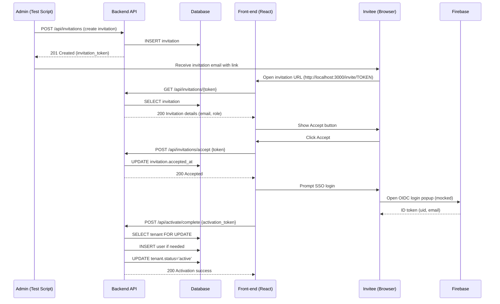
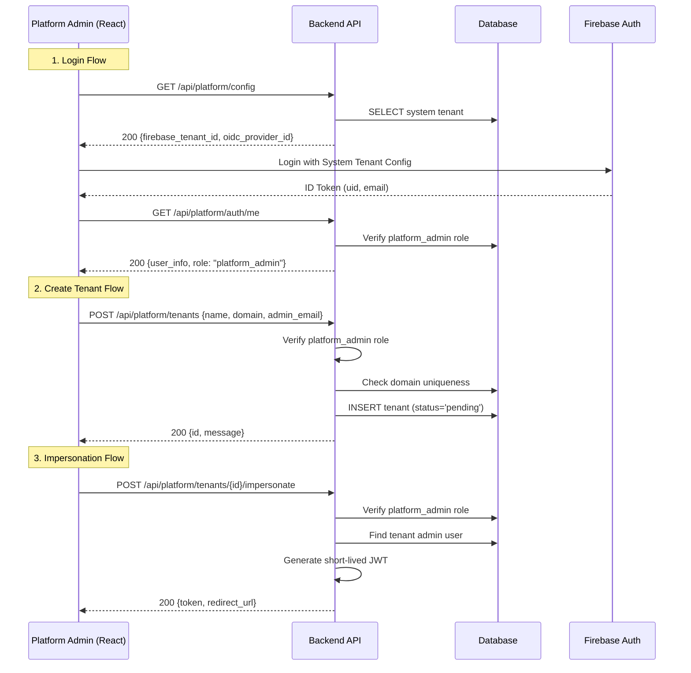
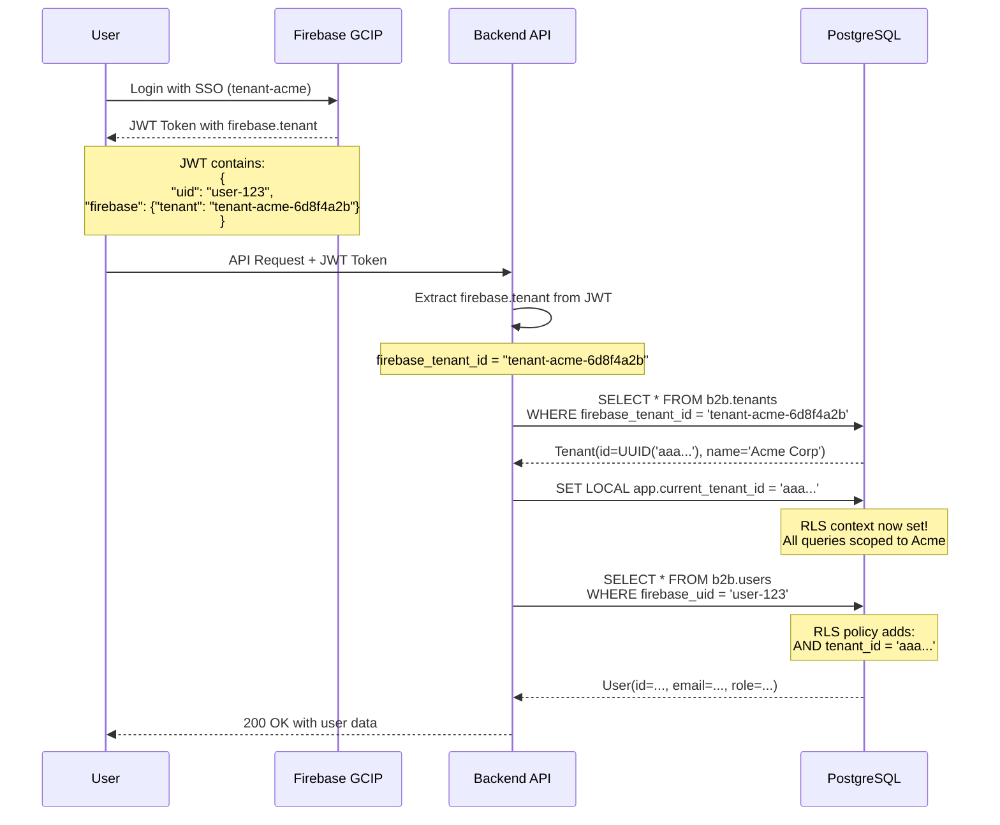
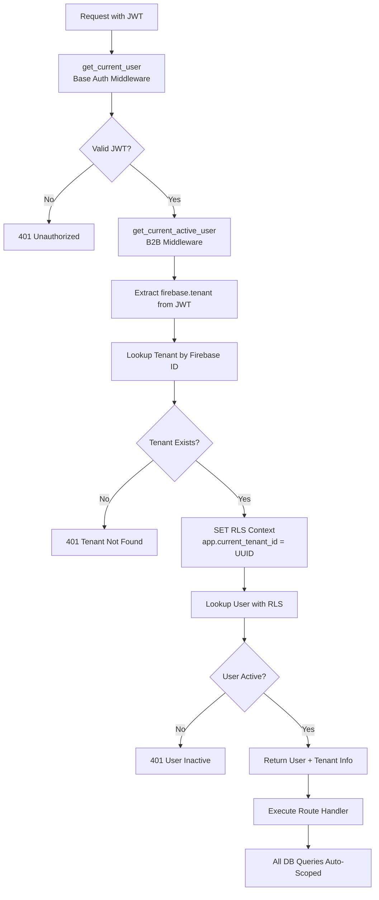
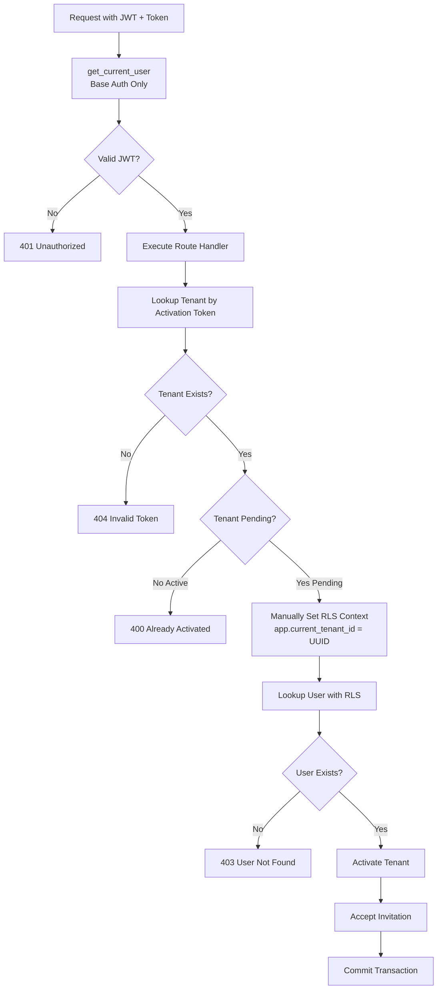
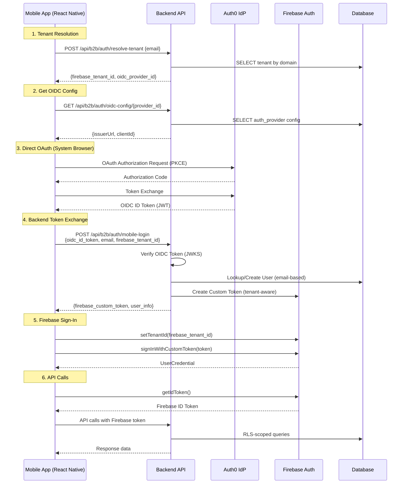
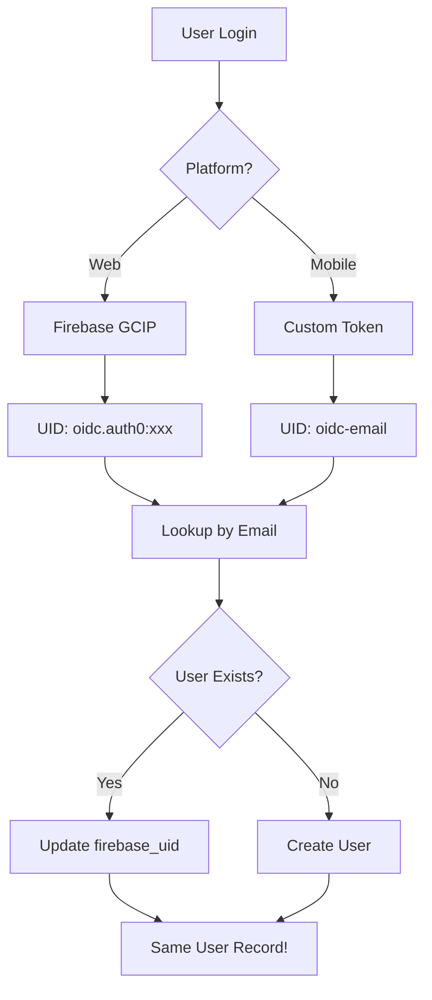
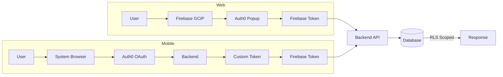

# API Sequence – Tenant On‑boarding & Invite‑User Flow

## Overview
This document describes, step‑by‑step, the **HTTP API calls** that make up the tenant activation (on‑boarding) flow and the invitation‑acceptance flow, and explains **what each endpoint does internally** (router logic → service layer → DB changes).

---

## Mermaid diagram (high‑level flow)


---

## Mermaid diagram – Invite‑User Flow

---

## Detailed step‑by‑step API sequence

### 1. **Create Tenant**
- **Endpoint**: `POST /api/tenants`
- **Router**: `app/routers/tenants.py` (not shown here but follows same pattern as other routers)
- **Service**: `tenant_service.create_tenant`
- **DB actions**: `INSERT` into `tenants` table, generates `tenant_id`, `activation_token`, `activation_expires_at`.
- **Response**: `{ "tenant_id": "<uuid>", "activation_token": "<token>" }`

### 2. **Create Invitation**
- **Endpoint**: `POST /api/invitations`
- **Router**: `app/routers/invitations.py`
- **Service**: `invitation_service.create_invitation`
- **DB actions**: `INSERT` into `invitations` with `email`, `role`, `invitation_token` (linked to tenant).
- **Response**: `{ "invitation_token": "<token>" }`

### 3. **Fetch Activation URL** (used by the test script to simulate the email link)
- **Endpoint**: `GET /api/invitations/{token}`
- **Router**: `app/routers/invitations.py`
- **Service**: `invitation_service.get_invitation_by_token`
- **DB actions**: `SELECT` invitation, compose URL `http://localhost:3000/activate/{token}`.
- **Response**: `{ "activation_url": "http://..." }`

### 4. **Validate Activation Token** (first front‑end request when user clicks the link)
- **Endpoint**: `GET /api/activate/validate/{token}`
- **Router**: `app/routers/activation.py` → `validate_activation_token`
- **Internal flow**:
  1. `tenant_service.get_tenant_by_activation_token` → fetch tenant.
  2. Verify token exists, not expired, tenant not already active.
  3. `invitation_service.get_invitation_by_token` → fetch admin email.
  4. Return `ActivationValidationResponse` (tenant_id, name, domain, admin_email, expires_at).
- **DB actions**: `SELECT` tenant & invitation, no writes.

### 5. **Retrieve SSO Configuration** (front‑end needs Firebase tenant & OIDC provider)
- **Endpoint**: `GET /api/activate/tenant-info/{tenant_id}`
- **Router**: `app/routers/activation.py` → `get_tenant_for_activation`
- **Internal flow**:
  1. `tenant_service.get_tenant_by_id` → fetch tenant.
  2. Return JSON with `firebase_tenant_id` and `oidc_provider_id`.
- **DB actions**: `SELECT` tenant.

### 6. **Complete Activation** (after successful SSO login)
- **Endpoint**: `POST /api/activate/complete`
- **Router**: `app/routers/activation.py` → `complete_activation`
- **Internal flow**:
  1. **Row lock** – `SELECT ... FOR UPDATE` on `TenantModel` using the activation token.
  2. **Replay protection** – check `activation_started_at`; if not set, set it now.
  3. **User lookup** – `user_service.get_user_by_firebase_uid` using `uid` from the Firebase mock token.
  4. **Role check** – ensure the user has `admin` role.
  5. **Accept invitation** – `invitation_service.accept_invitation` updates `accepted_at`.
  6. **Activate tenant** – `tenant_service.activate_tenant` sets `activation_status='active'` and records `activated_at`.
  7. Commit transaction and return success payload.
- **DB actions**: `SELECT ... FOR UPDATE`, possible `INSERT` of user (if not present), `UPDATE` invitation, `UPDATE` tenant.

### 7. **Poll Activation Status** (front‑end polls until SSO login creates the user)
- **Endpoint**: `GET /api/activate/check-status/{token}`
- **Router**: `app/routers/activation.py` → `check_activation_status`
- **Internal flow**:
  1. Fetch tenant & invitation.
  2. Query `users` table for a record matching the invitation email and `is_active=True`.
  3. Return `{status: "ready", user_created: true}` when the user exists, otherwise `{status: "pending"}`.
- **DB actions**: `SELECT` tenant, invitation, and user.

---

## Where the code lives
| Component | File | Responsibility |
|-----------|------|----------------|
| **Router** | `app/routers/activation.py` | HTTP endpoint definitions, request validation, response models |
| **Tenant service** | `app/services/tenant_service.py` | DB CRUD for tenants, token generation, activation logic |
| **Invitation service** | `app/services/invitation_service.py` | Create/accept invitations, token handling |
| **User service** | `app/services/user_service.py` | Lookup/create users based on Firebase UID |
| **Auth middleware** | `app/middleware/auth.py` | Extracts Firebase mock token, provides `current_user` dependency |
| **Test helpers** | `backend/tests/conftest.py` & `backend/tests/integration/` | `create_test_tenant`, `create_test_invitation` factories used by the test suite |

---

## Quick reference table (API → Service → DB)
| HTTP Method & Path | Service called | DB operation |
|---------------------|----------------|--------------|
| `POST /api/tenants` | `tenant_service.create_tenant` | `INSERT tenants` |
| `POST /api/invitations` | `invitation_service.create_invitation` | `INSERT invitations` |
| `GET /api/invitations/{token}` | `invitation_service.get_invitation_by_token` | `SELECT invitation` |
| `GET /api/activate/validate/{token}` | `tenant_service.get_tenant_by_activation_token` + `invitation_service.get_invitation_by_token` | `SELECT tenant`, `SELECT invitation` |
| `GET /api/activate/tenant-info/{tenant_id}` | `tenant_service.get_tenant_by_id` | `SELECT tenant` |
| `POST /api/activate/complete` | `tenant_service.activate_tenant`, `invitation_service.accept_invitation`, `user_service.get_user_by_firebase_uid` | `SELECT … FOR UPDATE`, possible `INSERT user`, `UPDATE invitation`, `UPDATE tenant` |
| `GET /api/activate/check-status/{token}` | `invitation_service.get_invitation_by_token`, `user_service.get_user_by_firebase_uid` | `SELECT invitation`, `SELECT user` |

---

## How to extend / customise
1. **Add extra validation** – modify `validate_activation_token` to also check tenant‑level feature flags.
2. **Support multi‑step SSO** – expose additional endpoint to fetch OIDC discovery metadata.
3. **Audit logging** – hook into `tenant_service.activate_tenant` to write an audit record (already present in `app/services/tenant_service.py`).

---

*Document generated on 2025‑11‑27.  Keep this file in `docs/` and reference it from the onboarding README.*

---

## Platform Tenant Onboarding Flow

This flow describes how a Platform Admin logs in and creates a new tenant.

### Mermaid Diagram (Platform Admin)



### Detailed API Steps

#### 1. **Get Platform Configuration**
- **Endpoint**: `GET /api/platform/config`
- **Access**: Public
- **Purpose**: Frontend needs to know *which* Firebase tenant to use for platform admin login.
- **Response**: `{ "firebase_tenant_id": "...", "oidc_provider_id": "..." }`

#### 2. **Platform Admin Login**
- **Endpoint**: `GET /api/platform/auth/me`
- **Access**: Authenticated (Firebase Token)
- **Middleware**: `verify_platform_admin`
- **Logic**:
  1. Validates Firebase token.
  2. Checks if user belongs to **System Tenant**.
  3. Checks if user has `platform_admin` role.
  4. Returns user details.

#### 3. **Create New Tenant**
- **Endpoint**: `POST /api/platform/tenants`
- **Access**: Platform Admin Only
- **Logic**:
  1. Verifies admin privileges.
  2. Checks if domain is unique.
  3. Creates tenant record in `tenants` table.
  4. (Future) Triggers async provisioning workflow.

#### 4. **Impersonate Tenant Admin**
- **Endpoint**: `POST /api/platform/tenants/{id}/impersonate`
- **Access**: Platform Admin Only
- **Logic**:
  1. Finds the target tenant's admin user.
  2. Generates a custom JWT signed by the backend.
  3. Frontend uses this token to "login as" that user.

---

## Tenant Resolution and RLS Context Management

### Overview

Our multi-tenant architecture uses **Firebase GCIP (Google Cloud Identity Platform) Multi-Tenancy** to isolate tenant authentication. Each tenant gets a unique Firebase tenant ID that is automatically embedded in JWT tokens. The backend then resolves this to our internal tenant UUID and sets Row Level Security (RLS) context.

### Two-Layer Tenant Identification

#### Layer 1: Firebase Tenant ID (External)
- **Format**: `"tenant-acme-6d8f4a2b"` (Firebase string identifier)
- **Stored in**: JWT token (`firebase.tenant` field)
- **Set by**: Firebase GCIP during user login
- **Purpose**: Identifies which Firebase tenant the user authenticated with
- **Managed by**: Firebase (external service)

#### Layer 2: Internal Tenant UUID (Database)
- **Format**: `123e4567-e89b-12d3-a456-426614174000` (UUID)
- **Stored in**: Database (`b2b.tenants.id`)
- **Linked via**: `b2b.tenants.firebase_tenant_id` column
- **Purpose**: Database RLS context and foreign key relationships
- **Managed by**: Our backend

### Tenant Resolution Flow



### Middleware Flow Comparison

#### Standard B2B API Requests (Automatic Resolution)

**Used by**: `/api/b2b/invitations/*`, `/api/b2b/teams/*`, etc.



**Implementation**: `services/b2b/middleware/b2b_auth.py`

```python
async def get_current_active_user(
    decoded_token: Dict[str, Any] = Depends(get_current_user),
    db: AsyncSession = Depends(get_db)
) -> Dict[str, Any]:
    # Extract Firebase tenant ID from token
    firebase_tenant_id = decoded_token.get('firebase', {}).get('tenant')
    
    # 1. Resolve Tenant UUID (NO RLS - tenants is global)
    tenant = await tenant_service.get_tenant_by_firebase_id(db, firebase_tenant_id)
    
    # 2. Set RLS Context
    current_tenant_id.set(str(tenant.id))
    await db.execute(text(f"SET LOCAL app.current_tenant_id = '{tenant.id}'"))
    
    # 3. Lookup User (WITH RLS - users table is protected)
    result = await db.execute(
        select(UserModel).where(UserModel.firebase_uid == firebase_uid)
    )
    user_row = result.scalar_one_or_none()
    
    return {"id": user.id, "tenant_id": tenant.id, "role": user.role, ...}
```

#### Activation API Requests (Manual Resolution)

**Used by**: `/api/b2b/activation/complete`



**Why Different?**
- Tenant is `activation_status='pending'` (not active)
- Standard B2B middleware expects fully active tenants
- Need manual control over RLS context for pending state
- Must handle case where tenant transitions pending → active

**Implementation**: `services/b2b/routers/activation.py`

```python
async def complete_activation(
    current_user: Dict[str, Any] = Depends(get_current_user),  # Base auth only
    db: AsyncSession = Depends(get_db)
):
    # Manual tenant resolution (tenant might be pending)
    
    # 1. Get tenant by activation token (NO RLS - tenants is global)
    tenant = await tenant_service.get_tenant_by_activation_token(db, token)
    
    # 2. Manually set RLS context for this specific tenant
    await rls_service.set_tenant_context(db, tenant.id)
    
    # 3. Query users/invitations (WITH RLS - tables are protected)
    user = await user_service.get_user_by_firebase_uid(db, tenant.id, firebase_uid)
    
    # 4. Activate tenant and accept invitation
    await invitation_service.accept_invitation(db, token)
    await tenant_service.activate_tenant(db, tenant.id, user.id)
    
    await db.commit()  # Router commits, not services
```

### JWT Token Structure

**Example Firebase GCIP JWT Token:**

```json
{
  "iss": "https://securetoken.google.com/project-id",
  "aud": "project-id",
  "iat": 1702000000,
  "exp": 1702003600,
  "uid": "firebase-user-abc123",
  "email": "john.doe@acme.com",
  "email_verified": true,
  "firebase": {
    "identities": {
      "oidc.auth0": ["auth0|64f7e8a9b2c1d3e4f5g6h7i8"],
      "email": ["john.doe@acme.com"]
    },
    "sign_in_provider": "oidc.auth0",
    "tenant": "tenant-acme-6d8f4a2b"   ← Firebase Tenant ID
  }
}
```

**Key Fields for Tenant Resolution:**
- `firebase.tenant`: Firebase tenant ID (string)
- `uid`: Firebase user ID (unique per user per Firebase project)
- `email`: User's email address
- `email_verified`: Must be `true` for invitation acceptance

### Database Schema

#### Tenants Table (Global - No RLS)
```sql
CREATE TABLE b2b.tenants (
    id UUID PRIMARY KEY DEFAULT gen_random_uuid(),
    name VARCHAR(255) NOT NULL,
    domain VARCHAR(255) UNIQUE NOT NULL,
    firebase_tenant_id VARCHAR(255) UNIQUE NOT NULL,  -- Links to Firebase
    activation_status VARCHAR(50) DEFAULT 'pending',
    activation_token VARCHAR(255),
    activation_expires_at TIMESTAMPTZ,
    is_active BOOLEAN DEFAULT TRUE,
    created_at TIMESTAMPTZ DEFAULT NOW()
);

-- Example:
-- id: 123e4567-e89b-12d3-a456-426614174000
-- firebase_tenant_id: 'tenant-acme-6d8f4a2b'
-- activation_status: 'active'
```

#### Users Table (RLS-Protected)
```sql
CREATE TABLE b2b.users (
    id UUID PRIMARY KEY DEFAULT gen_random_uuid(),
    tenant_id UUID NOT NULL REFERENCES b2b.tenants(id),
    firebase_uid VARCHAR(255) NOT NULL,
    email VARCHAR(255) NOT NULL,
    role_id UUID REFERENCES b2b.roles(id),
    is_active BOOLEAN DEFAULT TRUE,
    created_at TIMESTAMPTZ DEFAULT NOW(),
    UNIQUE(tenant_id, firebase_uid),
    UNIQUE(tenant_id, email)
);

ALTER TABLE b2b.users ENABLE ROW LEVEL SECURITY;

CREATE POLICY users_tenant_isolation ON b2b.users
    USING (tenant_id::text = current_setting('app.current_tenant_id', true));
```

### Security Guarantees

#### Defense Layer 1: JWT Signature Validation
- ✅ Firebase validates cryptographic signatures with private keys
- ✅ Only Firebase can issue valid tokens
- ✅ Tampering invalidates signature → 401 Unauthorized

#### Defense Layer 2: Tenant Resolution
- ✅ Backend looks up tenant by Firebase ID
- ✅ Non-existent tenants → 401 Tenant Not Found
- ✅ Inactive tenants rejected

#### Defense Layer 3: RLS Context
- ✅ Every request sets `app.current_tenant_id` to specific tenant UUID
- ✅ All queries to RLS-protected tables automatically scoped
- ✅ Cannot be bypassed by application code

#### Defense Layer 4: Database RLS Policies
- ✅ PostgreSQL enforces policies at row level
- ✅ Even direct SQL cannot bypass RLS (unless BYPASSRLS privilege)
- ✅ Test users do NOT have BYPASSRLS

#### Defense Layer 5: Role-Based Permissions
- ✅ Actions require specific permissions checked via `has_permission()`
- ✅ Permissions tied to roles, roles tied to tenants
- ✅ Double-check after RLS scoping

### Common Attack Scenarios

#### Scenario 1: User Tries to Access Another Tenant's Data
```
Request: GET /api/b2b/invitations/list
JWT: {"firebase": {"tenant": "tenant-acme-6d8f4a2b"}}

Middleware resolves:
  → Acme tenant (UUID: aaa...)
  → SET app.current_tenant_id = 'aaa...'

Database executes:
  SELECT * FROM b2b.invitations 
  WHERE tenant_id = 'aaa...'  ← RLS adds this

Result: Only sees Acme's invitations, never other tenants
```

#### Scenario 2: Malicious User Modifies JWT
```
Original: {"firebase": {"tenant": "tenant-acme-6d8f4a2b"}}
Tampered: {"firebase": {"tenant": "tenant-globex-9f2e1c7d"}}

Result:
  → Firebase signature validation FAILS
  → Request rejected with 401 before reaching backend
  → Attacker never reaches tenant resolution logic
```

#### Scenario 3: SQL Injection Attempt
```
Request: GET /api/b2b/users?search=' OR '1'='1
RLS Context: app.current_tenant_id = 'aaa...'

Even if SQL injection succeeds:
  SELECT * FROM b2b.users 
  WHERE name LIKE '%' OR '1'='1%'
  AND tenant_id = 'aaa...'  ← RLS policy still enforced

Result: Still only returns Acme's users, not all users
```

### RLS Service (Centralized Management)

**File**: `services/b2b/services/rls_service.py`

```python
class RLSService:
    @staticmethod
    async def set_tenant_context(db: AsyncSession, tenant_id: UUID):
        """Set RLS context for session"""
        await db.execute(text(f"SET LOCAL app.current_tenant_id = '{tenant_id}'"))
    
    @staticmethod
    async def get_current_context(db: AsyncSession) -> Optional[UUID]:
        """Get current RLS context (for testing/debugging)"""
        result = await db.execute(
            text("SELECT current_setting('app.current_tenant_id', true)")
        )
        value = result.scalar()
        return UUID(value) if value else None
    
    @staticmethod
    async def clear_context(db: AsyncSession):
        """Clear RLS context (mainly for testing)"""
        await db.execute(text("RESET app.current_tenant_id"))
```

**Benefits:**
- ✅ Centralized RLS management
- ✅ Testable - can verify context was set
- ✅ Consistent across routers, services, tests
- ✅ Easy debugging with `get_current_context()`

### Summary

**Tenant Resolution Process:**
1. User logs in → Firebase issues JWT with `firebase.tenant` field
2. Backend extracts Firebase tenant ID from token
3. Backend looks up internal tenant UUID via `firebase_tenant_id` column
4. Backend sets RLS context with internal UUID
5. All queries automatically scoped to that tenant via RLS policies

**Security:**
- Cannot forge Firebase tokens (cryptographic signatures)
- Cannot bypass tenant resolution (middleware enforced)
- Cannot bypass RLS (database-level enforcement)
- Defense in depth across 5 layers

**Implementation:**
- Standard B2B APIs: Automatic via `get_current_active_user` middleware
- Activation APIs: Manual via direct `rls_service.set_tenant_context()`
- Platform APIs: `app.is_platform_admin = 'true'` to bypass RLS

---

## Mobile Native Authentication Flow

This section describes the React Native mobile app authentication flow, which uses a different approach than web due to OIDC/OAuth limitations in mobile environments.

### Architecture Comparison: Web vs Mobile

| Aspect | Web | Mobile Native |
|--------|-----|---------------|
| **OAuth Flow** | Firebase GCIP handles OIDC | Direct Auth0 OAuth + Custom Token |
| **Firebase Token** | GCIP issues token after popup | Backend issues Custom Token |
| **Tenant API** | Browser popup with tenant set | `auth().setTenantId()` async method |
| **User Identity** | GCIP-generated UID | Backend-generated UID (email-based) |

### Mobile Authentication Sequence



### Key Components

#### 1. Tenant Resolution (`/api/b2b/auth/resolve-tenant`)

Allows mobile app to discover tenant configuration from email:

```python
# Router: services/b2b/routers/auth.py
@router.post("/resolve-tenant")
async def resolve_tenant(request: TenantResolutionRequest):
    domain = request.email.split('@')[1]
    tenant = await tenant_service.get_tenant_by_domain(db, domain)
    return {
        "firebase_tenant_id": tenant.firebase_tenant_id,
        "oidc_provider_id": tenant.auth_providers[0].provider_id
    }
```

#### 2. OIDC Configuration (`/api/b2b/auth/oidc-config/{provider_id}`)

Returns OAuth Configuration for `react-native-app-auth`:

```python
# Response
{
    "issuer_url": "https://dev-xxx.us.auth0.com",
    "client_id": "mobile_native_client_id",  # Auth0 Native App
    "scopes": ["openid", "profile", "email"]
}
```

#### 3. Mobile Token Exchange (`/api/b2b/auth/mobile-login`)

Most critical endpoint - validates Auth0 token and issues Firebase Custom Token:

```python
# Router: services/b2b/routers/auth.py
@router.post("/mobile-login")
async def mobile_login(request: MobileLoginRequest):
    # 1. Verify OIDC token from Auth0 (signature, issuer, audience)
    jwks_client = PyJWKClient(f"{issuer}/.well-known/jwks.json")
    decoded = jwt.decode(token, signing_key, algorithms=["RS256"])
    
    # 2. Create user (email-based identity)
    user = await user_service.get_or_create_user_by_email(
        db, tenant.id, email, firebase_uid, role
    )
    
    # 3. Generate Firebase Custom Token (tenant-aware)
    from firebase_admin import tenant_mgt
    tenant_client = tenant_mgt.auth_for_tenant(firebase_tenant_id)
    custom_token = tenant_client.create_custom_token(uid, claims)
    
    return {"firebase_custom_token": custom_token.decode(), "user": user}
```

#### 4. React Native Firebase Integration

**Critical**: Must use `setTenantId()` **method**, not property setter:

```javascript
// WRONG - Returns null on React Native Firebase!
this.auth.tenantId = tenantId;

// CORRECT - Use async method
await this.auth.setTenantId(tenantId);
await this.auth.signInWithCustomToken(customToken);
```

**Implementation**: `frontend/src/core/firebase/authService.native.js`

### AuthProvider Configuration

#### Database Model

The `auth_providers` table stores IdP configuration with mobile-specific client ID:

```python
# Model: services/b2b/models/auth_provider.py
class AuthProvider(Base):
    __tablename__ = "auth_providers"
    
    config_data = Column(JSONB)  # Stores OIDC config
    
    @property
    def oidc_client_id_mobile(self):
        # Separate client ID for Native apps (Auth0 requires this)
        return self.config_data.get('mobile_client_id')
```

#### Auth0 Configuration Note

Auth0 requires **separate applications** for web and mobile:
- **Web**: "Regular Web Application" (confidential client)
- **Mobile**: "Native Application" (public client with PKCE)

---

## Email-Based User Identity Management

### The Problem: Cross-Platform UID Inconsistency

Without proper handling, the same user logging in from web and mobile would get different Firebase UIDs:

| Platform | UID Generation | Example UID |
|----------|----------------|-------------|
| **Web** | Firebase GCIP | `oidc.auth0-company:auth0\|abc123...` |
| **Mobile** | Custom Token (old) | `oidc-john_acme_com` |

This causes users to appear as **two different people** in the database!

### Solution: Email as Canonical Identity

We use **email address** as the stable, canonical user identity. Firebase UID is treated as an authentication method that can change.



### Implementation

#### User Service Method

```python
# Service: services/b2b/services/user_service.py
async def get_or_create_user_by_email(
    self,
    db: AsyncSession,
    tenant_id: UUID,
    email: str,
    firebase_uid: str,
    name: str = None,
    role: str = "viewer"
) -> User:
    """
    Industry-standard email-based identity lookup.
    
    - Lookup by email (NOT firebase_uid)
    - If found: update firebase_uid to latest
    - If not found: create new user
    """
    email_lower = email.lower()
    
    # 1. Find existing user by email
    result = await db.execute(
        select(UserModel)
        .where(UserModel.tenant_id == tenant_id)
        .where(UserModel.email == email_lower)
    )
    existing = result.scalar_one_or_none()
    
    if existing:
        # 2a. Update firebase_uid if changed (handles web↔mobile)
        if existing.firebase_uid != firebase_uid:
            existing.firebase_uid = firebase_uid
        existing.last_login = now
        await db.flush()
        return existing
    else:
        # 2b. Create new user
        return await self.create_or_update_user(...)
```

#### Endpoint Usage

Both `/auth/me` and `/auth/sync-user` use this method:

```python
# Router: services/b2b/routers/auth.py
user = await user_service.get_or_create_user_by_email(
    db=db,
    tenant_id=tenant.id,
    email=email,
    firebase_uid=firebase_uid,
    name=name,
    role=user_role
)
```

### Cross-Platform Scenarios

| Scenario | Behavior | Result |
|----------|----------|--------|
| User activates on Web, logs in on Mobile | Finds user by email, updates UID | ✅ Same user |
| User first logs in on Mobile, then Web | Finds user by email, updates UID | ✅ Same user |
| User uses both platforms concurrently | Each login updates UID to latest | ✅ Same user |

### Security Considerations

1. **Email Verification**: OIDC tokens contain `email_verified` claim - always verify email is confirmed by IdP
2. **Tenant Isolation**: Email lookup is scoped to `tenant_id` via RLS
3. **UID Updates**: Only update firebase_uid if user already exists (prevents account hijacking)

---

## Summary: Complete Authentication Architecture

### Authentication Paths



### Key Files

| File | Purpose |
|------|---------|
| `services/b2b/routers/auth.py` | Mobile login, tenant resolution, user sync |
| `services/b2b/services/user_service.py` | Email-based user identity |
| `core/utils/firebase.py` | Custom token generation |
| `frontend/src/core/firebase/authService.native.js` | React Native Firebase integration |
| `frontend/src/core/firebase/oidcAuthService.native.js` | react-native-app-auth OAuth |

---

*Updated 2025-12-09: Added Mobile Native Authentication and Email-Based Identity sections*
