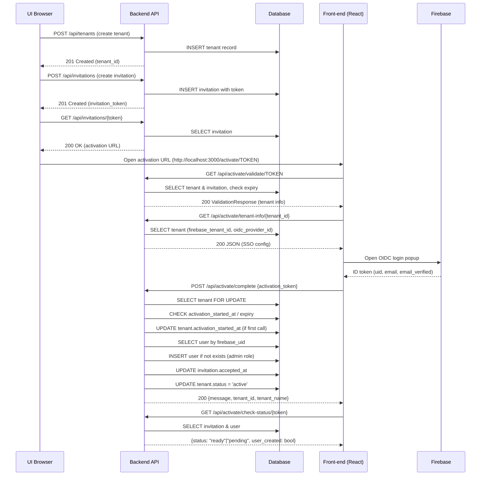
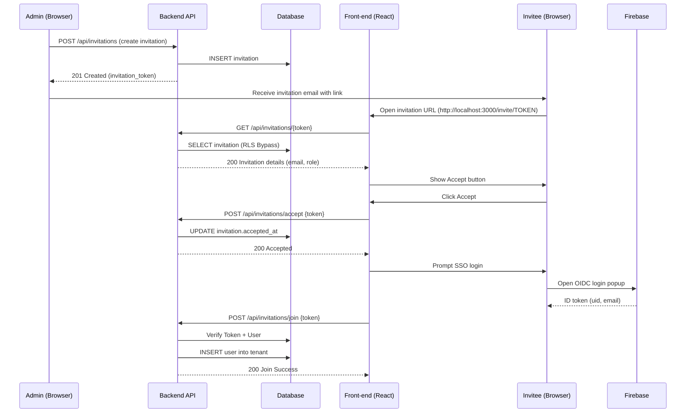
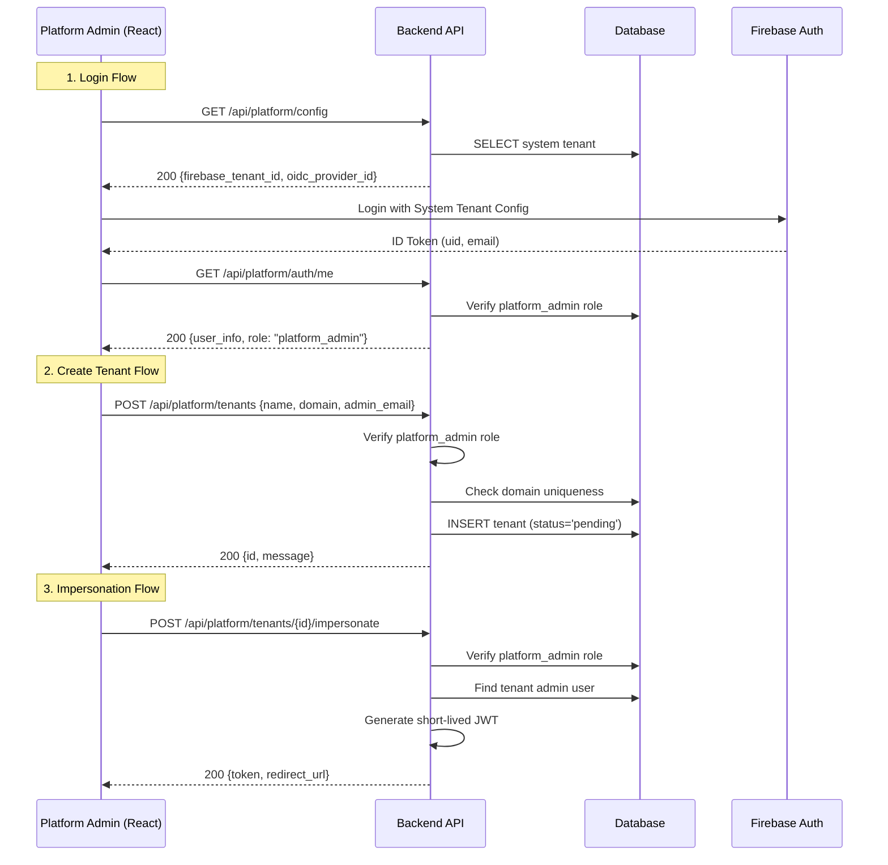

# Growth Workflows: Onboarding & Invitations

**Audience:** Product Managers, Frontend Developers, Backend Engineers

This document visualizes the core growth workflows: **Tenant Activation** (Onboarding), **User Invitation**, and **Platform Administration**.

For lower-level details on how requests are secured, see:
-   [Authentication Architecture](./authentication.md) - Request lifecycle & Mobile Auth
-   [Multi-Tenant Isolation](./multi-tenant-isolation.md) - RLS Mechanics

---

## 1. Tenant Activation Flow 🚀

How a "Pending" tenant becomes "Active" via the owner's first login.

### Key API Steps
1.  **Validate Token**: `GET /api/activate/validate/{token}` - Public endpoint (Bypasses RLS). Checks if tenant is pending.
2.  **Complete Activation**: `POST /api/activate/complete` - Requires Firebase Login. Transitions tenant state Pending → Active.

---

## 2. User Invitation Flow 📩

How an existing tenant admin invites a new member.

### RLS Bypass Strategy (Critical)
Since the `GET /invitations/{token}` endpoint is public (no user context yet), it uses a special **RLS Bypass** pattern:
1.  Router temporarily grants **Platform Admin** context (`app.is_platform_admin=true`).
2.  Looks up token globally across all tenants.
3.  Once found, immediately **scopes down** to that specific tenant (`set_tenant_context`) for subsequent operations.

---

## 3. Platform Admin Flows ⚡

Super-admin capabilities for managing the system.

### Platform Mermaid Diagram

### Steps
1.  **Login**: Authenticates against the dedicated **Platform Tenant**.
2.  **Impersonation**: Generates a short-lived custom JWT that allows the admin to "become" a tenant owner for debugging.
