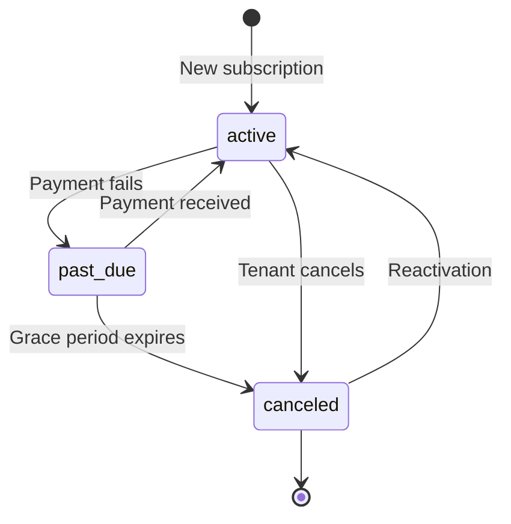

# B2B Subscription & Billing Specification

## Overview

The B2B subscription system provides tenant-level seat-based pricing with flexible payment options. Each organization (tenant) has exactly one active subscription that determines their feature access and billing.

## Subscription Tiers

### Starter (Free)
- **Base Price**: $0/month
- **Per-Seat Price**: $0/user
- **Features**: Basic SSO functionality
- **Payment Mode**: N/A (free)
- **Target**: Small teams evaluating the platform

### Professional
- **Base Price**: $50/month
- **Per-Seat Price**: $20/user/month
- **Features**: Advanced SSO, team management, basic audit logs
- **Payment Modes**: Card (Stripe) or Invoice
- **Billing Intervals**: Monthly or Yearly
- **Target**: Growing teams (5-50 users)

### Enterprise
- **Base Price**: $200/month
- **Per-Seat Price**: $50/user/month
- **Features**: All Professional features + advanced audit logs, custom SAML, priority support
- **Payment Modes**: Card (Stripe) or Invoice
- **Billing Intervals**: Monthly or Yearly
- **Target**: Large organizations (50+ users)

## Pricing Model

### Seat-Based Calculation

```
Total Monthly Cost = Base Price + (Active Seats × Per-Seat Price)
```

**Example (Professional tier, 10 active users):**
```
$50 + (10 × $20) = $250/month
```

### Seat Counting Rules

1. **Active Seats**: Count of users where `is_active = true`
2. **Recalculation**: Automated daily via Celery task
3. **Billing Period**: Seat count is frozen at billing period start for invoice generation
4. **Mid-Period Changes**: New users added mid-period are included in next billing cycle

### Yearly Billing

- **Discount**: 2 months free (10/12 months charged)
- **Calculation**: `(Monthly Cost × 10)`
- **Payment**: Upfront for the year
- **Seat Adjustments**: Prorated charges/credits for mid-year changes

## Payment Modes

### Card (Stripe)

- **Processing**: Automated via Stripe Checkout
- **Billing Cycle**: Monthly or Yearly subscription
- **Auto-Renewal**: Enabled by default
- **Invoice Generation**: Automatic from Stripe
- **Available For**: Professional, Enterprise tiers

**Workflow:**
1. Tenant initiates upgrade via frontend
2. Backend creates Stripe Checkout Session
3. User completes payment on Stripe
4. Webhook confirms payment
5. Subscription activated/upgraded
6. Email confirmation sent

### Invoice (Billable)

- **Processing**: Manual payment via wire transfer, check, etc.
- **Approval**: Requires platform admin approval to switch from card
- **Billing Cycle**: Monthly invoice generation on 1st of month
- **Payment Terms**: Net 30 days
- **Available For**: Enterprise tier only (typically)

**Workflow:**
1. Auto-generate invoice on billing period start
2. Email invoice to tenant admin
3. Tenant submits payment proof
4. Platform admin marks invoice as paid
5. Payment recorded in system

## Subscription Lifecycle

### Status Values

| Status | Description | Next States |
|--------|-------------|-------------|
| `active` | Subscription is current and paid | `past_due`, `canceled` |
| `past_due` | Payment failed or overdue invoice | `active`, `canceled` |
| `canceled` | Subscription ended by tenant/admin | `active` (if reactivated) |
| `trialing` | Free trial period (future) | `active`, `canceled` |

### State Transitions



### Tier Changes

**Upgrades (Starter → Professional → Enterprise):**
- Effective immediately
- Prorated charges for remaining period (future enhancement)
- New checkout session required for card payments

**Downgrades:**
- Effective at end of current billing period
- No refunds for remaining time
- Features reduced on downgrade date

## Invoice Management

### Invoice Statuses

| Status | Description | Transitions |
|--------|-------------|-------------|
| `draft` | Auto-generated, not finalized | → `sent` |
| `sent` | Emailed to tenant | → `paid`, `overdue` |
| `approved` | Reviewed by platform admin (invoice mode) | → `sent` |
| `paid` | Payment confirmed | Terminal state |
| `overdue` | Past due date, unpaid | → `paid` |
| `voided` | Canceled/invalidated | Terminal state |

### Invoice Generation

**Automated (Monthly):**
- **Trigger**: Celery beat task on 1st of each month (00:00 UTC)
- **Scope**: All tenants with `invoice` payment mode
- **Data Snapshot**: Captures seat count, pricing at generation time
- **Invoice Number Format**: `INV-YYYYMM-TENANTID`

**Manual Override:**
- Platform admin can generate on-demand via API
- Used for corrections, prorated charges, one-time fees

### Payment Tracking

**Card Payments:**
- Synced from Stripe via webhooks
- Invoice marked paid immediately on successful charge

**Invoice Payments:**
- Platform admin marks as paid via API
- Requires: payment date, admin ID, optional notes
- Audit trail maintained in `subscription_events`

## API Endpoints

### Tenant-Facing APIs

```
GET    /api/b2b/billing/subscription
POST   /api/b2b/billing/checkout
GET    /api/b2b/billing/invoices
GET    /api/b2b/billing/invoices/{id}
POST   /api/b2b/billing/webhooks/stripe
```

### Platform Admin APIs (Future)

```
GET    /api/platform/billing/subscriptions
POST   /api/platform/billing/invoices/{id}/mark-paid
GET    /api/platform/billing/invoices/overdue
POST   /api/platform/billing/payment-mode-requests/{id}/approve
```

## Database Schema

### Tables

#### `b2b.subscriptions`
Primary subscription record for each tenant.

**Key Fields:**
- `tenant_id` (UUID, unique) - Links to tenant
- `tier` (enum) - starter/professional/enterprise
- `payment_mode` (enum) - card/invoice
- `status` (enum) - active/past_due/canceled
- `seat_count` (integer) - Current active users
- `total_amount_cents` (integer) - Current monthly cost
- `current_period_start/end` (timestamp) - Billing period
- `stripe_subscription_id` (string) - For card payments

#### `b2b.invoices`
Billing invoices for invoice-mode subscriptions.

**Key Fields:**
- `subscription_id` (UUID) - Links to subscription
- `invoice_number` (string, unique) - Human-readable ID
- `status` (enum) - draft/sent/paid/overdue/voided
- `amount_due` (integer cents) - Total owed
- `seat_count_snapshot` (integer) - Frozen at generation
- `billing_period_start/end` (timestamp) - Coverage period
- `due_date` (timestamp) - Payment deadline
- `paid_at` (timestamp) - Payment confirmation time

#### `b2b.subscription_events`
Audit trail for all subscription changes.

**Key Fields:**
- `subscription_id` (UUID)
- `event_type` (enum) - created/upgraded/downgraded/canceled/payment_failed/etc.
- `metadata` (jsonb) - Context data (old/new values, reason, etc.)

#### `b2b.payment_mode_requests`
Approval workflow for switching payment modes.

**Key Fields:**
- `subscription_id` (UUID)
- `requested_mode` (enum) - Desired payment mode
- `status` (enum) - pending/approved/rejected
- `justification` (text) - Business reason
- `reviewed_by` (UUID) - Platform admin

### Row-Level Security (RLS)

All tables enforce tenant isolation:

```sql
CREATE POLICY tenant_isolation ON b2b.subscriptions
FOR ALL TO sso_user
USING (tenant_id::text = current_setting('app.current_tenant_id', true));
```

**Context Setting:**
- Set via middleware in `services.b2b.middleware.b2b_auth`
- Applied on every authenticated request
- Prevents cross-tenant data access

## Business Rules

### BR-1: One Subscription Per Tenant
- Each tenant has exactly one active subscription
- Archived subscriptions retained for history
- New subscription cancels/replaces existing

### BR-2: Seat Count Accuracy
- Daily recalculation ensures accuracy
- Frozen for invoice generation to prevent disputes
- Manual overrides tracked in audit log

### BR-3: Payment Mode Constraints
- **Starter**: No payment required
- **Professional**: Card or Invoice (with approval)
- **Enterprise**: Card or Invoice (typically pre-approved)

### BR-4: Downgrade Protection
- Cannot downgrade if active seats exceed target tier limits
- Must deactivate users first or contact support
- Prevents data loss/feature breakage

### BR-5: Grace Periods
- **Card Failures**: 3 retry attempts over 7 days
- **Overdue Invoices**: 30 days before suspension
- **Suspension**: Read-only access, no login for regular users
- **Cancellation**: After 60 days overdue

### BR-6: Renewal Behavior
- **Auto-renew**: Enabled by default for card subscriptions
- **Manual Renewal**: Required for invoice mode
- **Notification**: Email sent 7 days before renewal

## Integration Points

### Stripe Integration

**Configuration:**
- Separate B2B Stripe account (different keys from B2C)
- Webhook endpoint: `/api/b2b/billing/webhooks/stripe`
- Product IDs configured per tier/interval

**Key Events:**
- `checkout.session.completed` - Subscription created/upgraded
- `invoice.payment_succeeded` - Recurring payment successful
- `invoice.payment_failed` - Payment failure notification
- `customer.subscription.deleted` - Subscription canceled

### Email Notifications

**Templates** (`backend/templates/b2b/`):
- `subscription_activated.txt` - New subscription confirmation
- `subscription_upgraded.txt` - Tier upgrade notification
- `invoice_generated.txt` - Monthly invoice delivery
- `invoice_payment_reminder.txt` - Overdue payment reminder

**Triggers:**
- Subscription changes (webhook/service)
- Invoice generation (Celery task)
- Payment confirmations (webhook)

### Celery Tasks

**Scheduled Tasks:**
```python
# Daily at 02:00 UTC
recalculate_seat_counts.delay()

# Monthly on 1st at 00:00 UTC  
auto_generate_monthly_invoices.delay()

# Daily at 08:00 UTC (future)
send_payment_reminders.delay()
```

## Frontend Integration

### Subscription Settings Page

**Location**: `/billing/subscription`

**Features:**
- Current plan display with pricing breakdown
- Tier comparison table
- Upgrade/downgrade buttons
- Stripe Checkout integration
- Payment mode badge

### Invoices Page

**Location**: `/billing/invoices`

**Features:**
- Invoice list with status filters
- Downloadable PDF links (future)
- Payment status tracking
- Summary statistics

## Testing

### Test Coverage

**11/12 E2E tests passing (92% coverage)**

**Covered Scenarios:**
- ✅ Default starter tier for new tenants
- ✅ Subscription retrieval with seat counting
- ✅ Checkout session creation
- ✅ Invoice generation and formatting
- ✅ RLS isolation between tenants
- ✅ Payment tracking
- ✅ Overdue invoice queries

**Known Limitation:**
- ❌ Stripe checkout flow requires API keys in test environment

## Migration & Deployment

### Database Migration

**File**: `backend/migrations/b2b/008_billing.sql`

**Execution:**
```bash
psql $DATABASE_URL -f backend/migrations/b2b/008_billing.sql
```

### Environment Variables

```bash
# Stripe B2B Configuration
STRIPE_B2B_SECRET_KEY=sk_test_...
STRIPE_B2B_PUBLISHABLE_KEY=pk_test_...
STRIPE_B2B_WEBHOOK_SECRET=whsec_...

# Product/Price IDs
STRIPE_B2B_PRICE_PROFESSIONAL_MONTHLY=price_...
STRIPE_B2B_PRICE_PROFESSIONAL_YEARLY=price_...
STRIPE_B2B_PRICE_ENTERPRISE_MONTHLY=price_...
STRIPE_B2B_PRICE_ENTERPRISE_YEARLY=price_...
```

### Celery Beat Schedule

```python
CELERYBEAT_SCHEDULE = {
    'recalculate-seat-counts': {
        'task': 'services.b2b.tasks.billing_tasks.recalculate_seat_counts',
        'schedule': crontab(hour=2, minute=0),
    },
    'generate-monthly-invoices': {
        'task': 'services.b2b.tasks.billing_tasks.auto_generate_monthly_invoices',
        'schedule': crontab(hour=0, minute=0, day_of_month=1),
    },
}
```

## Future Enhancements

1. **Prorated Billing** - Mid-period upgrade credits
2. **Usage-Based Pricing** - API call metering, overage charges
3. **Self-Service Payment Mode Changes** - Automated approval
4. **Advanced Invoicing** - PDF generation, custom line items, tax
5. **Subscription Analytics** - MRR/ARR tracking, churn metrics
6. **Dunning Management** - Automated retry logic, progressive reminders
