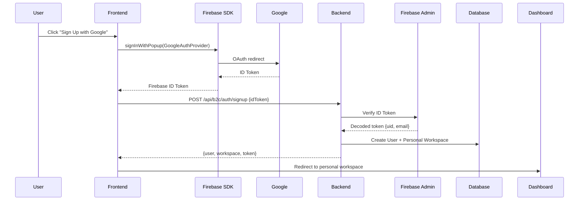
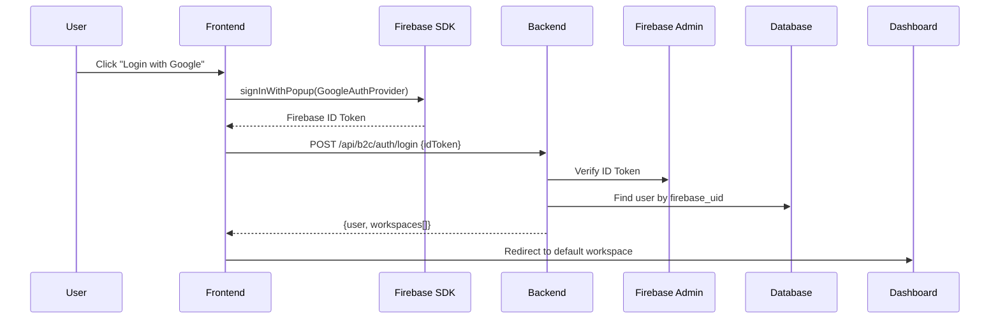

# SPEC-B2C-01: Authentication & Identity

**Status**: Draft  
**Last Updated**: 2025-12-15

## 1. Overview

B2C authentication uses **Native Firebase Authentication** (not GCIP Multi-Tenancy) to support individual user signup via social providers and email/password.

## 2. Supported Authentication Methods

### 2.1 Social Providers
- **Google Sign-In**: Primary method for quick onboarding
- **GitHub** (Optional): For developer-focused products
- **Apple Sign-In** (Optional): Required for iOS App Store

### 2.2 Email/Password
- Traditional email registration with email verification
- Password reset via Firebase auth

## 3. Authentication Flow

### 3.1 Signup Flow



### 3.2 Login Flow



## 4. Token Management

### 4.1 ID Token Verification
Backend verifies all incoming Firebase ID tokens using Firebase Admin SDK:

```python
decoded_token = await firebase_auth.verify_id_token(id_token)
firebase_uid = decoded_token['uid']
email = decoded_token['email']
email_verified = decoded_token['email_verified']
```

### 4.2 Session Management
- **Frontend**: Stores Firebase ID token in memory/secure storage
- **Token Refresh**: Firebase SDK handles automatic refresh
- **Expiration**: Tokens valid for 1 hour, auto-refreshed by SDK

## 5. User Model

```sql
CREATE TABLE b2c.users (
    id UUID PRIMARY KEY DEFAULT gen_random_uuid(),
    firebase_uid VARCHAR(255) UNIQUE NOT NULL,
    email VARCHAR(255) UNIQUE NOT NULL,
    display_name VARCHAR(255),
    avatar_url VARCHAR(500),
    email_verified BOOLEAN DEFAULT false,
    personal_workspace_id UUID REFERENCES b2c.workspaces(id),
    created_at TIMESTAMP DEFAULT NOW(),
    last_login_at TIMESTAMP,
    deleted_at TIMESTAMP
);

CREATE INDEX idx_users_firebase_uid ON b2c.users(firebase_uid);
CREATE INDEX idx_users_email ON b2c.users(email);
```

## 6. Security Requirements

### 6.1 Email Verification
- **Requirement**: Only verified emails can create workspaces
- **Enforcement**: Check `email_verified: true` in ID token before signup completion

### 6.2 Account Deletion
- **GDPR Compliance**: Users can request account deletion
- **Soft Delete**: Set `deleted_at`, anonymize data after 30 days
- **Cascade**: Delete all owned workspaces and remove from team workspaces

## 7. API Endpoints

### POST /api/b2c/auth/signup
**Request:**
```json
{
  "id_token": "eyJhbGc...",
  "display_name": "John Doe" // Optional override
}
```

**Response:**
```json
{
  "user": {
    "id": "uuid",
    "email": "user@example.com",
    "display_name": "John Doe",
    "personal_workspace_id": "uuid"
  },
  "workspace": {
    "id": "uuid",
    "name": "John's Workspace",
    "type": "personal"
  }
}
```

### POST /api/b2c/auth/login
**Request:**
```json
{
  "id_token": "eyJhbGc..."
}
```

**Response:**
```json
{
  "user": {
    "id": "uuid",
    "email": "user@example.com",
    "workspaces": [
      {"id": "uuid", "name": "Personal", "type": "personal"},
      {"id": "uuid", "name": "Team Alpha", "type": "team"}
    ]
  }
}
```

### GET /api/b2c/auth/me
**Headers:** `Authorization: Bearer <firebase_id_token>`

**Response:**
```json
{
  "id": "uuid",
  "email": "user@example.com",
  "display_name": "John Doe",
  "current_workspace_id": "uuid",
  "workspaces": [...]
}
```

## 8. Firebase Configuration

### 8.1 Project Setup
1. Create Firebase project: `my-saas-b2c`
2. Enable Authentication providers:
   - Google (OAuth 2.0)
   - Email/Password
3. Configure authorized domains for production

### 8.2 Frontend SDK Initialization
```javascript
import { initializeApp } from 'firebase/app';
import { getAuth } from 'firebase/auth';

const firebaseConfig = {
  apiKey: process.env.REACT_APP_FIREBASE_API_KEY,
  authDomain: "my-saas-b2c.firebaseapp.com",
  projectId: "my-saas-b2c"
};

const app = initializeApp(firebaseConfig);
export const auth = getAuth(app);
```

## 9. Migration from B2B Pattern

### Key Differences

| Aspect | B2B | B2C |
|--------|-----|-----|
| Firebase Setup | GCIP Multi-Tenancy | Single Project |
| Auth Providers | OIDC (per tenant) | Native (Google, Email) |
| User Resolution | Email domain → Tenant | Direct signup |
| Onboarding | Platform Admin invites | Self-service |

## 10. Open Questions

1. **Social Provider Priority**: Google-only initially, or add GitHub/Apple from start?
2. **Username Support**: Allow usernames in addition to email?
3. **2FA**: Implement in Phase 1 or defer?
