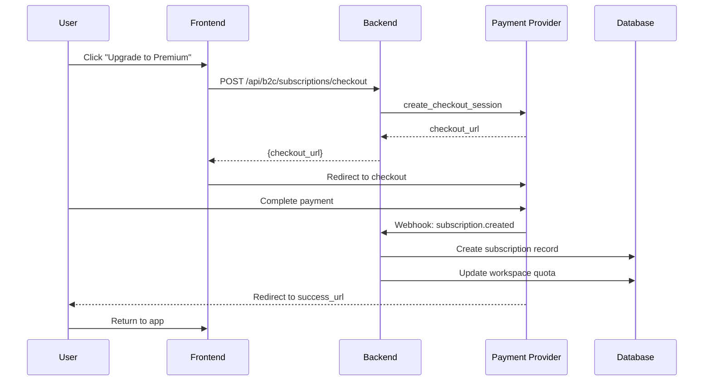

# SPEC-B2C-03: Subscriptions & Billing

**Status**: Draft  
**Last Updated**: 2025-12-15

## 1. Overview

The subscription system supports multiple payment providers (Stripe, Razorpay, Xendit) through a pluggable architecture. Subscriptions are tied to **workspaces** and control feature access via quota enforcement.

## 2. Subscription Tiers

### 2.1 Free Tier

**Price**: $0/month  
**Limits**:
- 1 Personal Workspace
- 5 Projects per workspace
- 100 MB storage
- Basic features only
- No team workspaces
- Community support only

**Included Features**:
- ✅ Google/Email authentication
- ✅ Personal workspace
- ✅ Basic project management
- ✅ 2 team members (shareable links only, viewer access)
- ❌ No team workspaces
- ❌ No priority support
- ❌ No advanced features

### 2.2 Premium Tier

**Price**: $12/month (or $120/year - save 17%)  
**Limits**:
- 1 Personal Workspace
- Up to 3 Team Workspaces
- Unlimited projects
- 10 GB storage
- Up to 10 members per team workspace
- Priority email support

**Included Features**:
- ✅ Everything in Free
- ✅ Team workspaces
- ✅ Advanced collaboration tools
- ✅ Priority support
- ✅ Custom branding (logo, colors)
- ✅ Export data (CSV, JSON)

### 2.3 Ultimate Tier

**Price**: $49/month (or $490/year - save 17%)  
**Limits**:
- Unlimited workspaces
- Unlimited projects
- 100 GB storage
- Unlimited members
- Dedicated support
- Custom integrations

**Included Features**:
- ✅ Everything in Premium
- ✅ SSO (SAML/OIDC)
- ✅ Advanced analytics
- ✅ Audit logs
- ✅ API access
- ✅ SLA guarantee (99.9% uptime)
- ✅ Dedicated account manager

## 3. Data Model

### 3.1 Database Schema

```sql
-- Subscriptions
CREATE TABLE b2c.subscriptions (
    id UUID PRIMARY KEY DEFAULT gen_random_uuid(),
    workspace_id UUID UNIQUE REFERENCES b2c.workspaces(id) ON DELETE CASCADE,
    
    -- Provider Info (polymorphic)
    provider VARCHAR(50) NOT NULL, -- 'stripe' | 'razorpay' | 'xendit'
    provider_customer_id VARCHAR(255),
    provider_subscription_id VARCHAR(255),
    
    -- Plan Details
    plan_tier VARCHAR(50) NOT NULL, -- 'free' | 'premium' | 'ultimate'
    billing_interval VARCHAR(20) DEFAULT 'monthly', -- 'monthly' | 'yearly'
    
    -- Status
    status VARCHAR(50) DEFAULT 'active', -- 'active' | 'canceled' | 'past_due' | 'trialing'
    trial_ends_at TIMESTAMP,
    current_period_start TIMESTAMP,
    current_period_end TIMESTAMP,
    cancel_at_period_end BOOLEAN DEFAULT false,
    canceled_at TIMESTAMP,
    
    -- Pricing
    amount_cents INTEGER NOT NULL DEFAULT 0, -- Price in cents
    currency VARCHAR(3) DEFAULT 'USD',
    
    created_at TIMESTAMP DEFAULT NOW(),
    updated_at TIMESTAMP DEFAULT NOW()
);

-- Coupons
CREATE TABLE b2c.coupons (
    id UUID PRIMARY KEY DEFAULT gen_random_uuid(),
    code VARCHAR(50) UNIQUE NOT NULL,
    name VARCHAR(255) NOT NULL,
    description TEXT,
    
    -- Discount Type
    discount_type VARCHAR(20) NOT NULL, -- 'percentage' | 'fixed_amount'
    discount_value INTEGER NOT NULL, -- Percentage (0-100) or cents
    
    -- Applicability
    applicable_tiers TEXT[], -- ['premium', 'ultimate'] or NULL for all
    min_purchase_amount_cents INTEGER, -- Minimum order value
    
    -- Limits
    max_redemptions INTEGER, -- NULL = unlimited
    redemptions_count INTEGER DEFAULT 0,
    max_redemptions_per_user INTEGER DEFAULT 1,
    
    -- Validity
    valid_from TIMESTAMP DEFAULT NOW(),
    valid_until TIMESTAMP,
    is_active BOOLEAN DEFAULT true,
    
    created_at TIMESTAMP DEFAULT NOW()
);

-- Coupon Redemptions
CREATE TABLE b2c.coupon_redemptions (
    id UUID PRIMARY KEY DEFAULT gen_random_uuid(),
    coupon_id UUID REFERENCES b2c.coupons(id) ON DELETE CASCADE,
    user_id UUID REFERENCES b2c.users(id) ON DELETE SET NULL,
    subscription_id UUID REFERENCES b2c.subscriptions(id) ON DELETE SET NULL,
    
    discount_applied_cents INTEGER NOT NULL,
    redeemed_at TIMESTAMP DEFAULT NOW()
);

-- Promotional Offers
CREATE TABLE b2c.promotional_offers (
    id UUID PRIMARY KEY DEFAULT gen_random_uuid(),
    name VARCHAR(255) NOT NULL,
    description TEXT,
    
    -- Offer Type
    offer_type VARCHAR(50) NOT NULL, -- 'trial_extension' | 'discount' | 'bonus_storage'
    
    -- Targeting
    target_user_segment VARCHAR(50), -- 'new_users' | 'churned_users' | 'all' | NULL
    target_plan VARCHAR(50), -- 'free' | 'premium' | 'ultimate' | NULL
    
    -- Offer Details (JSONB for flexibility)
    offer_config JSONB NOT NULL, -- e.g., {"trial_days": 30, "discount_percent": 50}
    
    -- Auto-apply or require code?
    auto_apply BOOLEAN DEFAULT false,
    promo_code VARCHAR(50) UNIQUE,
    
    -- Validity
    valid_from TIMESTAMP DEFAULT NOW(),
    valid_until TIMESTAMP,
    is_active BOOLEAN DEFAULT true,
    
    created_at TIMESTAMP DEFAULT NOW()
);

-- Subscription History (for audit/analytics)
CREATE TABLE b2c.subscription_events (
    id UUID PRIMARY KEY DEFAULT gen_random_uuid(),
    subscription_id UUID REFERENCES b2c.subscriptions(id) ON DELETE CASCADE,
    event_type VARCHAR(50) NOT NULL, -- 'created' | 'upgraded' | 'downgraded' | 'canceled' | 'renewed'
    from_tier VARCHAR(50),
    to_tier VARCHAR(50),
    metadata JSONB,
    created_at TIMESTAMP DEFAULT NOW()
);

-- Invoices (for all transactions)
CREATE TABLE b2c.invoices (
    id UUID PRIMARY KEY DEFAULT gen_random_uuid(),
    subscription_id UUID REFERENCES b2c.subscriptions(id) ON DELETE SET NULL,
    user_id UUID REFERENCES b2c.users(id) ON DELETE SET NULL,
    
    -- Provider Info
    provider VARCHAR(50) NOT NULL,
    provider_invoice_id VARCHAR(255),
    
    -- Invoice Details
    invoice_number VARCHAR(100) UNIQUE NOT NULL,
    amount_cents INTEGER NOT NULL,
    tax_cents INTEGER DEFAULT 0,
    total_cents INTEGER NOT NULL,
    currency VARCHAR(3) DEFAULT 'USD',
    
    -- Status
    status VARCHAR(50) NOT NULL, -- 'draft' | 'open' | 'paid' | 'void' | 'uncollectible'
    
    -- Billing Period
    period_start TIMESTAMP,
    period_end TIMESTAMP,
    
    -- Payment
    paid_at TIMESTAMP,
    payment_method_id UUID REFERENCES b2c.payment_methods(id),
    
    -- Files
    invoice_pdf_url VARCHAR(500), -- S3/Cloud storage URL
    
    -- Dates
    due_date TIMESTAMP,
    created_at TIMESTAMP DEFAULT NOW(),
    updated_at TIMESTAMP DEFAULT NOW()
);

-- Payment Methods (Cards, etc.)
CREATE TABLE b2c.payment_methods (
    id UUID PRIMARY KEY DEFAULT gen_random_uuid(),
    user_id UUID REFERENCES b2c.users(id) ON DELETE CASCADE,
    
    -- Provider Info
    provider VARCHAR(50) NOT NULL,
    provider_payment_method_id VARCHAR(255) NOT NULL,
    
    -- Card Details (anonymized)
    type VARCHAR(50) NOT NULL, -- 'card' | 'bank_account' | 'upi' | 'wallet'
    card_brand VARCHAR(50), -- 'visa' | 'mastercard' | 'amex'
    card_last4 VARCHAR(4),
    card_exp_month INTEGER,
    card_exp_year INTEGER,
    
    -- Status
    is_default BOOLEAN DEFAULT false,
    is_verified BOOLEAN DEFAULT false,
    
    created_at TIMESTAMP DEFAULT NOW(),
    updated_at TIMESTAMP DEFAULT NOW()
);

CREATE INDEX idx_subscriptions_workspace ON b2c.subscriptions(workspace_id);
CREATE INDEX idx_subscriptions_provider ON b2c.subscriptions(provider, provider_subscription_id);
CREATE INDEX idx_coupons_code ON b2c.coupons(code);
CREATE INDEX idx_invoices_user ON b2c.invoices(user_id);
CREATE INDEX idx_invoices_subscription ON b2c.invoices(subscription_id);
CREATE INDEX idx_payment_methods_user ON b2c.payment_methods(user_id);
```

## 4. Payment Provider Abstraction

### 4.1 Provider Interface

```python
from abc import ABC, abstractmethod
from typing import Dict, Optional
from uuid import UUID

class PaymentProvider(ABC):
    """Abstract interface for payment providers"""
    
    @abstractmethod
    async def create_customer(
        self,
        email: str,
        name: str,
        metadata: Optional[Dict] = None
    ) -> str:
        """Create customer, return provider_customer_id"""
        pass
    
    @abstractmethod
    async def create_subscription(
        self,
        customer_id: str,
        plan_id: str,
        trial_days: Optional[int] = None,
        coupon_code: Optional[str] = None
    ) -> Dict:
        """
        Create subscription
        Returns: {
            'subscription_id': str,
            'status': str,
            'current_period_end': datetime
        }
        """
        pass
    
    @abstractmethod
    async def cancel_subscription(
        self,
        subscription_id: str,
        cancel_immediately: bool = False
    ) -> Dict:
        """Cancel subscription"""
        pass
    
    @abstractmethod
    async def update_subscription(
        self,
        subscription_id: str,
        new_plan_id: str,
        prorate: bool = True
    ) -> Dict:
        """Upgrade/downgrade subscription"""
        pass
    
    @abstractmethod
    async def create_checkout_session(
        self,
        customer_id: str,
        plan_id: str,
        success_url: str,
        cancel_url: str,
        coupon_code: Optional[str] = None
    ) -> str:
        """Create checkout session, return checkout URL"""
        pass
    
    @abstractmethod
    async def verify_webhook(
        self,
        payload: bytes,
        signature: str
    ) -> Dict:
        """Verify and parse webhook event"""
        pass
    
    @abstractmethod
    async def add_payment_method(
        self,
        customer_id: str,
        payment_method_token: str
    ) -> Dict:
        """
        Attach payment method to customer
        Returns: {
            'payment_method_id': str,
            'type': str,
            'card_brand': str,
            'card_last4': str,
            'card_exp_month': int,
            'card_exp_year': int
        }
        """
        pass
    
    @abstractmethod
    async def remove_payment_method(
        self,
        payment_method_id: str
    ) -> bool:
        """Detach payment method from customer"""
        pass
    
    @abstractmethod
    async def set_default_payment_method(
        self,
        customer_id: str,
        payment_method_id: str
    ) -> bool:
        """Set default payment method for customer"""
        pass
    
    @abstractmethod
    async def get_invoice(
        self,
        invoice_id: str
    ) -> Dict:
        """
        Retrieve invoice details
        Returns: {
            'invoice_id': str,
            'invoice_number': str,
            'amount_cents': int,
            'status': str,
            'invoice_pdf': str,
            'period_start': datetime,
            'period_end': datetime
        }
        """
        pass
    
    @abstractmethod
    async def list_invoices(
        self,
        customer_id: str,
        limit: int = 10
    ) -> List[Dict]:
        """List customer invoices"""
        pass
```

### 4.2 Provider Implementations

#### Stripe Provider

```python
import stripe
from datetime import datetime

class StripeProvider(PaymentProvider):
    def __init__(self, api_key: str, webhook_secret: str):
        self.api_key = api_key
        self.webhook_secret = webhook_secret
        stripe.api_key = api_key
    
    async def create_customer(self, email: str, name: str, metadata: Optional[Dict] = None) -> str:
        customer = stripe.Customer.create(
            email=email,
            name=name,
            metadata=metadata or {}
        )
        return customer.id
    
    async def create_subscription(
        self,
        customer_id: str,
        plan_id: str,
        trial_days: Optional[int] = None,
        coupon_code: Optional[str] = None
    ) -> Dict:
        params = {
            'customer': customer_id,
            'items': [{'price': plan_id}]
        }
        if trial_days:
            params['trial_period_days'] = trial_days
        if coupon_code:
            params['coupon'] = coupon_code
        
        subscription = stripe.Subscription.create(**params)
        
        return {
            'subscription_id': subscription.id,
            'status': subscription.status,
            'current_period_end': datetime.fromtimestamp(subscription.current_period_end)
        }
    
    async def verify_webhook(self, payload: bytes, signature: str) -> Dict:
        event = stripe.Webhook.construct_event(
            payload, signature, self.webhook_secret
        )
        return event.to_dict()
```

#### Razorpay Provider

```python
import razorpay

class RazorpayProvider(PaymentProvider):
    def __init__(self, key_id: str, key_secret: str, webhook_secret: str):
        self.client = razorpay.Client(auth=(key_id, key_secret))
        self.webhook_secret = webhook_secret
    
    async def create_customer(self, email: str, name: str, metadata: Optional[Dict] = None) -> str:
        customer = self.client.customer.create({
            'email': email,
            'name': name,
            'notes': metadata or {}
        })
        return customer['id']
    
    async def create_subscription(
        self,
        customer_id: str,
        plan_id: str,
        trial_days: Optional[int] = None,
        coupon_code: Optional[str] = None
    ) -> Dict:
        params = {
            'plan_id': plan_id,
            'customer_notify': 1,
            'total_count': 12,  # Razorpay requires total_count
            'customer_id': customer_id
        }
        # Razorpay handles coupons differently (via offers)
        subscription = self.client.subscription.create(params)
        
        return {
            'subscription_id': subscription['id'],
            'status': subscription['status'],
            'current_period_end': datetime.fromtimestamp(subscription['current_end'])
        }
```

#### Xendit Provider

```python
import httpx

class XenditProvider(PaymentProvider):
    def __init__(self, api_key: str, webhook_secret: str):
        self.api_key = api_key
        self.webhook_secret = webhook_secret
        self.base_url = "https://api.xendit.co"
    
    async def create_customer(self, email: str, name: str, metadata: Optional[Dict] = None) -> str:
        async with httpx.AsyncClient() as client:
            response = await client.post(
                f"{self.base_url}/customers",
                auth=(self.api_key, ""),
                json={
                    'email': email,
                    'given_names': name,
                    'metadata': metadata or {}
                }
            )
            data = response.json()
            return data['id']
```

### 4.3 Provider Factory

```python
from core.config import settings

class PaymentProviderFactory:
    @staticmethod
    def get_provider() -> PaymentProvider:
        provider_name = settings.payment_provider  # 'stripe' | 'razorpay' | 'xendit'
        
        if provider_name == 'stripe':
            return StripeProvider(
                api_key=settings.stripe_api_key,
                webhook_secret=settings.stripe_webhook_secret
            )
        elif provider_name == 'razorpay':
            return RazorpayProvider(
                key_id=settings.razorpay_key_id,
                key_secret=settings.razorpay_key_secret,
                webhook_secret=settings.razorpay_webhook_secret
            )
        elif provider_name == 'xendit':
            return XenditProvider(
                api_key=settings.xendit_api_key,
                webhook_secret=settings.xendit_webhook_secret
            )
        else:
            raise ValueError(f"Unsupported payment provider: {provider_name}")

# Usage
payment_provider = PaymentProviderFactory.get_provider()
```

## 5. Subscription Lifecycle

### 5.1 Upgrade Flow (Free → Premium)



### 5.2 Downgrade Flow (Premium → Free)

- **Immediate**: Features disabled instantly, access until period end
- **End of Period**: Subscription canceled, plan downgraded at renewal date

### 5.3 Cancellation Flow

```python
async def cancel_subscription(
    workspace_id: UUID,
    cancel_immediately: bool,
    db: AsyncSession
):
    subscription = await db.get(Subscription, workspace_id)
    
    if cancel_immediately:
        # Cancel now, features disabled immediately
        await payment_provider.cancel_subscription(
            subscription.provider_subscription_id,
            cancel_immediately=True
        )
        subscription.status = 'canceled'
        subscription.canceled_at = datetime.utcnow()
    else:
        # Cancel at period end
        await payment_provider.cancel_subscription(
            subscription.provider_subscription_id,
            cancel_immediately=False
        )
        subscription.cancel_at_period_end = True
    
    await db.commit()
```

## 6. Coupon & Promo System

### 6.1 Coupon Application

```python
async def apply_coupon(
    coupon_code: str,
    user_id: UUID,
    subscription_id: UUID,
    order_amount_cents: int,
    db: AsyncSession
) -> int:
    """
    Apply coupon and return discounted amount
    Raises HTTPException if invalid
    """
    # Fetch coupon
    coupon = await db.execute(
        select(Coupon).where(Coupon.code == coupon_code.upper())
    )
    coupon = coupon.scalar_one_or_none()
    
    if not coupon:
        raise HTTPException(404, "Invalid coupon code")
    
    # Validate
    now = datetime.utcnow()
    if not coupon.is_active:
        raise HTTPException(400, "Coupon is no longer active")
    if coupon.valid_until and coupon.valid_until < now:
        raise HTTPException(400, "Coupon has expired")
    if coupon.max_redemptions and coupon.redemptions_count >= coupon.max_redemptions:
        raise HTTPException(400, "Coupon redemption limit reached")
    
    # Check user redemption limit
    user_redemptions = await db.scalar(
        select(func.count(CouponRedemption.id))
        .where(CouponRedemption.coupon_id == coupon.id)
        .where(CouponRedemption.user_id == user_id)
    )
    if user_redemptions >= coupon.max_redemptions_per_user:
        raise HTTPException(400, "You have already redeemed this coupon")
    
    # Calculate discount
    if coupon.discount_type == 'percentage':
        discount = int(order_amount_cents * coupon.discount_value / 100)
    else:  # fixed_amount
        discount = coupon.discount_value
    
    final_amount = max(0, order_amount_cents - discount)
    
    # Record redemption
    redemption = CouponRedemption(
        coupon_id=coupon.id,
        user_id=user_id,
        subscription_id=subscription_id,
        discount_applied_cents=discount
    )
    db.add(redemption)
    
    # Increment redemption count
    coupon.redemptions_count += 1
    await db.commit()
    
    return final_amount
```

### 6.2 Promotional Offer Examples

#### Trial Extension Offer
```json
{
  "name": "Extended Trial for Churned Users",
  "offer_type": "trial_extension",
  "target_user_segment": "churned_users",
  "target_plan": "premium",
  "offer_config": {
    "trial_days": 30,
    "message": "Welcome back! Enjoy 30 days free."
  },
  "auto_apply": true,
  "valid_from": "2025-01-01",
  "valid_until": "2025-03-31"
}
```

#### Black Friday Discount
```json
{
  "name": "Black Friday Sale",
  "offer_type": "discount",
  "target_user_segment": "all",
  "offer_config": {
    "discount_percent": 40,
    "duration_months": 3,
    "message": "40% off for 3 months!"
  },
  "promo_code": "BLACKFRIDAY2025",
  "valid_from": "2025-11-24",
  "valid_until": "2025-11-27"
}
```

## 7. Quota Enforcement

### 7.1 Middleware

```python
from functools import wraps

def enforce_quota(resource_type: str):
    """Decorator to enforce subscription quotas"""
    def decorator(func):
        @wraps(func)
        async def wrapper(*args, **kwargs):
            workspace_id = kwargs.get('workspace_id')
            db = kwargs.get('db')
            
            # Get subscription
            subscription = await db.scalar(
                select(Subscription)
                .where(Subscription.workspace_id == workspace_id)
            )
            
            # Check quota based on resource_type
            if resource_type == 'team_workspace':
                if subscription.plan_tier == 'free':
                    raise HTTPException(403, "Team workspaces require Premium plan")
                
                if subscription.plan_tier == 'premium':
                    workspace_count = await db.scalar(
                        select(func.count(Workspace.id))
                        .where(Workspace.owner_id == current_user_id)
                        .where(Workspace.type == 'team')
                    )
                    if workspace_count >= 3:
                        raise HTTPException(403, "Premium plan limited to 3 team workspaces")
            
            elif resource_type == 'project':
                if subscription.plan_tier == 'free':
                    project_count = await db.scalar(
                        select(func.count(Project.id))
                        .where(Project.workspace_id == workspace_id)
                    )
                    if project_count >= 5:
                        raise HTTPException(403, "Free plan limited to 5 projects. Upgrade to Premium for unlimited.")
            
            return await func(*args, **kwargs)
        return wrapper
    return decorator

# Usage
@router.post("/api/b2c/projects")
@enforce_quota('project')
async def create_project(workspace_id: UUID, ...):
    ...
```

## 8. Webhook Handling

### 8.1 Provider-Agnostic Webhook Processor

```python
@router.post("/api/b2c/webhooks/{provider}")
async def handle_webhook(
    provider: str,
    request: Request,
    db: AsyncSession = Depends(get_db)
):
    """Handle subscription webhooks from payment providers"""
    
    payload = await request.body()
    signature = request.headers.get('Stripe-Signature') or request.headers.get('X-Razorpay-Signature')
    
    # Get provider instance
    payment_provider = PaymentProviderFactory.get_provider()
    
    # Verify webhook
    event = await payment_provider.verify_webhook(payload, signature)
    
    # Process event
    if event['type'] == 'subscription.created':
        await handle_subscription_created(event['data'], db)
    elif event['type'] == 'subscription.updated':
        await handle_subscription_updated(event['data'], db)
    elif event['type'] == 'subscription.deleted':
        await handle_subscription_canceled(event['data'], db)
    elif event['type'] == 'invoice.payment_failed':
        await handle_payment_failed(event['data'], db)
    
    return {"status": "success"}
```

## 9. API Endpoints

### POST /api/b2c/subscriptions/checkout
Create checkout session for upgrade

**Request:**
```json
{
  "workspace_id": "uuid",
  "plan_tier": "premium",
  "billing_interval": "yearly",
  "coupon_code": "SAVE20"
}
```

**Response:**
```json
{
  "checkout_url": "https://checkout.stripe.com/..."
}
```

### POST /api/b2c/coupons/validate
Validate coupon before checkout

**Request:**
```json
{
  "coupon_code": "SAVE20",
  "plan_tier": "premium"
}
```

**Response:**
```json
{
  "valid": true,
  "discount_type": "percentage",
  "discount_value": 20,
  "final_price": "$9.60/month"
}
```

### GET /api/b2c/billing/invoices
List user's invoices

**Response:**
```json
{
  "invoices": [
    {
      "id": "uuid",
      "invoice_number": "INV-2025-001",
      "amount": "$12.00",
      "status": "paid",
      "period": "Dec 2024 - Jan 2025",
      "pdf_url": "/api/b2c/billing/invoices/{id}/download",
      "paid_at": "2025-01-01T00:00:00Z"
    }
  ],
  "total": 12
}
```

### GET /api/b2c/billing/invoices/{id}
Get specific invoice details

**Response:**
```json
{
  "id": "uuid",
  "invoice_number": "INV-2025-001",
  "amount_cents": 1200,
  "tax_cents": 200,
  "total_cents": 1400,
  "currency": "USD",
  "status": "paid",
  "period_start": "2024-12-01T00:00:00Z",
  "period_end": "2025-01-01T00:00:00Z",
  "paid_at": "2024-12-01T10:30:00Z",
  "line_items": [
    {
      "description": "Premium Plan - Monthly",
      "amount_cents": 1200
    }
  ],
  "pdf_url": "/api/b2c/billing/invoices/{id}/download"
}
```

### GET /api/b2c/billing/invoices/{id}/download
Download invoice PDF

**Response:** PDF file (Content-Type: application/pdf)

### GET /api/b2c/billing/payment-methods
List payment methods

**Response:**
```json
{
  "payment_methods": [
    {
      "id": "uuid",
      "type": "card",
      "card_brand": "visa",
      "card_last4": "4242",
      "card_exp_month": 12,
      "card_exp_year": 2028,
      "is_default": true,
      "is_verified": true
    }
  ]
}
```

### POST /api/b2c/billing/payment-methods
Add new payment method

**Request:**
```json
{
  "payment_method_token": "pm_abc123..." // From Stripe Elements / Razorpay / Xendit
}
```

**Response:**
```json
{
  "id": "uuid",
  "type": "card",
  "card_brand": "mastercard",
  "card_last4": "5555",
  "message": "Payment method added successfully"
}
```

### DELETE /api/b2c/billing/payment-methods/{id}
Remove payment method

**Response:**
```json
{
  "message": "Payment method removed successfully"
}
```

### PATCH /api/b2c/billing/payment-methods/{id}/set-default
Set as default payment method

**Response:**
```json
{
  "message": "Default payment method updated"
}
```

## 10. Free Tier Feature Gating

### What's In Free Tier?

✅ **Included**:
- Basic authentication (Google, Email)
- 1 Personal workspace
- 5 Projects
- 100 MB storage
- Basic API access
- Community support

❌ **Locked Behind Upgrade**:
- Team workspaces
- Unlimited projects
- Advanced features (analytics, exports)
- Priority support
- SSO (Ultimate plan only)
