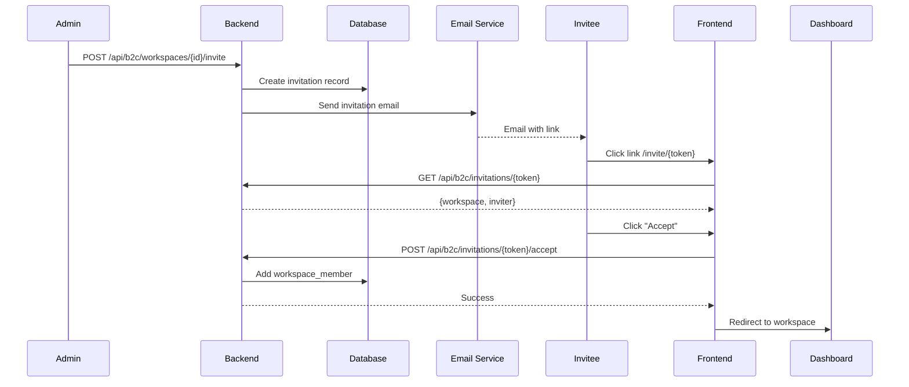

# SPEC-B2C-02: Workspaces & Data Isolation

**Status**: Draft  
**Last Updated**: 2025-12-15

## 1. Overview

Workspaces are the primary container for user data in B2C. Each user gets a **Personal Workspace** on signup and can create/join **Team Workspaces** for collaboration.

## 2. Workspace Types

### 2.1 Personal Workspace
- **Auto-created**: Generated automatically on user signup
- **Ownership**: Belongs to a single user
- **Deletion**: Deleted when user account is deleted
- **Billing**: Subscription tied to owner's account

### 2.2 Team Workspace
- **Creation**: User creates and invites others
- **Ownership**: Has designated owner (transferable)
- **Membership**: Multiple users with roles (Owner, Admin, Member)
- **Billing**: Subscription managed by owner

## 3. Data Model

### 3.1 Database Schema

```sql
CREATE SCHEMA b2c;

-- Workspaces Table
CREATE TABLE b2c.workspaces (
    id UUID PRIMARY KEY DEFAULT gen_random_uuid(),
    name VARCHAR(255) NOT NULL,
    type VARCHAR(20) NOT NULL CHECK (type IN ('personal', 'team')),
    owner_id UUID NOT NULL REFERENCES b2c.users(id) ON DELETE CASCADE,
    subscription_id UUID REFERENCES b2c.subscriptions(id),
    settings JSONB DEFAULT '{}',
    created_at TIMESTAMP DEFAULT NOW(),
    updated_at TIMESTAMP DEFAULT NOW(),
    deleted_at TIMESTAMP
);

-- Workspace Members (for team workspaces)
CREATE TABLE b2c.workspace_members (
    workspace_id UUID REFERENCES b2c.workspaces(id) ON DELETE CASCADE,
    user_id UUID REFERENCES b2c.users(id) ON DELETE CASCADE,
    role VARCHAR(50) NOT NULL CHECK (role IN ('owner', 'admin', 'member', 'viewer')),
    joined_at TIMESTAMP DEFAULT NOW(),
    invited_by UUID REFERENCES b2c.users(id),
    PRIMARY KEY (workspace_id, user_id)
);

-- Workspace Invitations
CREATE TABLE b2c.workspace_invitations (
    id UUID PRIMARY KEY DEFAULT gen_random_uuid(),
    workspace_id UUID REFERENCES b2c.workspaces(id) ON DELETE CASCADE,
    email VARCHAR(255) NOT NULL,
    role VARCHAR(50) NOT NULL DEFAULT 'member',
    invitation_token VARCHAR(255) UNIQUE NOT NULL,
    invited_by UUID REFERENCES b2c.users(id),
    expires_at TIMESTAMP NOT NULL,
    accepted_at TIMESTAMP,
    created_at TIMESTAMP DEFAULT NOW()
);

CREATE INDEX idx_workspace_members_user ON b2c.workspace_members(user_id);
CREATE INDEX idx_invitations_token ON b2c.workspace_invitations(invitation_token);
```

## 4. Row Level Security (RLS)

### 4.1 RLS Policies

Users can only access data in workspaces they belong to:

```sql
-- Example: Projects table RLS
ALTER TABLE b2c.projects ENABLE ROW LEVEL SECURITY;

CREATE POLICY workspace_member_access ON b2c.projects
    USING (
        workspace_id IN (
            SELECT workspace_id 
            FROM b2c.workspace_members 
            WHERE user_id = current_setting('app.current_user_id')::uuid
        )
    );
```

### 4.2 Context Setting

Backend sets user context before queries:

```python
from core.rls import rls_service

async def list_projects(
    current_user: dict = Depends(get_current_b2c_user),
    workspace_id: UUID,
    db: AsyncSession = Depends(get_db)
):
    # Set RLS context
    await rls_service.set_user_context(db, current_user['id'])
    
    # Verify user has access to this workspace
    member = await db.execute(
        select(WorkspaceMember)
        .where(WorkspaceMember.workspace_id == workspace_id)
        .where(WorkspaceMember.user_id == current_user['id'])
    )
    if not member.scalar_one_or_none():
        raise HTTPException(403, "Access denied")
    
    # Query projects (RLS auto-filters)
    result = await db.execute(
        select(Project).where(Project.workspace_id == workspace_id)
    )
    return result.scalars().all()
```

## 5. Workspace Lifecycle

### 5.1 Personal Workspace Creation

Triggered automatically on user signup:

```python
async def create_user_with_workspace(
    firebase_uid: str,
    email: str,
    display_name: str,
    db: AsyncSession
):
    # Create user
    user = User(
        firebase_uid=firebase_uid,
        email=email,
        display_name=display_name
    )
    db.add(user)
    await db.flush()
    
    # Create personal workspace
    workspace = Workspace(
        name=f"{display_name}'s Workspace",
        type="personal",
        owner_id=user.id
    )
    db.add(workspace)
    await db.flush()
    
    # Link user to workspace
    user.personal_workspace_id = workspace.id
    
    # Add as member
    member = WorkspaceMember(
        workspace_id=workspace.id,
        user_id=user.id,
        role="owner"
    )
    db.add(member)
    
    await db.commit()
    return user, workspace
```

### 5.2 Team Workspace Creation

```python
async def create_team_workspace(
    name: str,
    owner_id: UUID,
    db: AsyncSession
):
    # Verify owner has active subscription (if required)
    subscription = await get_user_subscription(owner_id, db)
    if subscription.plan_tier == 'free':
        raise HTTPException(403, "Team workspaces require Premium plan")
    
    # Create workspace
    workspace = Workspace(
        name=name,
        type="team",
        owner_id=owner_id,
        subscription_id=subscription.id
    )
    db.add(workspace)
    await db.flush()
    
    # Add owner as member
    member = WorkspaceMember(
        workspace_id=workspace.id,
        user_id=owner_id,
        role="owner"
    )
    db.add(member)
    await db.commit()
    
    return workspace
```

## 6. Roles & Permissions

### 6.1 Workspace Roles

| Role | Permissions |
|------|-------------|
| **Owner** | Full control, billing, delete workspace, transfer ownership |
| **Admin** | Manage members, settings (except billing) |
| **Member** | Create/edit content, view all workspace data |
| **Viewer** | Read-only access |

### 6.2 Permission Matrix

| Action | Owner | Admin | Member | Viewer |
|--------|:-----:|:-----:|:------:|:------:|
| View workspace | ✅ | ✅ | ✅ | ✅ |
| Create projects | ✅ | ✅ | ✅ | ❌ |
| Edit projects | ✅ | ✅ | ✅ | ❌ |
| Delete projects | ✅ | ✅ | ❌ | ❌ |
| Invite members | ✅ | ✅ | ❌ | ❌ |
| Remove members | ✅ | ✅ | ❌ | ❌ |
| Change settings | ✅ | ✅ | ❌ | ❌ |
| Manage billing | ✅ | ❌ | ❌ | ❌ |
| Delete workspace | ✅ | ❌ | ❌ | ❌ |

## 7. Invitation Flow

### 7.1 Invite User to Workspace



### 7.2 Invitation Expiry
- **Duration**: 7 days
- **Cleanup**: Expired invitations auto-deleted by daily cron job

## 8. Subscription-Workspace Relationship

### 8.1 Free Tier Limits
- **Personal Workspace**: 1 (always included)
- **Team Workspaces**: 0
- **Members per Team**: N/A

### 8.2 Premium Tier
- **Personal Workspace**: 1
- **Team Workspaces**: Up to 3
- **Members per Team**: Up to 10

### 8.3 Ultimate Tier
- **Personal Workspace**: 1
- **Team Workspaces**: Unlimited
- **Members per Team**: Unlimited

## 9. API Endpoints

### POST /api/b2c/workspaces
Create team workspace (Premium+ only)

**Request:**
```json
{
  "name": "Team Alpha",
  "type": "team"
}
```

**Response:**
```json
{
  "id": "uuid",
  "name": "Team Alpha",
  "type": "team",
  "owner_id": "uuid",
  "member_count": 1
}
```

### GET /api/b2c/workspaces/{id}
Get workspace details

**Response:**
```json
{
  "id": "uuid",
  "name": "Team Alpha",
  "type": "team",
  "owner": {"id": "uuid", "name": "John Doe"},
  "members": [
    {"user_id": "uuid", "role": "owner", "name": "John Doe"},
    {"user_id": "uuid", "role": "member", "name": "Jane Smith"}
  ],
  "subscription": {
    "plan": "premium",
    "status": "active"
  }
}
```

### POST /api/b2c/workspaces/{id}/invite
Invite user to workspace

**Request:**
```json
{
  "email": "newuser@example.com",
  "role": "member"
}
```

**Response:**
```json
{
  "invitation_id": "uuid",
  "email": "newuser@example.com",
  "expires_at": "2025-12-22T00:00:00Z"
}
```

### POST /api/b2c/invitations/{token}/accept
Accept workspace invitation

**Response:**
```json
{
  "workspace_id": "uuid",
  "role": "member",
  "message": "Successfully joined Team Alpha"
}
```

## 10. Data Isolation Verification

### 10.1 Test Scenarios
1. **User A** in Workspace X should NOT see projects from Workspace Y
2. **Removed member** should immediately lose access to workspace data
3. **Deleted workspace** should cascade delete all associated data

### 10.2 RLS Audit
Run periodic checks to ensure no RLS policy bypasses exist:

```sql
SELECT schemaname, tablename 
FROM pg_tables 
WHERE schemaname = 'b2c' 
  AND tablename NOT IN (
    SELECT tablename FROM pg_policies WHERE schemaname = 'b2c'
  );
```
